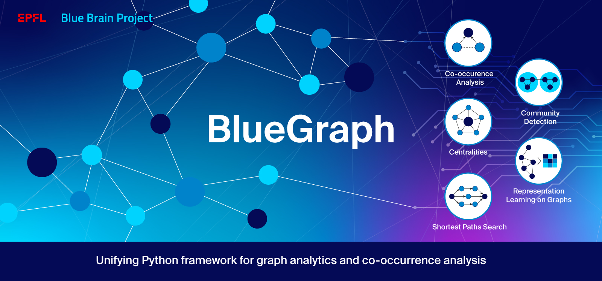

==========
Blue Graph
==========

|Travis_badge|

Unifying Python framework for graph analytics and co-occurrence analysis.

About
-----

BlueGraph is a Python framework that consolidates graph analytics capabilities from different graph processing backends. It provides the following set of interfaces:

- preprocessing and co-occurrence analysis API providing semantic property encoders and co-occurrence graph generators;
- graph analytics API providing interfaces for computing graph metrics, performing path search and community detection;
- representation learning API for applying various graph embedding techniques;
- representation learning downstream tasks API allowing the user to perform node classification, similarity queries, link prediction.

Using the built-in :code:`PGFrame` data structure (currently, `pandas <https://pandas.pydata.org/>`_-based implementation is available) for representing property graphs, it provides a backend-agnostic API supporting the following in-memory and persistent graph backends:

- `NetworkX <https://networkx.org/>`_ (for the analytics API)
- `graph-tool <https://graph-tool.skewed.de/>`_ (for the analytics API)
- `Neo4j <https://neo4j.com/>`_ (for the analytics and representation learning API);
- `StellarGraph <https://stellargraph.readthedocs.io/en/stable/>`_ (for the representation learning API).

This repository originated from the Blue Brain effort on building a COVID-19-related knowledge graph from the `CORD-19 <https://www.kaggle.com/allen-institute-for-ai/CORD-19-research-challenge>`_ dataset and analysing the generated graph to perform literature review of the role of glucose metabolism deregulations in the progression of COVID-19. For more details on how the knowledge graph is built, explored and analysed, see `COVID-19 co-occurrence graph generation and analysis <https://github.com/BlueBrain/BlueGraph/tree/master/cord19kg#readme>`__.

:code:`bluegraph` package
-------------------------

BlueGraph's API is built upon 4 main packages:

- :code:`bluegraph.core` providing the exchange data structure for graph representation that serves as the input to graph processors based on different backends (:code:`PGFrame`), as well as basic interfaces for different graph analytics and embedding classes (:code:`MetricProcessor`, :code:`PathFinder`, :code:`CommunityDetector`, :code:`GraphElementEmbedder`, etc).
- :code:`bluegraph.backends` is a package that collects implementation of various graph processing and analytics interfaces for different graph backends (for example, :code:`NXPathFinder` for path search capabilities provided by NetworkX, :code:`Neo4jCommunityDetector` for community detection methods provided by Neo4j, etc).
- :code:`bluegraph.preprocess` is a package that contains utils for preprocessing property graphs (e.g. :code:`SemanticPGEncoder` for encoding node/edge properties as numerical vectors, :code:`CooccurrenceGenerator` for generation and analysis of co-occurrence relations in PGFrames.)
- :code:`bluegraph.downstream` is a package that provides a set of utils for various downstream tasks based on vector representations of graphs and graph elements (for example, :code:`NodeSimilarityProcessor` for building and querying node similarity indices based on vector representation of nodes, :code:`EdgePredictor` for predicting true and false edges of the graph based on vector representation of its nodes, :code:`EmbeddingPipeline` for stacking pipelines of graph preprocessing, embedding, similarity index building, etc).

Main components of BlueGraph's API are illustrated in the following diagram:

.. image:: examples/figures/README_BlueGraph_components.png
  :alt: BlueGraph components

:code:`cord19kg` package
----------------------------

The :code:`cord19kg` package contains a set of tools for interactive exploration and analysis of the `CORD-19 <https://www.kaggle.com/allen-institute-for-ai/CORD-19-research-challenge>`_ dataset using the co-occurrence analysis of the extracted named entities. It includes data preparation and curation helpers, tools for generation and analysis of co-occurrence graphs. Moreover, it provides several interactive mini-applications (based on `JupyterDash <https://github.com/plotly/jupyter-dash>`_ and `ipywidgets <https://ipywidgets.readthedocs.io/en/stable/>`_) for Jupyter notebooks allowing the user to interactively perform:

- entity curation;
- graph visualization and analysis;
- dataset saving/loading from `Nexus <https://bluebrainnexus.io/>`_.

:code:`services` package
------------------------

Collects services included as a part of BlueGraph. Currently, only a mini-service for retrieving embedding vectors and similarity computation is included as a part of this repository (see embedder service specific `README <https://github.com/BlueBrain/BlueGraph/blob/master/services/embedder/README.rst>`_).

Installation
------------

It is recommended to use a virtual environment such as `venv <https://docs.python.org/3.6/library/venv.html>`_  or `conda environment <https://docs.conda.io/projects/conda/en/latest/user-guide/tasks/manage-environments.html>`_.

.. _installing_deps:

Installing backend dependencies
^^^^^^^^^^^^^^^^^^^^^^^^^^^^^^^

If you want to use :code:`graph-tool` as a backend, you need to manually install the library (it cannot be simply installed by running :code:`pip install`), as it is not an ordinary Python library, but a wrapper around a C++ library (please, see `graph-tool installation instructions <https://git.skewed.de/count0/graph-tool/-/wikis/installation-instructions#native-installation>`_).

Similarly, if you want to use the :code:`bluegraph.downstream.similarity` module for building similarity indices (on embedder nodes, for example), you should install the Facebook :code:`Faiss` library separately. Please, see `Faiss installation instructions <https://github.com/facebookresearch/faiss/blob/master/INSTALL.md>`_ (:code:`conda` and :code:`conda-forge` installation available).

You can install both :code:`graph-tool` and the Facebook :code:`Faiss` library by creating a new environment with the right dependencies using :code:`conda`, as follows:

::

  conda create --name <your_environment> -c conda-forge graph-tool faiss python=<your_python>
  conda activate <your_environment>

The same holds for the Neo4j backend: in order to use it, the database should be installed and started (please, see `Neo4j installation instructions <https://neo4j.com/docs/operations-manual/current/installation/>`_). Typically, the Neo4j-based interfaces provided by BlueGraph require the database uri (the bolt port), username and password to be provided. In addition, BlueGraph uses the Neo4j Graph Data Science (GDS) library, which should be installed separately for the database on which you would like to run the analytics (see `installation instructions <https://neo4j.com/docs/graph-data-science/current/installation/>`_).

Installing BlueGraph
^^^^^^^^^^^^^^^^^^^^^

BlueGraph supports Python versions >= 3.7 and pip >= 21.0.1. To update pip from the older versions run:

::
  
  pip install --upgrade pip wheel setuptools

The development version of BlueGraph can be installed from the source by cloning the current repository as follows:

::

    git clone https://github.com/BlueBrain/BlueGraph.git
    cd BlueGraph

Basic version including only the NetworkX backend can be installed using:

::

    pip install .

The prerequisites for using the :code:`graph-tool` backend can be found in 'Installing backend dependencies'. You can also install additional backends for Neo4j and StellarGraph by running the following:

::

    pip install .[<backend>]

Where :code:`<backend>` has one of the following values :code:`neo4j` or :code:`stellargraph`.

Alternatively, a version supporting all the backends can be installed by running the following commands:

::

    pip install .[all]

In order to use the :code:`cord19kg` package and its interactive Jupyter applications, run:

::

    pip install .[cord19kg]

Getting started
---------------
The `examples directory <https://github.com/BlueBrain/BlueGraph/tree/master/examples>`_ contains a set of Jupyter notebooks providing tutorials and usecases for BlueGraph.

To get started with property graph data structure :code:`PGFrame` provided by BlueGraph, get an example of semantic property encoding, see the `PGFrames and semantic encoding tutorial <https://github.com/BlueBrain/BlueGraph/blob/master/examples/notebooks/PGFrames%20and%20sematic%20encoding%20tutorial.ipynb>`_ notebook.

To get familiar with the ideas behind the co-occurrence analysis and the graph analytics interface provided by BlueGraph we recommend to run the following example notebooks: 

- `Literature exploration (PGFrames + in-memory analytics tutorial) <https://github.com/BlueBrain/BlueGraph/blob/master/examples/notebooks/Literature%20exploration%20(PGFrames%20%2B%20in-memory%20analytics%20tutorial).ipynb>`_  illustrates how to use BlueGraphs's analytics API for in-memory graph backends based on the :code:`NetworkX` and the :code:`graph-tool` libraries.
- `NASA keywords (PGFrames + Neo4j analytics tutorial) <https://github.com/BlueBrain/BlueGraph/blob/master/examples/notebooks/NASA%20keywords%20(PGFrames%20%2B%20Neo4j%20analytics%20tutorial).ipynb>`_ illustrates how to use the Neo4j-based analytics API for persistent property graphs.

`Embedding and downstream tasks tutorial <https://github.com/BlueBrain/BlueGraph/blob/master/examples/notebooks/Embedding%20and%20downstream%20tasks%20tutorial.ipynb>`_ starts from the co-occurrence graph generation example and guides the user through the graph representation learning and all it's downstream tasks including node similarity queries, node classification, edge prediction and embedding pipeline building.

Finally, `Create and push embedding pipeline into Nexus.ipynb <https://github.com/BlueBrain/BlueGraph/blob/master/examples/notebooks/Create%20and%20push%20embedding%20pipeline%20into%20Nexus.ipynb>`_ illustrates how embedding pipelines can be created and pushed to `Nexus <https://bluebrainnexus.io/>`_ and
`Embedding service API <https://github.com/BlueBrain/BlueGraph/blob/master/services/embedder/examples/notebooks/Embedding%20service%20API.ipynb>`_ shows how embedding service that retrieves the embedding pipelines from Nexus can be used.

Getting started with cord19kg
^^^^^^^^^^^^^^^^^^^^^^^^^^^^^
The :code:`cord19kg` packages provides `examples <https://github.com/BlueBrain/BlueGraph/tree/master/cord19kg/examples>`__ of CORD-19-specific co-occurrence analysis. Please, see more details on the CORD-19 analysis and exploration pipeline of the Blue Brain Project `here <https://github.com/BlueBrain/BlueGraph/blob/master/cord19kg/README.rst>`__.

We recommend starting from the `Co-occurrence analysis tutorial <https://github.com/BlueBrain/BlueGraph/blob/master/cord19kg/examples/notebooks/Co-occurrence%20analysis%20tutorial.ipynb>`_ notebook providing a simple starting example.

The `Topic-centered co-occurrence network analysis of CORD-19 <https://github.com/BlueBrain/BlueGraph/blob/master/cord19kg/examples/notebooks/Glucose%20is%20a%20risk%20facor%20for%20COVID-19%20(3000%20papers).ipynb>`_ notebook provides a full analysis pipeline on the selection of 3000 articles obtained by searching the CORD-19 dataset using the query *"Glucose is a risk factor for COVID-19"* (the search is performed using `BlueBrainSearch <https://github.com/BlueBrain/Search>`_).

The `Nexus-hosted co-occurrence network analysis of CORD-19 <https://github.com/BlueBrain/BlueGraph/blob/master/cord19kg/examples/notebooks/Nexus-hosted%20co-occurrence%20analysis%20tutorail.ipynb>`_ notebook provides an example for the previously mentioned 3000-article dataset, where datasets corresponding to different analysis steps can be saved and loaded to and from a `Blue Brain Nexus <https://bluebrainnexus.io/>`_ project.

Finally, the :code:`generate_10000_network.py` `script <https://github.com/BlueBrain/BlueGraph/blob/master/cord19kg/examples/generate_10000_network.py>`_ allows the user to generate the co-occurrence networks for 10'000 most frequent entities extracted from the entire CORD-19v47 database (based on paper- and paragraph- level entity co-occurrence). To run the script, simply execute :code:`python generate_10000_network.py` from the examples folder.

Note that the generated networks are highly dense (contain a large number of edges, for example, ~44M edges for the paper-based network), and the process of their generation, even if parallelized, is highly costly.

Licensing
---------
- Blue Graph is distributed under the Apache 2 license.
- Included example scripts and notebooks (`BlueGraph/examples <https://github.com/BlueBrain/BlueGraph/tree/master/examples>`_ and `BlueGraph/cord19kg/examples <https://github.com/BlueBrain/BlueGraph/tree/master/cord19kg/examples>`_) are distributed under the 3-Clause BSD License.
- Data files stored in the repository are distributed under the `Commons Attribution 4.0 International license (CC BY 4.0) <https://creativecommons.org/licenses/by/4.0/>`_ License.

Acknowledgements
----------------

The development of this project was supported by funding to the Blue Brain Project, a research center of the École polytechnique fédérale de Lausanne (EPFL), from the Swiss government’s ETH Board of the Swiss Federal Institutes of Technology.

.. |Travis_badge| image:: https://travis-ci.com/BlueBrain/BlueGraph.svg?branch=master
    :target: https://travis-ci.com/BlueBrain/BlueGraph

COPYRIGHT 2020–2021, Blue Brain Project/EPFL
