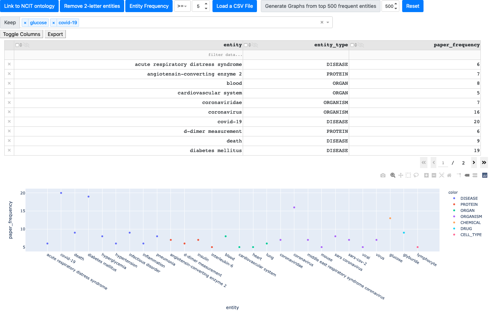
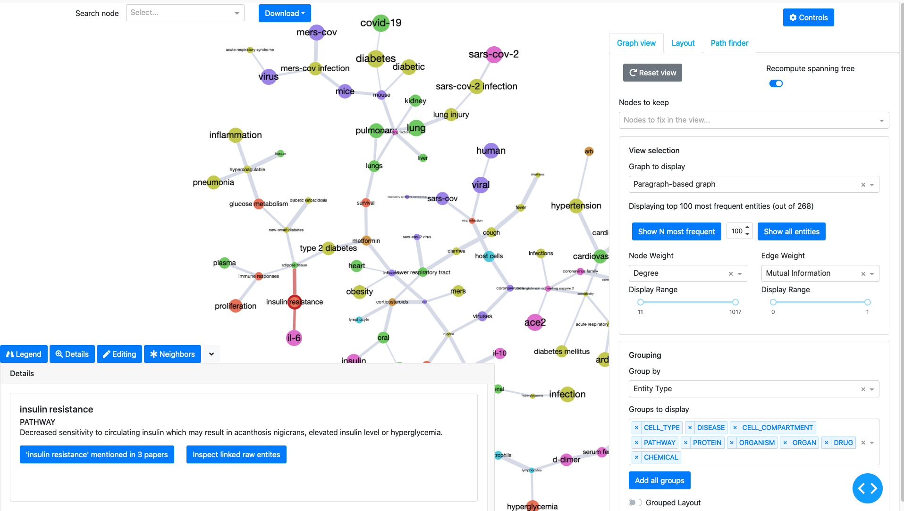

===============================================================================
CORD-19 co-occurrence knowledge graph generation, analysis and exploration
===============================================================================

About
-----

The `cord19kg` package contains a collection of tools, Jupyter notebooks and interactive applications for building, analysing and exploring co-occurrence knowledge graphs from entities extracted from the `CORD-19 v47 <https://www.kaggle.com/dataset/08dd9ead3afd4f61ef246bfd6aee098765a19d9f6dbf514f0142965748be859b/version/47>`_ dataset.

The co-occurence knowledge graph interactive building, analysis and exploration pipeline implemented in this repository is part of a bigger Blue Brain pipeline and effort for performing literature review of the *role of glucose metabolism deregulations in the progression of COVID-19*. The Blue Brain pipeline is made of the following steps:

1. Semantic Search on the CORD-19 dataset to select papers of interest using `BlueBrain/Search <https://github.com/BlueBrain/Search>`_.
2. Named Entity Recognition using `BlueBrain/Search <https://github.com/BlueBrain/Search>`_.
3. Entity Linking (to concepts from the `National Cancer Institute Thesaurus (NCIt) <https://ncithesaurus.nci.nih.gov/ncitbrowser>`_ using `BlueBrain/nexus-forge <https://github.com/BlueBrain/nexus-forge>`_ and interactive Entity Curation using the `cord19kg package curation app <https://github.com/BlueBrain/BlueGraph/blob/master/cord19kg/apps/curation_app.py>`_.
4. Co-occurrence knowledge graph generation using `BlueBrain/BlueGraph <https://github.com/BlueBrain/BlueGraph>`_.
5. Interactive Graph Exploration and Analysis using the `cord19kg package visualization and analysis app <https://github.com/BlueBrain/BlueGraph/blob/master/cord19kg/apps/visualization_app.py>`_.

Two use cases using the aforementioned pipeline are provided in this repository:

**A. Topic centered co-occurrence knowledge graph analysis** consisting of the following steps (steps 3-5 can be reproduced using the jupyter notebook `Glucose is a risk facor for COVID-19 (3000 papers).ipynb <https://github.com/BlueBrain/BlueGraph/blob/master/cord19kg/examples/notebooks/Glucose%20is%20a%20risk%20facor%20for%20COVID-19%20(3000%20papers).ipynb>`_ or you can |Glucose-COVID-19-Colab|):

1. Semantic Search on the CORD-19 dataset: the 3000 most relevant papers resulting from the query *'Glucose as a risk factor in COVID-19'* are selected.

   - The meta-data for the selected 3000 papers can be found `here <https://github.com/BlueBrain/BlueGraph/blob/master/cord19kg/examples/data/Glucose_risk_3000_paper_meta_data.csv>`__.
   - The semantic search can be reproduced using `this external notebook <https://github.com/BlueBrain/Search-Graph-Examples>`__.

2. Named Entity Recognition from the 3000 papers: named entities of the following 9 types are extracted: "Cell Compartment", "Cell Type", "Chemical", "Symptom / Disease", "Drug", "Organ / System", "Organism", "Biological Process / Pathway" and "Protein".

   - The dataset with extracted named entities can be found `here <https://github.com/BlueBrain/BlueGraph/blob/master/cord19kg/examples/data/Glucose_risk_3000_papers.csv.zip>`__.
   - The entity extraction can be reproduced using `this external notebook <https://github.com/BlueBrain/Search-Graph-Examples>`_.

3. Entity Linking and Curation: extracted entities are linked to concepts from the `NCIt ontology <https://ncithesaurus.nci.nih.gov/ncitbrowser/>`_. The resulting linked entities can be further curated using an interactive plotly-dash based `curation app <https://github.com/BlueBrain/BlueGraph/blob/master/cord19kg/apps/curation_app.py>`_.

   - The ontology linked entities dataset can be found `here <https://github.com/BlueBrain/BlueGraph/blob/master/cord19kg/examples/data/ontology_linking_3000_papers.csv.zip>`__.
   
   - The ontology linking is yielding very fine grained types that get normalised and mapped to the 9 entity types of interest. The corresponding type mappings are available `here <https://github.com/BlueBrain/BlueGraph/blob/master/cord19kg/examples/data/NCIT_type_mapping.json>`__.
        
4. Co-occurrence Knowledge Graph Generation: paper- and paragraph-based co-occurrences of the top 1500 most frequent entities are used to build a knowledge graph whose nodes represent linked entities and whose edges represent entity co-occurrences. The edges are weighted using raw co-occurrence frequencies and mutual-information-based scores: positive pointwise mutual information (PPMI) and normalized point-wise mutual information (NPMI).

5. Interactive Graph Exploration and Analysis: the generated paper- and paragraph-based graphs can be interactively analysed and explored based on node centrality measures (PageRank, weighted degree), community partitions, shortest paths search and minimum spanning trees using an interactive plotly-dash and dash-cytoscape based `visualization and exploration app <https://github.com/BlueBrain/BlueGraph/blob/master/cord19kg/apps/visualization_app.py>`_

**B. Co-occurrence analysis of the entire CORD-19v47 dataset** consists of the previously described steps 2-5 (i.e. no prior semantic search is performed) and can be reproduced using the provided `generate_10000_network.py <https://github.com/BlueBrain/BlueGraph/blob/master/cord19kg/examples/generate_10000_network.py>`_ script. In this usecase, 10'000 most frequent entities are used to build the co-occurrence graphs (note that the generated networks are highly dense and contain a large number of edges, for example, ~44M edges for the paper-based network, and the process of their generation, even if parallelized, is highly costly).

1. The dataset containing extracted and linked entities for the entire CORD-19v47 dataset can be found `here <https://github.com/BlueBrain/BlueGraph/blob/master/cord19kg/examples/data/CORD_19_v47_occurrence_top_10000.json.zip>`__.
2. The script outputs generated co-occurrence graphs based on paper-/paragraph-level co-occurrence and their minimum spanning trees (based on the NPMI distance score) and stores them as JSON. In addition, it computes centrality measures and community partition and stores them as node attributes. 

.. _installation:

Installation
------------

To install the :code:`cord19kg` package alongside with all its dependencies, run

.. code-block::

  pip install .[cord19kg]

Interactive applications
------------------------

Curation app
^^^^^^^^^^^^

The entity curation app allows to view the input data table with entity occurrences, their occurrence frequency, type, etc. It also allows to link the data to the ontology (provided the input linking table), filter entities by their name, frequency and type. The following figure illustrates a snippet of the curation app:

Graph visualization app
^^^^^^^^^^^^^^^^^^^^^^^

The graph visualization app allows to view the generated co-occurrence graphs as minimal spanning trees, perform visual inspection of its nodes and edges, as well as perform visual analytics:

- filter nodes and edges;
- associate node sizes and edge thinkness values with different node/edge statistics;
- group and filter nodes by different criteria (entity type, communitities detected using co-occurrence frequency and mutual information);
- search for paths between different entities.

The application provides a set of interactive capabilities for examining the data associated to the nodes and edges of the underlying graphs. For example, given a selected node, it allows the user to:

- access the definition of the corresponding entity from the provided ontology linking;
- view the papers that mention the entity;
- inspect raw entities that ontology linking has mapped to a given entity;
- access the set of nearest neighbors with the highest mutual information scores.

It also allows to edit the underlying graph objects or their visualization displayed in the app.

The following figure illustrates a snippet of the curation app:

Examples and tutorials
----------------------

To be able to run examples and tutorials, please, install the :code:`cord19kg` package (see the installation instructions above).

The :code:`cord19kg` packages provides `examples <https://github.com/BlueBrain/BlueGraph/tree/master/cord19kg/examples>`_ of the CORD-19-specific co-occurrence analysis. We recommend starting from the `Co-occurrence analysis tutorial <https://github.com/BlueBrain/BlueGraph/blob/master/cord19kg/examples/notebooks/Co-occurrence%20analysis%20tutorial.ipynb>`_ notebook providing a simple starting example of a small data sample.

The `Topic-centered co-occurrence network analysis of CORD-19 <https://github.com/BlueBrain/BlueGraph/blob/master/cord19kg/examples/notebooks/Glucose%20is%20a%20risk%20facor%20for%20COVID-19%20(3000%20papers).ipynb>`_ notebook provides a full analysis pipeline on the selection of 3000 articles obtained by searching the CORD-19 dataset using the query *"Glucose is a risk factor for COVID-19"* (the search is performed using `BlueSearch <https://github.com/BlueBrain/BlueBrainSearch>`_).

The :code:`generate_10000_networks.py` `script <https://github.com/BlueBrain/BlueGraph/blob/master/cord19kg/examples/generate_10000_network.py>`_ allows the user to generate the co-occurrence graphs for 10'000 most frequent entities extracted from the entire CORD-19v47 database (based on paper- and paragraph- level entity co-occurrence). To run the script, simply execute :code:`python generate_10000_networks.py` from the examples folder. Note that the generated networks are highly dense (contain a large number of edges, for example, ~44M edges for the paper-based network), and the process of their generation, even if parallelized, is highly costly.

.. |Glucose-COVID-19-Colab| image:: https://colab.research.google.com/assets/colab-badge.svg
  :alt: Google Colab
  :target: https://colab.research.google.com/github/BlueBrain/BlueGraph/blob/master/cord19kg/examples/notebooks/Glucose%20is%20a%20risk%20facor%20for%20COVID-19%20(3000%20papers).ipynb#scrollTo=UbEdKOdlt925
