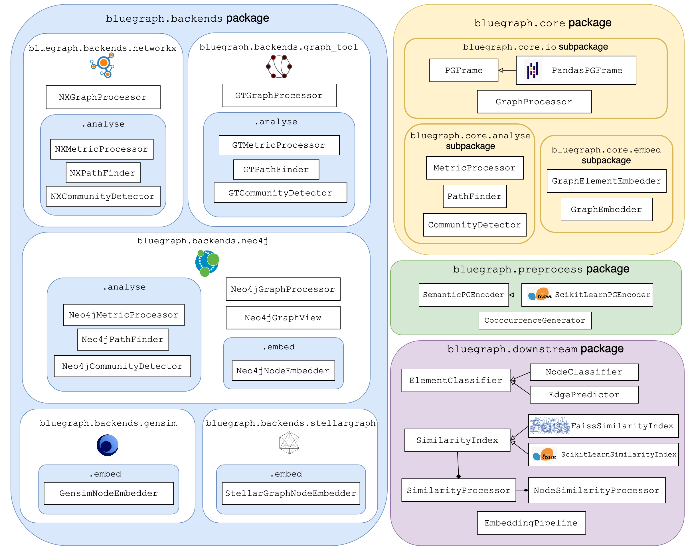

.. _bluegraph_api_ref:

BlueGraph API
================

:code:`bluegraph` package
---------------------------

BlueGraph's API is built upon 4 main packages:

- :ref:`bluegraph_core_ref` provides the exchange data structure for graph representation that serves as the input to graph processors based on different backends (`PGFrame`), as well as basic interfaces for different graph analytics and embedding classes (`MetricProcessor`, `PathFinder`, `CommunityDetector`, `GraphElementEmbedder`, etc).
- :ref:`bluegraph_backends_ref` collects implementation of various graph processing and analytics interfaces for different graph backends (for example, `NXPathFinder` for path search capabilities provided by NetworkX, `Neo4jCommunityDetector` for community detection methods provided by Neo4j, etc).
- :ref:`bluegraph_preprocess_ref` contains utils for preprocessing property graphs (e.g. `SemanticPGEncoder` for encoding node/edge properties as numerical vectors, `CooccurrenceGenerator` for generation and analysis of co-occurrence relations in PGFrames.)
- :ref:`bluegraph_downstream_ref` provides a set of utils for various downstream tasks based on vector representations of graphs and graph elements (for example, `NodeSimilarityProcessor` for building and querying node similarity indices based on vector representation of nodes, `EdgePredictor` for predicting true and false edges of the graph based on vector representation of its nodes, `EmbeddingPipeline` for stacking pipelines of graph preprocessing, embedding, similarity index building, etc).

Main components of BlueGraph's API are illustrated in the following diagram:

.. toctree::
   :glob:
   :titlesonly:

   packages/bluegraph_core_ref
   packages/bluegraph_backends_ref
   packages/bluegraph_preprocess_ref
   packages/bluegraph_downstream_ref

