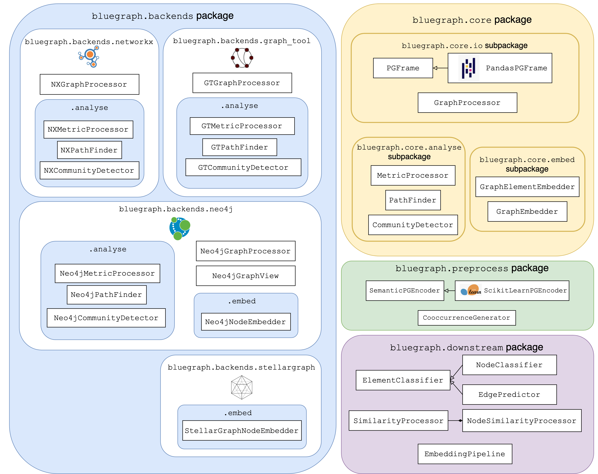

====================
vO.1.1 Release Notes
====================

Introducing Blue Graph
======================

This is an initial release of Blue Graph, a graph analytics framework for Python designed to unify different graph processing APIs. Its main goal is to provide a set of uniform APIs enabling users to peform graph analytics tasks abstracting away from the specificities of different graph processing tools, **backends**, and the graph data structures they provide. 

Using the built-in `PGFrame` data structure for representing **property graphs with node/edge types and property data types** as a 'data exchange layer' between different analytics interfaces, it provides a backend-agnostic API supporting both in-memory (`NetworkX <https://networkx.org/>`_, `graph-tool <https://graph-tool.skewed.de/>`_ and `StellarGraph <https://stellargraph.readthedocs.io/en/stable/>`_) and persistent graph backends (`Neo4j <https://neo4j.com/>`_).
 
It provides the following set of interfaces:

- preprocessing and co-occurrence analysis API providing semantic property encoders and co-occurrence graph generators;
- graph analytics API providing interfaces for computing graph metrics, performing path search and community detection;
- unsupervised representation learning API for applying various graph embedding techniques;
- representation learning downstream tasks API allowing the user to perform node classification, similarity queries, link prediction.

The main components of BlueGraph's API are illustrated in the following diagram:

Blue Graph's core
=================

The :code:`bluegraph.core` package provides the exchange graph data structure that serves as the input to graph processors based on different backends (:code:`PGFrame`), as well as basic interfaces for different graph analytics and embedding classes (:code:`MetricProcessor`, :code:`PathFinder`, :code:`CommunityDetector`, :code:`GraphElementEmbedder`, etc).

PGFrame
-------

This data structure represents property graphs with node/edge types and property data types. It is based on two dataframes: one for nodes, their types and properties as well as one for edges and their types/properties. Moreover, `PGFrame` supports setting data types to node/edge properties. Three high-level data types are currently supported: :code:`numeric` for numerical properties (for example, age), :code:`category` for properties representing categorical labels (for example, sex) and :code:`text` for representing textual properties (for example, description). 

This release includes a :code:`pandas`-based implementation (:code:`PandasPGFrame`) of the `PGFrame` data structure.

GraphProcessor
--------------

:code:`GraphProcessor` is a basic interface for accessing and manipulating different graph elements (nodes/edges/properties) of backend-specific graph objects. 

Graph preprocessing with BlueGraph
==================================

The :code:`bluegraph.preprocessing` package provides a set of utils for preprocessing `PGFrame` graph objects.

Co-occurrence generation
------------------------

The :code:`CooccurrenceGenerator` interface allows the user to examine a provided property graph for co-occurrences (based on its nodes or edges), generate co-occurrence edges, and compute the following statistics:

- co-occurrece factors,
- co-occurrence frequency,
- positive/normalized pointwise mutual information of the co-occurrence [4]_.

Semantic property encoding
--------------------------

The :code:`SemanticPGEncoder` interface allows the user to convert properties of nodes and edges into numerical vectors. Currently, `ScikitLearnPGEncoder` is implemented in Blue Graph.

The encoder object can be instantiated as in the following example:

.. code-block:: python

	encoder = ScikitLearnPGEncoder(node_properties, edge_properties,
	                               heterogeneous, drop_types,
	                               encode_types, edge_features,
	                               categorical_encoding,
	                               text_encoding,
	                               text_encoding_max_dimension,
	                               missing_numeric,
	                               imputation_strategy,
	                               standardize_numeric)

Where the following parameters can be specified:

- :code:`node_properties` a list of node property names to encode;
- :code:`edge_properties` a list of edge property names to encode;
- :code:`heterogeneous` a flag indicating if the feature space is heterogeneous accross different node/edge types;
- :code:`encode_types` a flag indicating if node/edge types should be included in the generated features;
- :code:`categorical_encoding` defines a strategy for encoding **categorical properties** (currently, `Multi Label Binarizer <https://scikit-learn.org/stable/modules/generated/sklearn.preprocessing.MultiLabelBinarizer.html>`_ is available);
- :code:`text_encoding` defines a strategy for encoding **text properties** (currently, `TfIdf <https://scikit-learn.org/stable/modules/generated/sklearn.feature_extraction.text.TfidfVectorizer.html>`_ and `Doc2Vec <https://radimrehurek.com/gensim/auto_examples/tutorials/run_doc2vec_lee.html>`_ encodings are available);
- :code:`missing_numeric` a strategy for treating missing **numeric property** values (dropping or imputing such values is possible);
- :code:`imputation_strategy` a strategy for imputing missing **numeric property** values (currently, only the mean imputation is available);
- :code:`standardize_numeric` a flag indicating if **numerical property** values should be standardized.

Backend support
===============

Blue Graph supports the following in-memory and persistent graph analytics tools (see :code:`bluegraph.backends`):

- `NetworkX <https://networkx.org/>`_ (for the analytics API)
- `graph-tool <https://graph-tool.skewed.de/>`_ (for the analytics API)
- `Neo4j <https://neo4j.com/>`_ (for the analytics and representation learning API);
- `StellarGraph <https://stellargraph.readthedocs.io/en/stable/>`_ (for the representation learning API).

NetworkX
--------

The NetworkX-based graph analytics interfaces implemented in Blue Graph can be found in :code:`bluegraph.backends.networkx`.

Conversion between :code:`PGFrame` and NetworkX graph objects can be done using :code:`pgframe_to_networkx` and :code:`networkx_to_pgframe`. :code:`NXGraphProcessor` allows accessing and manipulating graph elements of NetworkX graphs (:code:`bluegraph.backends.networkx.io`).

Graph metrics
~~~~~~~~~~~~~

The :code:`NXMetricsProcessor` interface supports the following graph metrics (all supporting unweighted and weighted graph edges):

- graph density,
- degree centrality,
- PageRank centrality,
- betweenness centrality,
- closeness centrality.

Writing centrality measures as node properties is available.

Path search
~~~~~~~~~~~~~

The :code:`NXPathFinder` interface supports the following path search tasks:

- minimum spanning tree (unweighted and weighted, in-place labeling of the tree edges is available),
- top neighbors by edge weight,
- single shortest path (unweighted and weighted, excluding direct edge is available),
- all shortest paths (excluding direct edge is available),
- top shortest paths (unweighted and weighted, excluding direct edge is available, Naive [1]_ and Yen [3]_ strategies are available)
- nested shortest paths [2]_ (unweighted and weighted, excluding direct edge is available, Naive and Yen strategies are available).

Community detection
~~~~~~~~~~~~~~~~~~~

The :code:`NXCommunityDetector` interface supports the following community detection methods (all supporting both weighted and unweighted graphs):

- Louvain algorithm (:code:`strategy="louvain"`)
- Girvan–Newman algorithm (:code:`strategy="girvan-newman"`)
- Label propagation (:code:`strategy="lpa"`)
- Hierarchical clustering (:code:`strategy="hierarchical"`, only for nodes with numerical features)

And supports the following partition quality metrics: modularity, performance, coverage.

Writing community labels as node properties is available.

graph-tool
----------

The graph-tool-based analytics interfaces implemented in Blue Graph can be found in :code:`bluegraph.backends.graph_tool`.

Conversion between :code:`PGFrame` and graph-tool objects can be done using :code:`pgframe_to_graph_tool` and :code:`graph_tool_to_pgframe`. :code:`GTGraphProcessor` allows accessing and manipulating graph elements of graph-tool graphs (:code:`bluegraph.backends.graph_tool.io`).

Graph metrics
~~~~~~~~~~~~~

The :code:`GTMetricsProcessor` interface supports the following graph metrics (all supporting unweighted and weighted graph edges):

- graph density,
- degree centrality,
- PageRank centrality,
- betweenness centrality,
- closeness centrality.

Writing centrality measures as node properties is available.

Path search
~~~~~~~~~~~

The :code:`GTPathFinder` interface supports the following path search tasks:

- minimum spanning tree (unweighted and weighted, in-place labeling of the tree edges is available),
- top neighbors by edge weight,
- single shortest path (unweighted and weighted, excluding direct edge is available),
- all shortest paths (excluding direct edge is available),
- top shortest paths (unweighted and weighted, excluding direct edge is available, only the Naive [1]_ strategy is available)
- nested shortest paths [2]_ (unweighted and weighted, excluding direct edge is available, the Naive strategy is available).

Community detection
~~~~~~~~~~~~~~~~~~~

The :code:`GTCommunityDetector` interface supports the following community detection methods (supporting both weighted and unweighted graphs):

- Statistical inference with Stochastic Block Models (:code:`strategy="sbm"`) [5]_,
- Hierarchical clustering (:code:`strategy="hierarchical"`, only for nodes with numerical features).

And supports the following partition quality metrics: modularity, performance, coverage.

Writing community labels as node properties is available.

Neo4j
-----

The Neo4j-based graph analytics interfaces implemented in Blue Graph can be found in :code:`bluegraph.backends.neo4j` and are based on the `Neo4j Graph Data Science Library <https://neo4j.com/product/graph-data-science-library/>`_ (version :code:`>= 1.5`).

A Neo4j database instance can be populated from a :code:`PGFrame` object using :code:`pgframe_to_neo4j` and a :code:`PGFrame` object can be read from a Neo4j database using :code:`neo4j_to_pgframe`. :code:`Neo4jGraphProcessor` allows accessing and manipulating graph elements of Neo4j graphs (:code:`bluegraph.backends.neo4j.io`).

Graph metrics
~~~~~~~~~~~~~

The :code:`Neo4jMetricsProcessor` interface supports the following graph metrics:

- graph density (unweighted and weighted),
- degree centrality (unweighted and weighted),
- PageRank centrality (unweighted and weighted),
- betweenness centrality (only unweighted),
- closeness centrality (only unweighted).

Writing centrality measures as node properties is available.

Path search
~~~~~~~~~~~

The :code:`Neo4jPathFinder` interface supports the following path search tasks:

- minimum spanning tree (unweighted and weighted, only in-place labeling of the tree edges is available),
- top neighbors by edge weight,
- single shortest path (unweighted and weighted, excluding direct edge is available),
- all shortest paths (excluding direct edge is available),
- top shortest paths (unweighted and weighted, excluding direct edge is available, only the Yen [3]_ strategy is available)
- nested shortest paths [2]_ (unweighted and weighted, excluding direct edge is available, only the Yen [3]_ strategy is available).

Community detection
~~~~~~~~~~~~~~~~~~~

The :code:`Neo4jCommunityDetector` interface supports the following community detection methods (all supporting both weighted and unweighted graphs):

- Louvain algorithm (:code:`strategy="louvain"`)
- Girvan–Newman algorithm (:code:`strategy="girvan-newman"`)
- Label propagation (:code:`strategy="lpa"`)
- Hierarchical clustering (:code:`strategy="hierarchical"`, only for nodes with numerical features)

And supports the following partition quality metrics: modularity, performance, coverage.

Writing community labels as node properties is available.

Node representation learning
~~~~~~~~~~~~~~~~~~~~~~~~~~~~

The :code:`Neo4jNodeEmbedder` interface supports the following unsupervised node representation models:

- node2vec (transductive, only unweighted version),
- FastRP (transductive),
- GraphSAGE (inductive, model is saved in a model catalog of the current Neo4j instance).

StellarGraph
------------

The StellarGraph-based graph representation learning interfaces implemented in Blue Graph can be found in :code:`bluegraph.backends.stellargraph`.

Conversion between :code:`PGFrame` and StellarGraph objects can be done using :code:`pgframe_to_stellargraph` and :code:`stellargraph_to_pgframe` (:code:`bluegraph.backends.stellargraph.io`).

Node representation learning
~~~~~~~~~~~~~~~~~~~~~~~~~~~~

The :code:`StellarGraphNodeEmbedder` interface supports the following unsupervised node representation models:

- node2vec (transductive, based on `this demo <https://stellargraph.readthedocs.io/en/stable/demos/embeddings/keras-node2vec-embeddings.html>`__),
- Watch Your Step (transductive, based on `this demo <https://stellargraph.readthedocs.io/en/stable/demos/embeddings/watch-your-step-embeddings.html>`__),
- Deep Graph Infomax GCN, GAT, GraphSAGE (transductive, based on `this demo <https://stellargraph.readthedocs.io/en/stable/demos/embeddings/deep-graph-infomax-embeddings.html>`__),
- attri2vec (inductive, based on `this demo <https://stellargraph.readthedocs.io/en/stable/demos/embeddings/deep-graph-infomax-embeddings.html>`__),
- attri2vec (inductive, based on `this demo <https://stellargraph.readthedocs.io/en/stable/demos/embeddings/attri2vec-embeddings.html>`__),
- GraphSAGE (inductive, based on `this demo <https://stellargraph.readthedocs.io/en/stable/demos/embeddings/graphsage-unsupervised-sampler-embeddings.html>`__),
- Deep Graph Infomax GCN & GAT with Cluster-GCN training procedure (inductive, based on `this demo <https://stellargraph.readthedocs.io/en/stable/demos/embeddings/deep-graph-infomax-embeddings.html>`__).

Downstream tasks with BlueGraph
===============================

Node classification API
-----------------------

The :code:`NodeClassifier` interface provides a wrapper allowing to build classification models of PGFrame nodes.

The classifier object can be instantiated as in the following example:

.. code-block:: python
	
	classifier = NodeClassifier(model, feature_vector_prop, feature_props, **kwargs)

Where the following parameters can be specified:

- :code:`model` a classification model object that supports two methods :code:`model.fit(data, labels)` and :code:`model.fit(data)` (for example, `LinearSVC <https://scikit-learn.org/stable/modules/generated/sklearn.svm.LinearSVC.html>`_);
- :code:`feature_vector_prop` name of the feature vector property to use;
- :code:`feature_props` a list of property names (all must be numeric) to concatenate in order to obtain the node feature vectors.

Edge prediction API
-------------------

The :code:`EdgePredictor` interface provides a wrapper allowing for building edge prediction models for PGFrame graphs. Such models allow the user to discriminate between 'true' and 'false' edges based on embedding vectors of their source and target nodes.

The classifier object can be instantiated as in the following example:

.. code-block:: python
	
	classifier = EdgePredictor(model, feature_vector_prop, feature_props, operator, directed)

Where the following parameters can be specified:

- :code:`model` a classification model object that supports two methods :code:`model.fit(data, labels)` and :code:`model.fit(data)` (for example, `LinearSVC <https://scikit-learn.org/stable/modules/generated/sklearn.svm.LinearSVC.html>`_);
- :code:`feature_vector_prop` name of the node feature vector property to use;
- :code:`feature_props` a list of property names (all must be numeric) to concatenate in order to obtain the node feature vectors;
- :code:`operator` binary operator to apply on the embedding vectors of source and target nodes (available operators, "hadamard", "l1", "l2" and "average").

The :code:`generate_negative_edges` util allows the user to generate 'fake' edges given a graph (that can be used for training an :code:`EdgePredictor`).

Similarity API
--------------

The :code:`SimilarityProcessor` interface allows building vector similarity indices using the `Faiss Library <https://github.com/facebookresearch/faiss>`_. It wraps the indices (names or IDs) of the points, vector space and similarity measure configurations. It also allows segmenting the search space into Voronoi cells (see `this example <https://github.com/facebookresearch/faiss/wiki/Faster-search>`_) allowing to speed up the search.

The :code:`NodeSimilarityProcessor` is another wrapper that provides a higher-level abstraction to :code:`SimilarityProcessor` and allows building and querying **node** similarity indices using Faiss. It wraps the underlying graph object and the vector similarity processor and provides an interface for querying similar nodes.

Building embedding pipelines
----------------------------

:code:`EmbeddingPipeline` allows chaining the following steps and respective components:

- property encoding (optional),
- embedding model training (and prediction),
- similarity index training (and querying).

Such embedding pipelines can also be saved and loaded.

Appendix
--------

.. [1] **Naive strategy for finding top shortest paths**: the strategy first finds the set of all shortest paths from the source to the target node, it then ranks them by the cumulative distance score and returns n best paths. This naive strategy performs better for highly dense graphs (where every node is connected to almost every other node). Note, that if there are less than n unweighted shortest paths in the graph, the naive strategy may return less than n paths.

.. [2] **Nested shortest paths**: nested paths are found iteratively for each level of depth. For example, if `e1 <-> e2 <-> ... <-> eN` is a path on the current level of depth, then the function searches for paths between each consecutive pair of nodes (e1 and 	e2, e2 and e3, etc.).

.. [3] **Yen's k-shortest paths search algorithm**: see Yen, Jin Y. "Finding the k shortest loopless paths in a network". Management Science 17.11 (1971): 712-716.

.. [4] **Pointwise mutual information**: see Bouma, Gerlof. "Normalized (pointwise) mutual information in collocation extraction." Proceedings of GSCL (2009): 31-40.

.. [5] https://graph-tool.skewed.de/static/doc/demos/inference/inference.html
