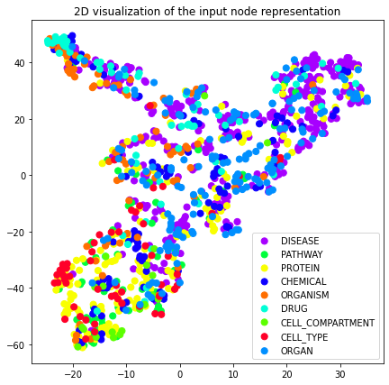
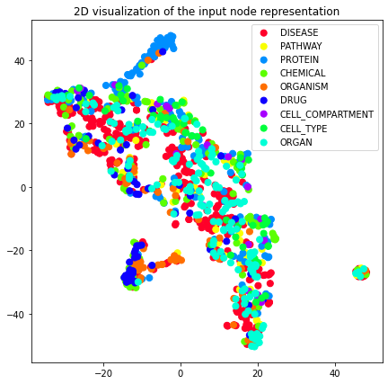
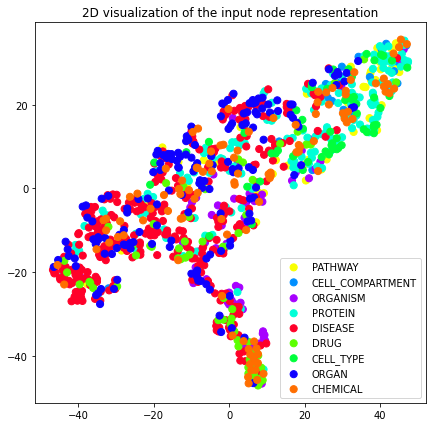
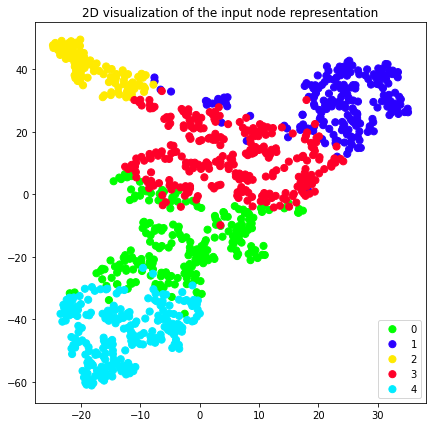
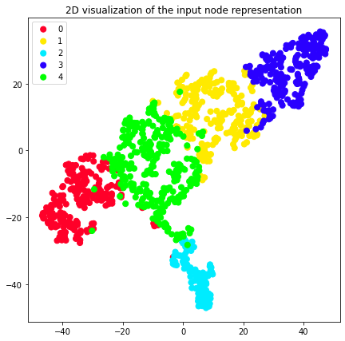
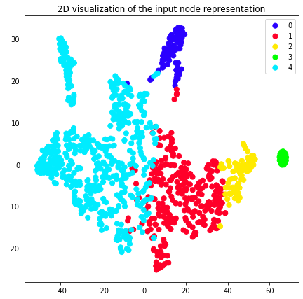

.. _embedding_tutorial:

Embedding and downstream tasks tutorial
=======================================

This tutorial illustrates an example of a co-occurrence graph and guides the user through the graph representation learning and all it's downstream tasks including node similarity queries, node classification, edge prediction and embedding pipeline building. The source notebook can be found `here <https://github.com/BlueBrain/BlueGraph/blob/master/examples/notebooks/Embedding%20and%20downstream%20tasks%20tutorial.ipynb>`_.

.. code:: ipython3

    import pandas as pd
    import numpy as np
    
    from sklearn import model_selection
    from sklearn.svm import LinearSVC
    
    from bluegraph.core import PandasPGFrame
    from bluegraph.preprocess.generators import CooccurrenceGenerator
    from bluegraph.preprocess.encoders import ScikitLearnPGEncoder
    
    from bluegraph.core.embed.embedders import GraphElementEmbedder
    from bluegraph.backends.stellargraph import StellarGraphNodeEmbedder
    
    from bluegraph.downstream import EmbeddingPipeline, transform_to_2d, plot_2d, get_classification_scores
    from bluegraph.downstream.similarity import (SimilarityProcessor, NodeSimilarityProcessor)
    from bluegraph.downstream.node_classification import NodeClassifier
    from bluegraph.downstream.link_prediction import (generate_negative_edges,
                                                      EdgePredictor)

Data preparation
----------------

Fist, we read the source dataset with mentions of entities in different
paragraphs

.. code:: ipython3

    mentions = pd.read_csv("../data/labeled_entity_occurrence.csv")

.. code:: ipython3

    # Extract unique paper/seciton/paragraph identifiers
    mentions = mentions.rename(columns={"occurrence": "paragraph"})
    number_of_paragraphs = len(mentions["paragraph"].unique())

.. code:: ipython3

    mentions

.. raw:: html

    

    
    <table border="1" class="dataframe">
      <thead>
        <tr style="text-align: right;">
          <th></th>
          <th>entity</th>
          <th>paragraph</th>
        </tr>
      </thead>
      <tbody>
        <tr>
          <th>0</th>
          <td>lithostathine-1-alpha</td>
          <td>1</td>
        </tr>
        <tr>
          <th>1</th>
          <td>pulmonary</td>
          <td>1</td>
        </tr>
        <tr>
          <th>2</th>
          <td>host</td>
          <td>1</td>
        </tr>
        <tr>
          <th>3</th>
          <td>lithostathine-1-alpha</td>
          <td>2</td>
        </tr>
        <tr>
          <th>4</th>
          <td>surfactant protein d measurement</td>
          <td>2</td>
        </tr>
        <tr>
          <th>...</th>
          <td>...</td>
          <td>...</td>
        </tr>
        <tr>
          <th>2281346</th>
          <td>covid-19</td>
          <td>227822</td>
        </tr>
        <tr>
          <th>2281347</th>
          <td>covid-19</td>
          <td>227822</td>
        </tr>
        <tr>
          <th>2281348</th>
          <td>viral infection</td>
          <td>227823</td>
        </tr>
        <tr>
          <th>2281349</th>
          <td>lipid</td>
          <td>227823</td>
        </tr>
        <tr>
          <th>2281350</th>
          <td>inflammation</td>
          <td>227823</td>
        </tr>
      </tbody>
    </table>
    
2281351 rows × 2 columns

    

We will also load a dataset that contains definitions of entities and
their types

.. code:: ipython3

    entity_data = pd.read_csv("../data/entity_types_defs.csv")

.. code:: ipython3

    entity_data

.. raw:: html

    

    
    <table border="1" class="dataframe">
      <thead>
        <tr style="text-align: right;">
          <th></th>
          <th>entity</th>
          <th>entity_type</th>
          <th>definition</th>
        </tr>
      </thead>
      <tbody>
        <tr>
          <th>0</th>
          <td>(e3-independent) e2 ubiquitin-conjugating enzyme</td>
          <td>PROTEIN</td>
          <td>(E3-independent) E2 ubiquitin-conjugating enzy...</td>
        </tr>
        <tr>
          <th>1</th>
          <td>(h115d)vhl35 peptide</td>
          <td>CHEMICAL</td>
          <td>A peptide vaccine derived from the von Hippel-...</td>
        </tr>
        <tr>
          <th>2</th>
          <td>1,1-dimethylhydrazine</td>
          <td>DRUG</td>
          <td>A clear, colorless, flammable, hygroscopic liq...</td>
        </tr>
        <tr>
          <th>3</th>
          <td>1,2-dimethylhydrazine</td>
          <td>CHEMICAL</td>
          <td>A compound used experimentally to induce tumor...</td>
        </tr>
        <tr>
          <th>4</th>
          <td>1,25-dihydroxyvitamin d(3) 24-hydroxylase, mit...</td>
          <td>PROTEIN</td>
          <td>1,25-dihydroxyvitamin D(3) 24-hydroxylase, mit...</td>
        </tr>
        <tr>
          <th>...</th>
          <td>...</td>
          <td>...</td>
          <td>...</td>
        </tr>
        <tr>
          <th>28127</th>
          <td>zygomycosis</td>
          <td>DISEASE</td>
          <td>Any infection due to a fungus of the Zygomycot...</td>
        </tr>
        <tr>
          <th>28128</th>
          <td>zygomycota</td>
          <td>ORGANISM</td>
          <td>A phylum of fungi that are characterized by ve...</td>
        </tr>
        <tr>
          <th>28129</th>
          <td>zygosity</td>
          <td>ORGANISM</td>
          <td>The genetic condition of a zygote, especially ...</td>
        </tr>
        <tr>
          <th>28130</th>
          <td>zygote</td>
          <td>CELL_COMPARTMENT</td>
          <td>The cell formed by the union of two gametes, e...</td>
        </tr>
        <tr>
          <th>28131</th>
          <td>zyxin</td>
          <td>ORGANISM</td>
          <td>Zyxin (572 aa, ~61 kDa) is encoded by the huma...</td>
        </tr>
      </tbody>
    </table>
    
28132 rows × 3 columns

    

Generation of a co-occurrence graph
~~~~~~~~~~~~~~~~~~~~~~~~~~~~~~~~~~~

We first create a graph whose nodes are entities

.. code:: ipython3

    graph = PandasPGFrame()
    entity_nodes = mentions["entity"].unique()
    graph.add_nodes(entity_nodes)
    graph.add_node_types({n: "Entity" for n in entity_nodes})
    
    entity_props = entity_data.rename(columns={"entity": "@id"}).set_index("@id")
    graph.add_node_properties(entity_props["entity_type"], prop_type="category")
    graph.add_node_properties(entity_props["definition"], prop_type="text")

.. code:: ipython3

    paragraph_prop = pd.DataFrame({"paragraphs": mentions.groupby("entity").aggregate(set)["paragraph"]})
    graph.add_node_properties(paragraph_prop, prop_type="category")

.. code:: ipython3

    graph.nodes(raw_frame=True)

.. raw:: html

    

    
    <table border="1" class="dataframe">
      <thead>
        <tr style="text-align: right;">
          <th></th>
          <th>@type</th>
          <th>entity_type</th>
          <th>definition</th>
          <th>paragraphs</th>
        </tr>
        <tr>
          <th>@id</th>
          <th></th>
          <th></th>
          <th></th>
          <th></th>
        </tr>
      </thead>
      <tbody>
        <tr>
          <th>lithostathine-1-alpha</th>
          <td>Entity</td>
          <td>PROTEIN</td>
          <td>Lithostathine-1-alpha (166 aa, ~19 kDa) is enc...</td>
          <td>{1, 2, 3, 18178, 195589, 104454, 88967, 104455...</td>
        </tr>
        <tr>
          <th>pulmonary</th>
          <td>Entity</td>
          <td>ORGAN</td>
          <td>Relating to the lungs as the intended site of ...</td>
          <td>{1, 196612, 196613, 196614, 196621, 196623, 16...</td>
        </tr>
        <tr>
          <th>host</th>
          <td>Entity</td>
          <td>ORGANISM</td>
          <td>An organism that nourishes and supports anothe...</td>
          <td>{1, 114689, 3, 221193, 180243, 180247, 28, 180...</td>
        </tr>
        <tr>
          <th>surfactant protein d measurement</th>
          <td>Entity</td>
          <td>PROTEIN</td>
          <td>The determination of the amount of surfactant ...</td>
          <td>{145537, 2, 3, 4, 5, 6, 51202, 103939, 103940,...</td>
        </tr>
        <tr>
          <th>communication response</th>
          <td>Entity</td>
          <td>PATHWAY</td>
          <td>A statement (either spoken or written) that is...</td>
          <td>{46592, 64000, 2, 28162, 166912, 226304, 88585...</td>
        </tr>
        <tr>
          <th>...</th>
          <td>...</td>
          <td>...</td>
          <td>...</td>
          <td>...</td>
        </tr>
        <tr>
          <th>drug binding site</th>
          <td>Entity</td>
          <td>PATHWAY</td>
          <td>The reactive parts of a macromolecule that dir...</td>
          <td>{225082, 225079}</td>
        </tr>
        <tr>
          <th>carbaril</th>
          <td>Entity</td>
          <td>CHEMICAL</td>
          <td>A synthetic carbamate acetylcholinesterase inh...</td>
          <td>{225408, 225409, 225415, 225419, 225397}</td>
        </tr>
        <tr>
          <th>ny-eso-1 positive tumor cells present</th>
          <td>Entity</td>
          <td>CELL_TYPE</td>
          <td>An indication that Cancer/Testis Antigen 1 exp...</td>
          <td>{225544, 226996}</td>
        </tr>
        <tr>
          <th>mustelidae</th>
          <td>Entity</td>
          <td>ORGANISM</td>
          <td>Taxonomic family which includes the Ferret.</td>
          <td>{225901, 225903}</td>
        </tr>
        <tr>
          <th>friulian language</th>
          <td>Entity</td>
          <td>ORGANISM</td>
          <td>An Indo-European Romance language spoken in th...</td>
          <td>{225901, 225903}</td>
        </tr>
      </tbody>
    </table>
    
17989 rows × 4 columns

    

For each node we will add the ``frequency`` property that counts the
total number of paragraphs where the entity was mentioned.

.. code:: ipython3

    frequencies = graph._nodes["paragraphs"].apply(len)
    frequencies.name = "frequency"
    graph.add_node_properties(frequencies)

.. code:: ipython3

    graph.nodes(raw_frame=True)

.. raw:: html

    

    
    <table border="1" class="dataframe">
      <thead>
        <tr style="text-align: right;">
          <th></th>
          <th>@type</th>
          <th>entity_type</th>
          <th>definition</th>
          <th>paragraphs</th>
          <th>frequency</th>
        </tr>
        <tr>
          <th>@id</th>
          <th></th>
          <th></th>
          <th></th>
          <th></th>
          <th></th>
        </tr>
      </thead>
      <tbody>
        <tr>
          <th>lithostathine-1-alpha</th>
          <td>Entity</td>
          <td>PROTEIN</td>
          <td>Lithostathine-1-alpha (166 aa, ~19 kDa) is enc...</td>
          <td>{1, 2, 3, 18178, 195589, 104454, 88967, 104455...</td>
          <td>80</td>
        </tr>
        <tr>
          <th>pulmonary</th>
          <td>Entity</td>
          <td>ORGAN</td>
          <td>Relating to the lungs as the intended site of ...</td>
          <td>{1, 196612, 196613, 196614, 196621, 196623, 16...</td>
          <td>8295</td>
        </tr>
        <tr>
          <th>host</th>
          <td>Entity</td>
          <td>ORGANISM</td>
          <td>An organism that nourishes and supports anothe...</td>
          <td>{1, 114689, 3, 221193, 180243, 180247, 28, 180...</td>
          <td>2660</td>
        </tr>
        <tr>
          <th>surfactant protein d measurement</th>
          <td>Entity</td>
          <td>PROTEIN</td>
          <td>The determination of the amount of surfactant ...</td>
          <td>{145537, 2, 3, 4, 5, 6, 51202, 103939, 103940,...</td>
          <td>268</td>
        </tr>
        <tr>
          <th>communication response</th>
          <td>Entity</td>
          <td>PATHWAY</td>
          <td>A statement (either spoken or written) that is...</td>
          <td>{46592, 64000, 2, 28162, 166912, 226304, 88585...</td>
          <td>160</td>
        </tr>
        <tr>
          <th>...</th>
          <td>...</td>
          <td>...</td>
          <td>...</td>
          <td>...</td>
          <td>...</td>
        </tr>
        <tr>
          <th>drug binding site</th>
          <td>Entity</td>
          <td>PATHWAY</td>
          <td>The reactive parts of a macromolecule that dir...</td>
          <td>{225082, 225079}</td>
          <td>2</td>
        </tr>
        <tr>
          <th>carbaril</th>
          <td>Entity</td>
          <td>CHEMICAL</td>
          <td>A synthetic carbamate acetylcholinesterase inh...</td>
          <td>{225408, 225409, 225415, 225419, 225397}</td>
          <td>5</td>
        </tr>
        <tr>
          <th>ny-eso-1 positive tumor cells present</th>
          <td>Entity</td>
          <td>CELL_TYPE</td>
          <td>An indication that Cancer/Testis Antigen 1 exp...</td>
          <td>{225544, 226996}</td>
          <td>2</td>
        </tr>
        <tr>
          <th>mustelidae</th>
          <td>Entity</td>
          <td>ORGANISM</td>
          <td>Taxonomic family which includes the Ferret.</td>
          <td>{225901, 225903}</td>
          <td>2</td>
        </tr>
        <tr>
          <th>friulian language</th>
          <td>Entity</td>
          <td>ORGANISM</td>
          <td>An Indo-European Romance language spoken in th...</td>
          <td>{225901, 225903}</td>
          <td>2</td>
        </tr>
      </tbody>
    </table>
    
17989 rows × 5 columns

    

Now, for constructing co-occurrence network we will select only 1000
most frequent entities.

.. code:: ipython3

    nodes_to_include = graph._nodes.nlargest(1000, "frequency").index

.. code:: ipython3

    nodes_to_include

.. parsed-literal::

    Index(['covid-19', 'blood', 'human', 'infectious disorder', 'heart',
           'diabetes mellitus', 'lung', 'sars-cov-2', 'mouse', 'pulmonary',
           ...
           'wheezing', 'chief complaint', 'azathioprine', 'ileum', 'hematology',
           'nonalcoholic steatohepatitis', 'nervous system disorder',
           'renal impairment', 'urticaria', 'rectum'],
          dtype='object', name='@id', length=1000)

The ``CooccurrenceGenerator`` class allows us to generate co-occurrence
edges from overlaps in node property values or edge (or edge
properties). In this case we consider the ``paragraph`` node property
and construct co-occurrence edges from overlapping sets of paragraphs.
In addition, we will compute some co-occurrence statistics: total
co-occurrence frequency and normalized pointwise mutual information
(NPMI).

.. code:: ipython3

    %%time
    generator = CooccurrenceGenerator(graph.subgraph(nodes=nodes_to_include))
    paragraph_cooccurrence_edges = generator.generate_from_nodes(
        "paragraphs", total_factor_instances=number_of_paragraphs,
        compute_statistics=["frequency", "npmi"],
        parallelize=True, cores=8)

.. parsed-literal::

    Examining 499500 pairs of terms for co-occurrence...
    CPU times: user 8.08 s, sys: 2.39 s, total: 10.5 s
    Wall time: 1min 29s

.. code:: ipython3

    cutoff = paragraph_cooccurrence_edges["npmi"].mean()

.. code:: ipython3

    paragraph_cooccurrence_edges = paragraph_cooccurrence_edges[paragraph_cooccurrence_edges["npmi"] > cutoff]

We add generated edges to the original graph

.. code:: ipython3

    graph._edges = paragraph_cooccurrence_edges
    graph.edge_prop_as_numeric("frequency")
    graph.edge_prop_as_numeric("npmi")

.. code:: ipython3

    graph.edges(raw_frame=True)

.. raw:: html

    

    
    <table border="1" class="dataframe">
      <thead>
        <tr style="text-align: right;">
          <th></th>
          <th></th>
          <th>common_factors</th>
          <th>frequency</th>
          <th>npmi</th>
        </tr>
        <tr>
          <th>@source_id</th>
          <th>@target_id</th>
          <th></th>
          <th></th>
          <th></th>
        </tr>
      </thead>
      <tbody>
        <tr>
          <th rowspan="5" valign="top">surfactant protein d measurement</th>
          <th>microorganism</th>
          <td>{2, 3, 7810, 58, 41, 7754, 7850, 26218, 7853, ...</td>
          <td>19</td>
          <td>0.235263</td>
        </tr>
        <tr>
          <th>lung</th>
          <td>{2, 103939, 51202, 5, 4, 103940, 15, 145438, 3...</td>
          <td>93</td>
          <td>0.221395</td>
        </tr>
        <tr>
          <th>alveolar</th>
          <td>{223872, 2, 51202, 100502, 7831, 149657, 19522...</td>
          <td>25</td>
          <td>0.336175</td>
        </tr>
        <tr>
          <th>epithelial cell</th>
          <td>{2, 4, 5, 222298, 7825, 7732, 7733, 169174, 7738}</td>
          <td>9</td>
          <td>0.175923</td>
        </tr>
        <tr>
          <th>molecule</th>
          <td>{2, 7750, 49991, 134504, 206448, 49, 52, 20645...</td>
          <td>10</td>
          <td>0.113611</td>
        </tr>
        <tr>
          <th>...</th>
          <th>...</th>
          <td>...</td>
          <td>...</td>
          <td>...</td>
        </tr>
        <tr>
          <th rowspan="2" valign="top">severe acute respiratory syndrome</th>
          <th>caax prenyl protease 2</th>
          <td>{205345, 185829, 227486, 220124, 220126}</td>
          <td>5</td>
          <td>0.142611</td>
        </tr>
        <tr>
          <th>transmembrane protease serine 2</th>
          <td>{223746, 223747, 167301, 223752, 200971, 22375...</td>
          <td>21</td>
          <td>0.238160</td>
        </tr>
        <tr>
          <th rowspan="3" valign="top">ciliated bronchial epithelial cell</th>
          <th>cystic fibrosis pulmonary exacerbation</th>
          <td>{46779}</td>
          <td>1</td>
          <td>0.088963</td>
        </tr>
        <tr>
          <th>caax prenyl protease 2</th>
          <td>{215748, 220047}</td>
          <td>2</td>
          <td>0.151639</td>
        </tr>
        <tr>
          <th>transmembrane protease serine 2</th>
          <td>{167360, 167358, 167301, 214566, 214567, 16138...</td>
          <td>14</td>
          <td>0.305697</td>
        </tr>
      </tbody>
    </table>
    
161332 rows × 3 columns

    

Recall that we have generated edges only for the 1000 most frequent
entities, the rest of the entities will be isolated (having no incident
edges). Let us remove all the isolated nodes.

.. code:: ipython3

    graph.remove_isolated_nodes()

.. code:: ipython3

    graph.number_of_nodes()

.. parsed-literal::

    1000

Next, we save the generated co-occurrence graph.

.. code:: ipython3

    graph.export_json("../data/cooccurrence_graph.json")

.. code:: ipython3

    graph = PandasPGFrame.load_json("../data/cooccurrence_graph.json")

Node feature extraction
~~~~~~~~~~~~~~~~~~~~~~~

We extract node features from entity definitions using the ``tfidf``
model.

.. code:: ipython3

    encoder = ScikitLearnPGEncoder(
        node_properties=["definition"],
        text_encoding_max_dimension=512)

.. code:: ipython3

    %%time
    transformed_graph = encoder.fit_transform(graph)

.. parsed-literal::

    CPU times: user 763 ms, sys: 16.5 ms, total: 780 ms
    Wall time: 781 ms

We can have a glance at the vocabulary that the encoder constructed for
the ‘definition’ property

.. code:: ipython3

    vocabulary = encoder._node_encoders["definition"].vocabulary_
    list(vocabulary.keys())[:10]

.. parsed-literal::

    ['relating',
     'lungs',
     'site',
     'administration',
     'product',
     'usually',
     'action',
     'lower',
     'respiratory',
     'tract']

We will add additional properties to our transformed graph corresponding
to the entity type labels. We will also add NPMI as an edge property to
this transformed graph.

.. code:: ipython3

    transformed_graph.add_node_properties(
        graph.get_node_property_values("entity_type"))
    transformed_graph.add_edge_properties(
        graph.get_edge_property_values("npmi"), prop_type="numeric")

.. code:: ipython3

    transformed_graph.nodes(raw_frame=True)

.. raw:: html

    

    
    <table border="1" class="dataframe">
      <thead>
        <tr style="text-align: right;">
          <th></th>
          <th>features</th>
          <th>@type</th>
          <th>entity_type</th>
        </tr>
        <tr>
          <th>@id</th>
          <th></th>
          <th></th>
          <th></th>
        </tr>
      </thead>
      <tbody>
        <tr>
          <th>pulmonary</th>
          <td>[0.0, 0.0, 0.0, 0.0, 0.0, 0.0, 0.0, 0.0, 0.0, ...</td>
          <td>Entity</td>
          <td>ORGAN</td>
        </tr>
        <tr>
          <th>host</th>
          <td>[0.0, 0.0, 0.0, 0.0, 0.0, 0.0, 0.0, 0.0, 0.0, ...</td>
          <td>Entity</td>
          <td>ORGANISM</td>
        </tr>
        <tr>
          <th>surfactant protein d measurement</th>
          <td>[0.0, 0.0, 0.0, 0.0, 0.0, 0.0, 0.0, 0.0, 0.0, ...</td>
          <td>Entity</td>
          <td>PROTEIN</td>
        </tr>
        <tr>
          <th>microorganism</th>
          <td>[0.0, 0.0, 0.0, 0.0, 0.0, 0.0, 0.0, 0.0, 0.0, ...</td>
          <td>Entity</td>
          <td>ORGANISM</td>
        </tr>
        <tr>
          <th>lung</th>
          <td>[0.0, 0.0, 0.0, 0.0, 0.0, 0.0, 0.0, 0.0, 0.0, ...</td>
          <td>Entity</td>
          <td>ORGAN</td>
        </tr>
        <tr>
          <th>...</th>
          <td>...</td>
          <td>...</td>
          <td>...</td>
        </tr>
        <tr>
          <th>candida parapsilosis</th>
          <td>[0.0, 0.0, 0.0, 0.0, 0.0, 0.0, 0.0, 0.0, 0.0, ...</td>
          <td>Entity</td>
          <td>ORGANISM</td>
        </tr>
        <tr>
          <th>ciliated bronchial epithelial cell</th>
          <td>[0.0, 0.0, 0.0, 0.0, 0.0, 0.0, 0.0, 0.0, 0.0, ...</td>
          <td>Entity</td>
          <td>CELL_TYPE</td>
        </tr>
        <tr>
          <th>cystic fibrosis pulmonary exacerbation</th>
          <td>[0.0, 0.0, 0.0, 0.0, 0.0, 0.0, 0.0, 0.0, 0.0, ...</td>
          <td>Entity</td>
          <td>DISEASE</td>
        </tr>
        <tr>
          <th>caax prenyl protease 2</th>
          <td>[0.0, 0.0, 0.3198444339599345, 0.0, 0.0, 0.0, ...</td>
          <td>Entity</td>
          <td>PROTEIN</td>
        </tr>
        <tr>
          <th>transmembrane protease serine 2</th>
          <td>[0.0, 0.0, 0.2853086240289885, 0.0, 0.0, 0.0, ...</td>
          <td>Entity</td>
          <td>PROTEIN</td>
        </tr>
      </tbody>
    </table>
    
1000 rows × 3 columns

    

Node embedding and downstream tasks
-----------------------------------

Node embedding using StellarGraph
~~~~~~~~~~~~~~~~~~~~~~~~~~~~~~~~~

Using ``StellarGraphNodeEmbedder`` we construct three different
embeddings of our transformed graph corresponding to different embedding
techniques.

.. code:: ipython3

    node2vec_embedder = StellarGraphNodeEmbedder(
        "node2vec", edge_weight="npmi", embedding_dimension=64, length=10, number_of_walks=20)
    node2vec_embedding = node2vec_embedder.fit_model(transformed_graph)

.. code:: ipython3

    attri2vec_embedder = StellarGraphNodeEmbedder(
        "attri2vec", feature_vector_prop="features",
        length=5, number_of_walks=10,
        epochs=10, embedding_dimension=128, edge_weight="npmi")
    attri2vec_embedding = attri2vec_embedder.fit_model(transformed_graph)

.. parsed-literal::

    link_classification: using 'ip' method to combine node embeddings into edge embeddings

.. code:: ipython3

    gcn_dgi_embedder = StellarGraphNodeEmbedder(
        "gcn_dgi", feature_vector_prop="features", epochs=250, embedding_dimension=512)
    gcn_dgi_embedding = gcn_dgi_embedder.fit_model(transformed_graph)

.. parsed-literal::

    Using GCN (local pooling) filters...

The ``fit_model`` method produces a dataframe of the following shape

.. code:: ipython3

    node2vec_embedding

.. raw:: html

    

    
    <table border="1" class="dataframe">
      <thead>
        <tr style="text-align: right;">
          <th></th>
          <th>embedding</th>
        </tr>
      </thead>
      <tbody>
        <tr>
          <th>pulmonary</th>
          <td>[-0.0267185028642416, 0.12179452925920486, 0.3...</td>
        </tr>
        <tr>
          <th>host</th>
          <td>[0.29223915934562683, -0.03492278978228569, -0...</td>
        </tr>
        <tr>
          <th>surfactant protein d measurement</th>
          <td>[0.22007207572460175, -0.10403415560722351, 0....</td>
        </tr>
        <tr>
          <th>microorganism</th>
          <td>[0.44575220346450806, 0.23855045437812805, 0.0...</td>
        </tr>
        <tr>
          <th>lung</th>
          <td>[0.14752529561519623, -0.012554896995425224, 0...</td>
        </tr>
        <tr>
          <th>...</th>
          <td>...</td>
        </tr>
        <tr>
          <th>candida parapsilosis</th>
          <td>[0.24093332886695862, 0.26452910900115967, 0.2...</td>
        </tr>
        <tr>
          <th>ciliated bronchial epithelial cell</th>
          <td>[0.34408074617385864, -0.10590770095586777, -0...</td>
        </tr>
        <tr>
          <th>cystic fibrosis pulmonary exacerbation</th>
          <td>[0.1874609738588333, 0.10671538859605789, 0.15...</td>
        </tr>
        <tr>
          <th>caax prenyl protease 2</th>
          <td>[0.12152642756700516, -0.1140185073018074, 0.0...</td>
        </tr>
        <tr>
          <th>transmembrane protease serine 2</th>
          <td>[0.24554236233234406, -0.15642617642879486, -0...</td>
        </tr>
      </tbody>
    </table>
    
1000 rows × 1 columns

    

Let us add the embedding vectors obtained using different models as node
properties of our graph.

.. code:: ipython3

    transformed_graph.add_node_properties(
        node2vec_embedding.rename(columns={"embedding": "node2vec"}))

.. code:: ipython3

    transformed_graph.add_node_properties(
        attri2vec_embedding.rename(columns={"embedding": "attri2vec"}))

.. code:: ipython3

    transformed_graph.add_node_properties(
        gcn_dgi_embedding.rename(columns={"embedding": "gcn_dgi"}))

.. code:: ipython3

    transformed_graph.nodes(raw_frame=True)

.. raw:: html

    

    
    <table border="1" class="dataframe">
      <thead>
        <tr style="text-align: right;">
          <th></th>
          <th>features</th>
          <th>@type</th>
          <th>entity_type</th>
          <th>node2vec</th>
          <th>attri2vec</th>
          <th>gcn_dgi</th>
        </tr>
        <tr>
          <th>@id</th>
          <th></th>
          <th></th>
          <th></th>
          <th></th>
          <th></th>
          <th></th>
        </tr>
      </thead>
      <tbody>
        <tr>
          <th>pulmonary</th>
          <td>[0.0, 0.0, 0.0, 0.0, 0.0, 0.0, 0.0, 0.0, 0.0, ...</td>
          <td>Entity</td>
          <td>ORGAN</td>
          <td>[-0.0267185028642416, 0.12179452925920486, 0.3...</td>
          <td>[0.05733078718185425, 0.01203194260597229, 0.0...</td>
          <td>[0.0, 0.023581763729453087, 0.0039869388565421...</td>
        </tr>
        <tr>
          <th>host</th>
          <td>[0.0, 0.0, 0.0, 0.0, 0.0, 0.0, 0.0, 0.0, 0.0, ...</td>
          <td>Entity</td>
          <td>ORGANISM</td>
          <td>[0.29223915934562683, -0.03492278978228569, -0...</td>
          <td>[0.11861100792884827, 0.03717246651649475, 0.0...</td>
          <td>[0.014181436970829964, 0.02308788150548935, 0....</td>
        </tr>
        <tr>
          <th>surfactant protein d measurement</th>
          <td>[0.0, 0.0, 0.0, 0.0, 0.0, 0.0, 0.0, 0.0, 0.0, ...</td>
          <td>Entity</td>
          <td>PROTEIN</td>
          <td>[0.22007207572460175, -0.10403415560722351, 0....</td>
          <td>[0.022555828094482422, 0.012120962142944336, 0...</td>
          <td>[0.014378657564520836, 0.018117913976311684, 0...</td>
        </tr>
        <tr>
          <th>microorganism</th>
          <td>[0.0, 0.0, 0.0, 0.0, 0.0, 0.0, 0.0, 0.0, 0.0, ...</td>
          <td>Entity</td>
          <td>ORGANISM</td>
          <td>[0.44575220346450806, 0.23855045437812805, 0.0...</td>
          <td>[0.2857934236526489, 0.06738367676734924, 0.04...</td>
          <td>[0.0, 0.03591851517558098, 0.01817336678504944...</td>
        </tr>
        <tr>
          <th>lung</th>
          <td>[0.0, 0.0, 0.0, 0.0, 0.0, 0.0, 0.0, 0.0, 0.0, ...</td>
          <td>Entity</td>
          <td>ORGAN</td>
          <td>[0.14752529561519623, -0.012554896995425224, 0...</td>
          <td>[0.03261128067970276, 0.013175904750823975, 0....</td>
          <td>[0.0, 0.02394128404557705, 0.00096351653337478...</td>
        </tr>
        <tr>
          <th>...</th>
          <td>...</td>
          <td>...</td>
          <td>...</td>
          <td>...</td>
          <td>...</td>
          <td>...</td>
        </tr>
        <tr>
          <th>candida parapsilosis</th>
          <td>[0.0, 0.0, 0.0, 0.0, 0.0, 0.0, 0.0, 0.0, 0.0, ...</td>
          <td>Entity</td>
          <td>ORGANISM</td>
          <td>[0.24093332886695862, 0.26452910900115967, 0.2...</td>
          <td>[0.5700308084487915, 0.10381141304969788, 0.04...</td>
          <td>[0.0, 0.0287627000361681, 0.011954414658248425...</td>
        </tr>
        <tr>
          <th>ciliated bronchial epithelial cell</th>
          <td>[0.0, 0.0, 0.0, 0.0, 0.0, 0.0, 0.0, 0.0, 0.0, ...</td>
          <td>Entity</td>
          <td>CELL_TYPE</td>
          <td>[0.34408074617385864, -0.10590770095586777, -0...</td>
          <td>[0.04814663529396057, 0.007427006959915161, 0....</td>
          <td>[0.015862038359045982, 0.021181784570217133, 0...</td>
        </tr>
        <tr>
          <th>cystic fibrosis pulmonary exacerbation</th>
          <td>[0.0, 0.0, 0.0, 0.0, 0.0, 0.0, 0.0, 0.0, 0.0, ...</td>
          <td>Entity</td>
          <td>DISEASE</td>
          <td>[0.1874609738588333, 0.10671538859605789, 0.15...</td>
          <td>[0.17152228951454163, 0.06249934434890747, 0.0...</td>
          <td>[0.0, 0.021716605871915817, 0.0115924431011080...</td>
        </tr>
        <tr>
          <th>caax prenyl protease 2</th>
          <td>[0.0, 0.0, 0.3198444339599345, 0.0, 0.0, 0.0, ...</td>
          <td>Entity</td>
          <td>PROTEIN</td>
          <td>[0.12152642756700516, -0.1140185073018074, 0.0...</td>
          <td>[0.005792677402496338, 0.00861203670501709, 0....</td>
          <td>[0.0, 0.022432465106248856, 0.0, 0.01220933441...</td>
        </tr>
        <tr>
          <th>transmembrane protease serine 2</th>
          <td>[0.0, 0.0, 0.2853086240289885, 0.0, 0.0, 0.0, ...</td>
          <td>Entity</td>
          <td>PROTEIN</td>
          <td>[0.24554236233234406, -0.15642617642879486, -0...</td>
          <td>[0.0036212801933288574, 0.01460447907447815, 0...</td>
          <td>[0.004629091359674931, 0.02167048677802086, 0....</td>
        </tr>
      </tbody>
    </table>
    
1000 rows × 6 columns

    

Plotting the embeddings
~~~~~~~~~~~~~~~~~~~~~~~

Having produced the embedding vectors, we can project them into a 2D
space using dimensionality reduction techniques such as TSNE
(t-distributed Stochastic Neighbor Embedding).

.. code:: ipython3

    node2vec_2d = transform_to_2d(transformed_graph._nodes["node2vec"].tolist())

.. code:: ipython3

    attri2vec_2d = transform_to_2d(transformed_graph._nodes["attri2vec"].tolist())

.. code:: ipython3

    gcn_dgi_2d = transform_to_2d(transformed_graph._nodes["gcn_dgi"].tolist())

We can now plot these 2D vectors using the ``plot_2d`` util provided by
``bluegraph``.

.. code:: ipython3

    plot_2d(transformed_graph, vectors=node2vec_2d, label_prop="entity_type")

.. code:: ipython3

    plot_2d(transformed_graph, vectors=attri2vec_2d, label_prop="entity_type")

.. code:: ipython3

    plot_2d(transformed_graph, vectors=gcn_dgi_2d, label_prop="entity_type")

Node similarity
~~~~~~~~~~~~~~~

We would like to be able to search for similar nodes using the computed
vector embeddings. For this we can use the ``NodeSimilarityProcessor``
interfaces provided as a part of ``bluegraph``.

We construct similarity processors for different embeddings and query
top 10 most similar nodes to the terms ``glucose`` and ``covid-19``.

.. code:: ipython3

    node2vec_l2 = NodeSimilarityProcessor(transformed_graph, "node2vec", similarity="euclidean")
    node2vec_cosine = NodeSimilarityProcessor(
        transformed_graph, "node2vec", similarity="cosine")

.. code:: ipython3

    node2vec_l2.get_similar_nodes(["glucose", "covid-19"], k=10)

.. parsed-literal::

    {'glucose': {'glucose': 0.0,
      'diabetic nephropathy': 0.022807017,
      'glyburide': 0.033994067,
      'organic phosphate': 0.04709367,
      'nonalcoholic fatty liver disease': 0.04723443,
      'high density lipoprotein': 0.04861709,
      'corticoliberin': 0.04927961,
      'alanine': 0.05068703,
      'nonalcoholic steatohepatitis': 0.058482233,
      'anion gap measurement': 0.06444341},
     'covid-19': {'covid-19': 0.0,
      'coronavirus': 0.03517927,
      'fatal': 0.04741274,
      'gas exchanger device': 0.051472366,
      'ace inhibitor': 0.08773716,
      'angiotensin ii receptor antagonist': 0.089843504,
      'chronic disease': 0.10653562,
      'person': 0.10949335,
      'caspase-5': 0.12055046,
      'acute respiratory distress syndrome': 0.12273884}}

.. code:: ipython3

    node2vec_cosine.get_similar_nodes(["glucose", "covid-19"], k=10)

.. parsed-literal::

    {'glucose': {'glucose': 1.0,
      'diabetic nephropathy': 0.9966209,
      'glyburide': 0.9932219,
      'high density lipoprotein': 0.9918676,
      'organic phosphate': 0.99136525,
      'renin': 0.99125046,
      'nonalcoholic fatty liver disease': 0.99047256,
      'corticoliberin': 0.9900597,
      'alanine': 0.99005544,
      'glucose tolerance test': 0.9895024},
     'covid-19': {'covid-19': 1.0,
      'coronavirus': 0.9931073,
      'gas exchanger device': 0.9905698,
      'fatal': 0.98960567,
      'angiotensin ii receptor antagonist': 0.98190624,
      'ace inhibitor': 0.9806813,
      'acute respiratory distress syndrome': 0.97907054,
      'chronic disease': 0.9772134,
      'brain natriuretic peptide measurement': 0.97601354,
      'n-terminal fragment brain natriuretic protein': 0.9759254}}

.. code:: ipython3

    attri2vec_l2 = NodeSimilarityProcessor(transformed_graph, "attri2vec")
    attri2vec_cosine = NodeSimilarityProcessor(
        transformed_graph, "attri2vec", similarity="cosine")

.. code:: ipython3

    attri2vec_l2.get_similar_nodes(["glucose", "covid-19"], k=10)

.. parsed-literal::

    {'glucose': {'glucose': 0.0,
      'serine protease': 0.011853555,
      'pelvis': 0.013240928,
      'undifferentiated pleomorphic sarcoma, inflammatory variant': 0.013882367,
      'axon': 0.015395222,
      'digestion': 0.016053673,
      'blood clot': 0.016593607,
      'autosome': 0.016648712,
      'placenta': 0.016690642,
      'small intestine': 0.016924005},
     'covid-19': {'covid-19': 0.0,
      'chronic obstructive pulmonary disease': 0.00027665,
      'pulmonary edema': 0.00048476088,
      'inflammatory disorder': 0.00053259253,
      'h1n1 influenza': 0.00065496314,
      'liver failure': 0.00070417905,
      'pleural effusion': 0.0007130121,
      'dopamine': 0.0007325809,
      'autoimmune disease': 0.0007502788,
      'cystic fibrosis': 0.00075345597}}

.. code:: ipython3

    attri2vec_cosine.get_similar_nodes(["glucose", "covid-19"], k=10)

.. parsed-literal::

    {'glucose': {'glucose': 1.0,
      'electrolytes': 0.9751882,
      'hemoglobin': 0.9746613,
      'creatine': 0.97402763,
      'serine protease': 0.9737351,
      'degradation': 0.9723628,
      'stress': 0.9708574,
      'ferritin': 0.9695964,
      'dehydration': 0.9695911,
      'pelvis': 0.96943915},
     'covid-19': {'covid-19': 1.0,
      'middle east respiratory syndrome': 0.9899076,
      'chronic obstructive pulmonary disease': 0.97712785,
      'septicemia': 0.9737382,
      'pulmonary tuberculosis': 0.97295624,
      'childhood-onset systemic lupus erythematosus': 0.9722101,
      'viral respiratory tract infection': 0.9720638,
      'severe acute respiratory syndrome': 0.9713605,
      'delirium': 0.96736157,
      'propofol': 0.96604985}}

.. code:: ipython3

    gcn_l2 = NodeSimilarityProcessor(transformed_graph, "gcn_dgi")
    gcn_cosine = NodeSimilarityProcessor(
        transformed_graph, "gcn_dgi", similarity="cosine")

.. code:: ipython3

    gcn_l2.get_similar_nodes(["glucose", "covid-19"], k=10)

.. parsed-literal::

    {'glucose': {'glucose': 0.0,
      'glucose tolerance test': 0.0027770519,
      'insulin': 0.0031083203,
      'triglycerides': 0.0033685833,
      'high density lipoprotein': 0.0035548043,
      'cholesterol': 0.005037848,
      'organic phosphate': 0.0052323933,
      'uric acid': 0.005298337,
      'preeclampsia': 0.005724673,
      'fetus': 0.005797167},
     'covid-19': {'covid-19': 0.0,
      'coronavirus': 0.0006752984,
      'fatal': 0.0018509441,
      'acute respiratory distress syndrome': 0.0023226053,
      'severe acute respiratory syndrome': 0.0042806137,
      'myocarditis': 0.0045585167,
      'angiotensin ii receptor antagonist': 0.0046461723,
      'sars-cov-2': 0.004926972,
      'middle east respiratory syndrome': 0.0050644292,
      'cardiac valve injury': 0.005253168}}

.. code:: ipython3

    gcn_cosine.get_similar_nodes(["glucose", "covid-19"], k=10)

.. parsed-literal::

    {'glucose': {'glucose': 1.0,
      'triglycerides': 0.9800253,
      'insulin': 0.97935605,
      'cholesterol': 0.97785485,
      'glucose tolerance test': 0.97757936,
      'high density lipoprotein': 0.9747925,
      'low density lipoprotein': 0.97083735,
      'plasma': 0.96803534,
      'atherosclerosis': 0.9662866,
      'septin-4': 0.9633577},
     'covid-19': {'covid-19': 1.0,
      'coronavirus': 0.99664533,
      'fatal': 0.99134463,
      'acute respiratory distress syndrome': 0.9889315,
      'angiotensin ii receptor antagonist': 0.9799968,
      'severe acute respiratory syndrome': 0.9796317,
      'myocarditis': 0.9776465,
      'sars-cov-2': 0.9761453,
      'middle east respiratory syndrome': 0.9748552,
      'cardiac valve injury': 0.97404176}}

Node clustering
~~~~~~~~~~~~~~~

We can cluster nodes according to their node embeddings. Often such
clustering helps to reveal the community structure encoded in the
underlying networks.

In this example we will use the ``BayesianGaussianMixture`` model
provided by the scikit-learn to cluster the nodes according to different
embeddings into 5 clusters.

.. code:: ipython3

    from sklearn import mixture

.. code:: ipython3

    N = 5

.. code:: ipython3

    X = transformed_graph.get_node_property_values("node2vec").to_list()
    gmm = mixture.BayesianGaussianMixture(n_components=N, covariance_type='full').fit(X)
    node2vec_clusters = gmm.predict(X)

.. code:: ipython3

    X = transformed_graph.get_node_property_values("attri2vec").to_list()
    gmm = mixture.BayesianGaussianMixture(n_components=5, covariance_type='full').fit(X)
    attri2vec_clusters = gmm.predict(X)

.. code:: ipython3

    X = transformed_graph.get_node_property_values("gcn_dgi").to_list()
    gmm = mixture.BayesianGaussianMixture(n_components=5, covariance_type='full').fit(X)
    gcn_dgi_clusters = gmm.predict(X)

Below we inspect the most frequent cluster members.

.. code:: ipython3

    def show_top_members(clusters, N):
        for i in range(N):
            df = transformed_graph._nodes.iloc[np.where(clusters == i)]
            df.loc[:, "frequency"] = df.index.map(lambda x: graph._nodes.loc[x, "frequency"])
            print(f"#{i}: ", ", ".join(df.nlargest(10, columns=["frequency"]).index))

.. code:: ipython3

    show_top_members(node2vec_clusters, N)

.. parsed-literal::

    #0:  lung, liver, survival, virus, brain, glucose, cancer, plasma, angiotensin-converting enzyme 2, vascular
    #1:  blood, heart, pulmonary, death, renal, hypertension, oral cavity, fever, injury, oxygen
    #2:  infectious disorder, bacteria, antibiotic, pneumonia, escherichia coli, staphylococcus aureus, pathogen, klebsiella pneumoniae, microorganism, mucoid pseudomonas aeruginosa
    #3:  covid-19, diabetes mellitus, sars-cov-2, kidney, serum, cardiovascular system, dog, person, septicemia, obesity
    #4:  human, mouse, inflammation, animal, cytokine, interleukin-6, dna, tissue, antibody, proliferation

.. code:: ipython3

    show_top_members(attri2vec_clusters, N)

.. parsed-literal::

    #0:  infectious disorder, heart, diabetes mellitus, lung, sars-cov-2, mouse, pulmonary, bacteria, liver, virus
    #1:  death, person, proliferation, molecule, lower, failure, intestinal, transfer, organism, seizure
    #2:  dog, cat, water, depression, horse, anxiety, nasal, subarachnoid hemorrhage, proximal, brother
    #3:  human, renal, survival, brain, hypertension, oral cavity, injury, oxygen, airway, neutrophil
    #4:  covid-19, blood, inflammation, antibiotic, cytokine, organ, sars coronavirus, pneumonia, cystic fibrosis, staphylococcus aureus

.. code:: ipython3

    show_top_members(gcn_dgi_clusters, N)

.. parsed-literal::

    #0:  lung, sars-cov-2, liver, survival, virus, brain, glucose, kidney, cancer, serum
    #1:  infectious disorder, respiratory system, oral cavity, pneumonia, skin, fever, cystic fibrosis, urine, human immunodeficiency virus, influenza
    #2:  human, mouse, inflammation, animal, cytokine, plasma, interleukin-6, neoplasm, dna, neutrophil
    #3:  covid-19, blood, heart, diabetes mellitus, pulmonary, death, renal, hypertension, cardiovascular system, dog
    #4:  bacteria, antibiotic, escherichia coli, staphylococcus aureus, pathogen, klebsiella pneumoniae, microorganism, mucoid pseudomonas aeruginosa, organism, sputum

We can also use the previously ``plot_2d`` util and color our 2D nore
representation according to the clusters they belong to.

.. code:: ipython3

    plot_2d(transformed_graph, vectors=node2vec_2d, labels=node2vec_clusters)

.. code:: ipython3

    plot_2d(transformed_graph, vectors=attri2vec_2d, labels=attri2vec_clusters)

.. code:: ipython3

    plot_2d(transformed_graph, vectors=gcn_dgi_2d, labels=gcn_dgi_clusters)

Node classification
~~~~~~~~~~~~~~~~~~~

Another downstream task that we would like to perform is node
classification. We would like to automatically assign entity types
according to their node embeddings. For this we will build predictive
models for entity type prediction based on:

-  Only node features
-  Node2vec embeddings (only structure)
-  Attri2vec embeddings (structure and node features)
-  GCN Deep Graph Infomax embeddings (structure and node features)

First of all, we split the graph nodes into the train and the test sets.

.. code:: ipython3

    train_nodes, test_nodes = model_selection.train_test_split(
        transformed_graph.nodes(), train_size=0.8)

Now we use the ``NodeClassifier`` interface to create our classification
models. As the base model we will use the linear SVM classifier
(``LinearSVC``) provided by ``scikit-learn``.

.. code:: ipython3

    features_classifier = NodeClassifier(LinearSVC(), feature_vector_prop="features")
    features_classifier.fit(transformed_graph, train_elements=train_nodes, label_prop="entity_type")
    features_pred = features_classifier.predict(transformed_graph, predict_elements=test_nodes)

.. code:: ipython3

    node2vec_classifier = NodeClassifier(LinearSVC(), feature_vector_prop="node2vec")
    node2vec_classifier.fit(transformed_graph, train_elements=train_nodes, label_prop="entity_type")
    node2vec_pred = node2vec_classifier.predict(transformed_graph, predict_elements=test_nodes)

.. code:: ipython3

    attri2vec_classifier = NodeClassifier(LinearSVC(), feature_vector_prop="attri2vec")
    attri2vec_classifier.fit(transformed_graph, train_elements=train_nodes, label_prop="entity_type")
    attri2vec_pred = attri2vec_classifier.predict(transformed_graph, predict_elements=test_nodes)

.. code:: ipython3

    gcn_dgi_classifier = NodeClassifier(LinearSVC(), feature_vector_prop="gcn_dgi")
    gcn_dgi_classifier.fit(transformed_graph, train_elements=train_nodes, label_prop="entity_type")
    gcn_dgi_pred = gcn_dgi_classifier.predict(transformed_graph, predict_elements=test_nodes)

Let us have a look at the scores of different node classification models
we have produced.

.. code:: ipython3

    true_labels = transformed_graph._nodes.loc[test_nodes, "entity_type"]

.. code:: ipython3

    get_classification_scores(true_labels, features_pred, multiclass=True)

.. parsed-literal::

    {'accuracy': 0.635,
     'precision': 0.635,
     'recall': 0.635,
     'f1_score': 0.635,
     'roc_auc_score': 0.8083029132187587}

.. code:: ipython3

    get_classification_scores(true_labels, node2vec_pred, multiclass=True)

.. parsed-literal::

    {'accuracy': 0.485,
     'precision': 0.485,
     'recall': 0.485,
     'f1_score': 0.485,
     'roc_auc_score': 0.7481056821008721}

.. code:: ipython3

    get_classification_scores(true_labels, attri2vec_pred, multiclass=True)

.. parsed-literal::

    {'accuracy': 0.465,
     'precision': 0.465,
     'recall': 0.465,
     'f1_score': 0.465,
     'roc_auc_score': 0.730884244585123}

.. code:: ipython3

    get_classification_scores(true_labels, gcn_dgi_pred, multiclass=True)

.. parsed-literal::

    {'accuracy': 0.475,
     'precision': 0.475,
     'recall': 0.475,
     'f1_score': 0.47500000000000003,
     'roc_auc_score': 0.7375557514371716}

Link prediction
---------------

Finally, we would like to use the produced node embeddings to predict
the existance of edges. This downstream task is formulated as follows:
given a pair of nodes and their embedding vectors, is there an edge
between these nodes?

As the first step of the edges prediciton task we will generate false
edges for training (node pairs that don’t have edges between them).

.. code:: ipython3

    false_edges = generate_negative_edges(transformed_graph)

We will now split both true and false edges into training and test sets.

.. code:: ipython3

    true_train_edges, true_test_edges = model_selection.train_test_split(
        transformed_graph.edges(), train_size=0.8)

.. code:: ipython3

    false_train_edges, false_test_edges = model_selection.train_test_split(
        false_edges, train_size=0.8)

And, finally, we will use the ``EdgePredictor`` interface to build our
model (using ``LinearSVC`` as before and the Hadamard product as the
binary operator between the embedding vectors for the source and the
target nodes.

.. code:: ipython3

    model = EdgePredictor(LinearSVC(), feature_vector_prop="node2vec",
                          operator="hadamard", directed=False)
    model.fit(transformed_graph, true_train_edges, negative_samples=false_train_edges)

.. code:: ipython3

    true_labels = np.hstack([
        np.ones(len(true_test_edges)),
        np.zeros(len(false_test_edges))])

.. code:: ipython3

    y_pred = model.predict(transformed_graph, true_test_edges + false_test_edges)

Let us have a look at the obtained scores.

.. code:: ipython3

    get_classification_scores(true_labels, y_pred)

.. parsed-literal::

    {'accuracy': 0.7333526166814736,
     'precision': 0.7333526166814736,
     'recall': 0.7333526166814736,
     'f1_score': 0.7333526166814736,
     'roc_auc_score': 0.6385106459699332}

Creating and saving embedding pipelines
---------------------------------------

``bluegraph`` allows to create emebedding pipelines (using the
``EmbeddingPipeline`` class) that represent a useful wrapper around a
sequence of steps necessary to produce embeddings and compute point
similarities. In the example below we create a pipeline for producing
``attri2vec`` node embeddings and computing their cosine similarity.

We first create an encoder object that will be used in our pipeline as a
preprocessing step.

.. code:: ipython3

    definition_encoder = ScikitLearnPGEncoder(
        node_properties=["definition"], text_encoding_max_dimension=512)

We then create an embedder object.

.. code:: ipython3

    D = 128
    params = {
        "length": 5,
        "number_of_walks": 10,
        "epochs": 5,
        "embedding_dimension": D
    }
    attri2vec_embedder = StellarGraphNodeEmbedder(
        "attri2vec", feature_vector_prop="features", edge_weight="npmi", **params)

And finally we create a pipeline object. Note that in the code below we
use the ``SimilarityProcessor`` interface and not
``NodeSimilarityProcessor``, as we have done it previously. We use this
lower abstraction level interface, because the ``EmbeddingPipeline`` is
designed to work with any embedding models (not only node embedding
models).

.. code:: ipython3

    attri2vec_pipeline = EmbeddingPipeline(
        preprocessor=definition_encoder,
        embedder=attri2vec_embedder,
        similarity_processor=SimilarityProcessor(similarity="cosine", dimension=D))

We run the fitting process, which given the input data: 1. fits the
encoder 2. transforms the data 3. fits the embedder 4. produces the
embedding table 5. fits the similarity processor index

.. code:: ipython3

    attri2vec_pipeline.run_fitting(graph)

.. parsed-literal::

    link_classification: using 'ip' method to combine node embeddings into edge embeddings

How we can save our pipeline to the file system.

.. code:: ipython3

    attri2vec_pipeline.save(
        "../data/attri2vec_test_model",
        compress=True)

.. parsed-literal::

    INFO:tensorflow:Assets written to: ../data/attri2vec_test_model/embedder/model/assets

And we can load the pipeline back into memory:

.. code:: ipython3

    pipeline = EmbeddingPipeline.load(
        "../data/attri2vec_test_model.zip",
        embedder_interface=GraphElementEmbedder,
        embedder_ext="zip")

We can use ``retrieve_embeddings`` and ``get_similar_points`` methods of
the pipeline object to respectively get embedding vectors and top most
similar nodes for the input nodes.

.. code:: ipython3

    pipeline.retrieve_embeddings(["covid-19", "glucose"])

.. parsed-literal::

    [[0.03959071636199951,
      0.032603919506073,
      0.02912318706512451,
      0.023616909980773926,
      0.02949810028076172,
      ...],
     [0.09464719891548157,
      0.08620131015777588,
      0.09758979082107544,
      0.10243555903434753,
      0.07644689083099365,
      ...]]

.. code:: ipython3

    pipeline.get_similar_points(["covid-19", "glucose"], k=5)

.. parsed-literal::

    ([Index(['covid-19', 'dyspnea', 'severe acute respiratory syndrome',
             'childhood-onset systemic lupus erythematosus',
             'middle east respiratory syndrome'],
            dtype='object', name='@id'),
      Index(['glucose', 'fatigue', 'molecule', 'failure', 'proximal'], dtype='object', name='@id')],
     array([[1.0000001 , 0.98857516, 0.9865621 , 0.9859584 , 0.9846051 ],
            [1.        , 0.99113065, 0.98963416, 0.9891695 , 0.9890311 ]],
           dtype=float32))

