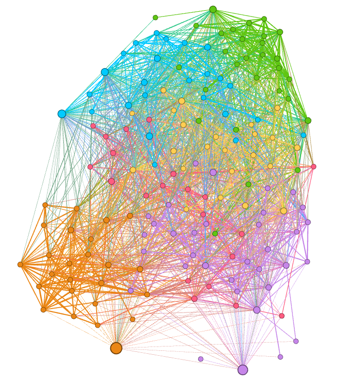
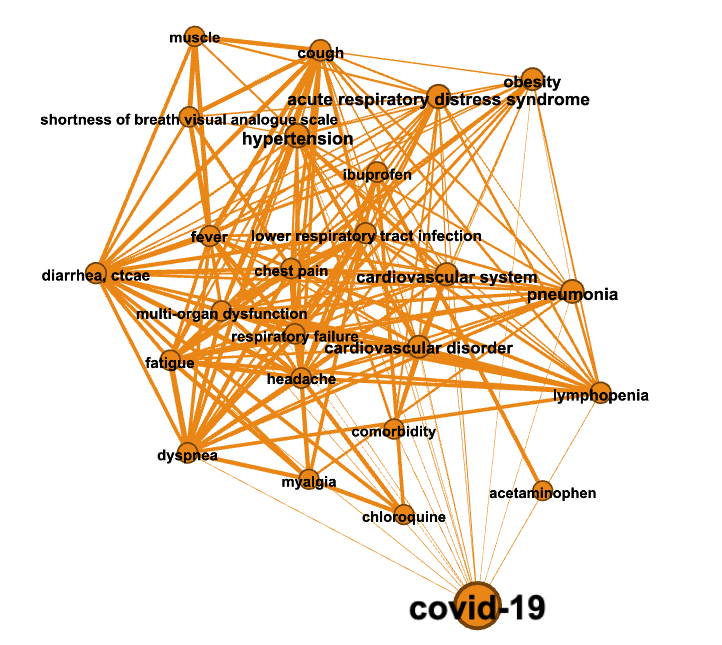
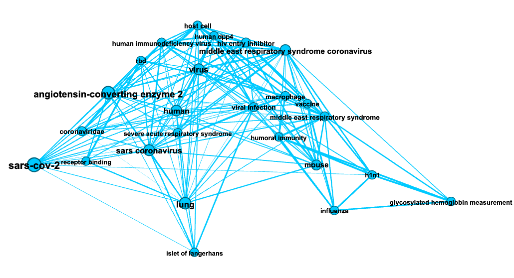
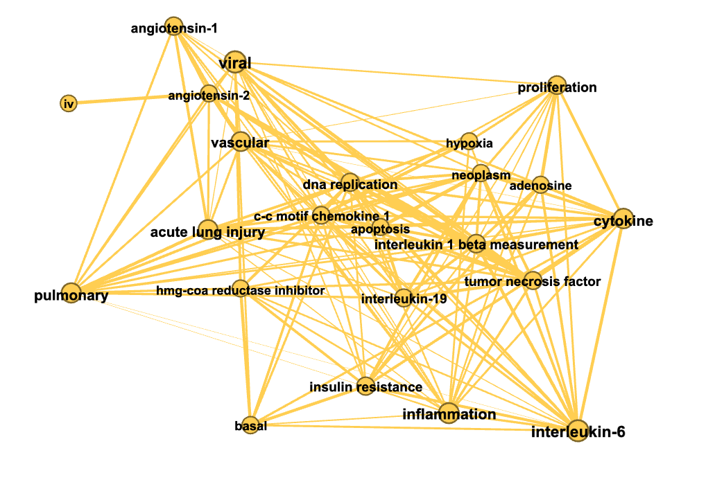
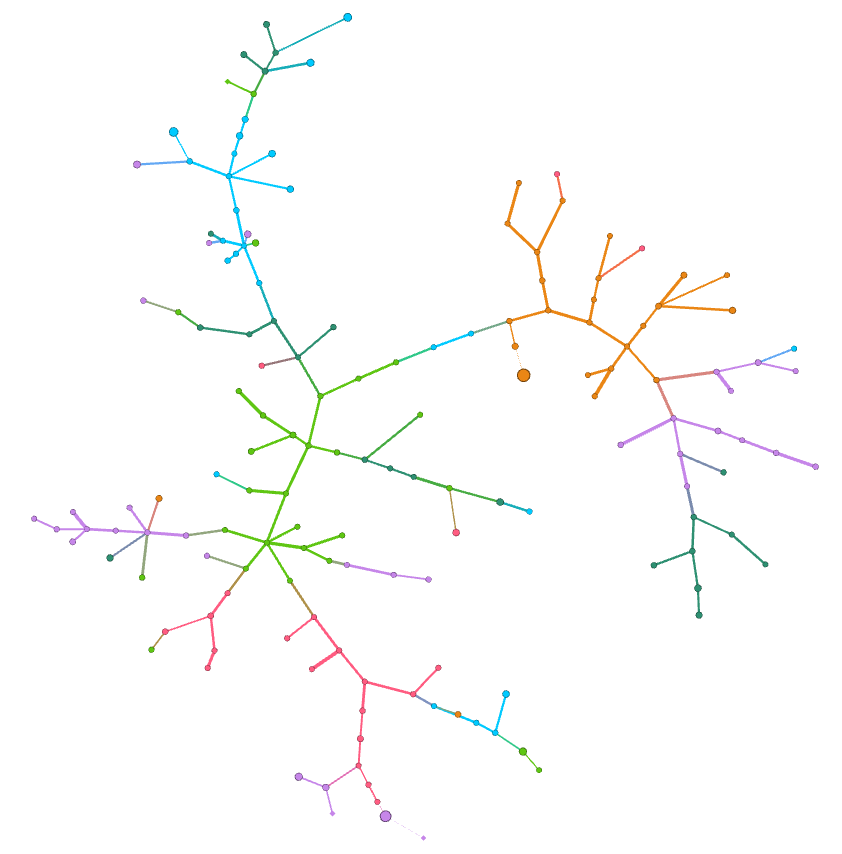
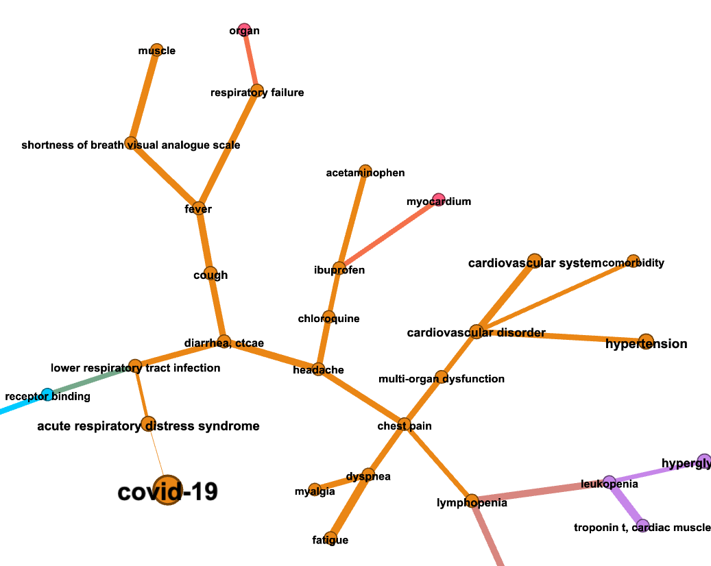
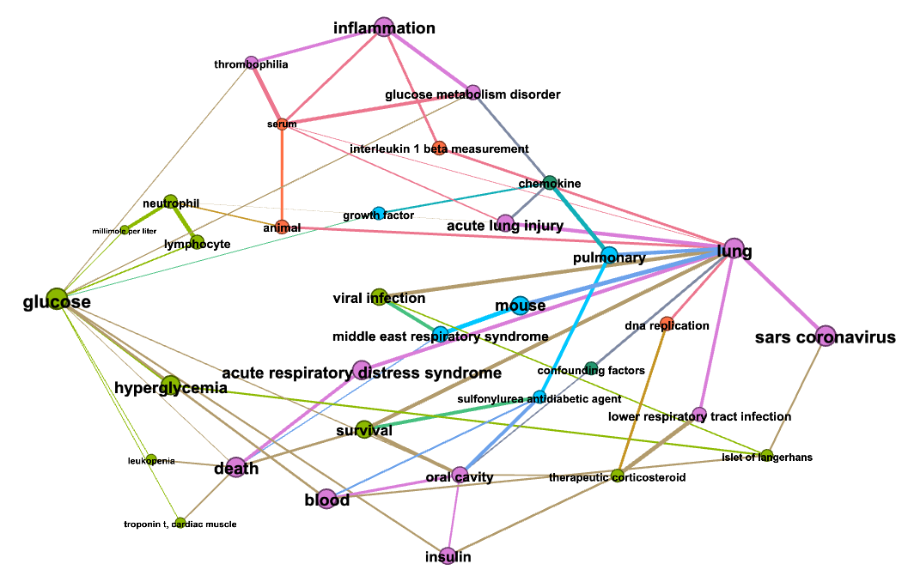

.. _literature_tutorial:

Literature exploration: in-memory analytics tutorial
=====================================================

In this example we illustrate how network analytics can be used for
literature exploration. The source notebook can be found `here <https://github.com/BlueBrain/BlueGraph/blob/master/examples/notebooks/Literature%20exploration%20(PGFrames%20%2B%20in-memory%20analytics%20tutorial).ipynb>`__.

The input dataset contains occurrences of different terms in paragraphs
of scientific articles previously extracted by means of a Named Entity
Recognition (NER) model. This dataset is transformed into three
co-occurrence networks: representing paper- and paragraph-level
co-occurrence relation between terms. The term relations in the
above-mentioned networks are quantified using mutual-information-based
scores (pointwise mutual information and its normalized version).

The networks are further analysed using classical tools from complex
networks: we find various centrality measures characterizing the
importance of extracted terms, we detect term communities representing
denesely connected clusters of terms and finally we illustrate how the
algorithms for finding shortest paths and minimum spanning trees can be
used to perform guided search in networks.

.. code:: ipython3

    import networkx as nx
    import pandas as pd
    import numpy as np

.. code:: ipython3

    from bluegraph.core import (PandasPGFrame,
                                pretty_print_paths,
                                pretty_print_tripaths,
                                graph_elements_from_paths)
    from bluegraph.preprocess.generators import CooccurrenceGenerator
    
    from bluegraph.backends.graph_tool import (GTMetricProcessor,
                                               GTPathFinder,
                                               GTGraphProcessor,
                                               GTCommunityDetector)
    from bluegraph.backends.graph_tool import graph_tool_to_pgframe
    
    from bluegraph.backends.networkx import NXCommunityDetector, NXPathFinder
    
    from bluegraph.backends.stellargraph import StellarGraphNodeEmbedder

Entity-occurrence property graph
-----------------------------------

In this section we will create a property graph whose nodes are papers
and extracted named entities, and whose edges connect entities to the
papers they occur in.

The input data is given by occurrences of different entities in specific
paragraphs of scientific articles.

.. code:: ipython3

    mentions = pd.read_csv("../data/literature_NER_example.csv")

.. code:: ipython3

    mentions.sample(5)

.. raw:: html

    

    
    <table border="1" class="dataframe">
      <thead>
        <tr style="text-align: right;">
          <th></th>
          <th>entity</th>
          <th>occurrence</th>
        </tr>
      </thead>
      <tbody>
        <tr>
          <th>1510</th>
          <td>viral</td>
          <td>214924:The Protective Role Of Angiotensin-Conv...</td>
        </tr>
        <tr>
          <th>720</th>
          <td>dipeptidyl peptidase 4</td>
          <td>184360:Cardiovascular Effects Of Sdpp4 Upregul...</td>
        </tr>
        <tr>
          <th>1019</th>
          <td>insulin</td>
          <td>214924:The Interplay Between Covid-19 And Ampk...</td>
        </tr>
        <tr>
          <th>556</th>
          <td>diabetes mellitus</td>
          <td>184360:Mechanisms Of Sars-Cov-2 Entry Into Hos...</td>
        </tr>
        <tr>
          <th>540</th>
          <td>diabetes mellitus</td>
          <td>214924:Introduction:7</td>
        </tr>
      </tbody>
    </table>
    

Every paragraph is identified using the format
``<paper_id>:<section_id>:<paragraph_id>``. From this data we will
extract occurrences in distinct papers/paragraphs as follows:

.. code:: ipython3

    # Extract unique paper/seciton/paragraph identifiers
    mentions["paper"] = mentions["occurrence"].apply(
        lambda x: x.split(":")[0])
    
    mentions = mentions.rename(columns={"occurrence": "paragraph"})
    mentions.sample(5)

.. raw:: html

    

    
    <table border="1" class="dataframe">
      <thead>
        <tr style="text-align: right;">
          <th></th>
          <th>entity</th>
          <th>paragraph</th>
          <th>paper</th>
        </tr>
      </thead>
      <tbody>
        <tr>
          <th>154</th>
          <td>blood</td>
          <td>214728:Cap Community-Acquired Pneumonia Covid-...</td>
          <td>214728</td>
        </tr>
        <tr>
          <th>833</th>
          <td>glycosylated hemoglobin measurement</td>
          <td>184360:Gliptins ::: Therapeutic Potential Of T...</td>
          <td>184360</td>
        </tr>
        <tr>
          <th>1506</th>
          <td>viral</td>
          <td>214924:The Interplay Between Covid-19 And Ampk...</td>
          <td>214924</td>
        </tr>
        <tr>
          <th>936</th>
          <td>hypertension</td>
          <td>211125:Introduction:5</td>
          <td>211125</td>
        </tr>
        <tr>
          <th>828</th>
          <td>glyburide</td>
          <td>160564:Data Extraction And Study Quality ::: M...</td>
          <td>160564</td>
        </tr>
      </tbody>
    </table>
    

We, first, create an empty property graph object.

.. code:: ipython3

    graph = PandasPGFrame()

Then we add nodes for unique entities and papers

.. code:: ipython3

    entity_nodes = mentions["entity"].unique()
    graph.add_nodes(entity_nodes)
    graph.add_node_types({n: "Entity" for n in entity_nodes})
    
    paper_nodes = mentions["paper"].unique()
    graph.add_nodes(paper_nodes)
    graph.add_node_types({n: "Paper" for n in paper_nodes})

.. code:: ipython3

    graph.nodes(raw_frame=True)

.. raw:: html

    

    
    <table border="1" class="dataframe">
      <thead>
        <tr style="text-align: right;">
          <th></th>
          <th>@type</th>
        </tr>
        <tr>
          <th>@id</th>
          <th></th>
        </tr>
      </thead>
      <tbody>
        <tr>
          <th>ace inhibitor</th>
          <td>Entity</td>
        </tr>
        <tr>
          <th>acetaminophen</th>
          <td>Entity</td>
        </tr>
        <tr>
          <th>acute lung injury</th>
          <td>Entity</td>
        </tr>
        <tr>
          <th>acute respiratory distress syndrome</th>
          <td>Entity</td>
        </tr>
        <tr>
          <th>adenosine</th>
          <td>Entity</td>
        </tr>
        <tr>
          <th>...</th>
          <td>...</td>
        </tr>
        <tr>
          <th>78884</th>
          <td>Paper</td>
        </tr>
        <tr>
          <th>35198</th>
          <td>Paper</td>
        </tr>
        <tr>
          <th>139943</th>
          <td>Paper</td>
        </tr>
        <tr>
          <th>172581</th>
          <td>Paper</td>
        </tr>
        <tr>
          <th>102473</th>
          <td>Paper</td>
        </tr>
      </tbody>
    </table>
    
177 rows × 1 columns

    

We now add edges from entities to the papers they occur in storing
paragraphs as edge properties.

.. code:: ipython3

    occurrence_edges = mentions.groupby(by=["entity", "paper"]).aggregate(set)

.. code:: ipython3

    occurrence_edges

.. raw:: html

    

    
    <table border="1" class="dataframe">
      <thead>
        <tr style="text-align: right;">
          <th></th>
          <th></th>
          <th>paragraph</th>
        </tr>
        <tr>
          <th>entity</th>
          <th>paper</th>
          <th></th>
        </tr>
      </thead>
      <tbody>
        <tr>
          <th rowspan="2" valign="top">ace inhibitor</th>
          <th>184360</th>
          <td>{184360:Conclusion:62, 184360:Combined Therape...</td>
        </tr>
        <tr>
          <th>197804</th>
          <td>{197804:Caption:71, 197804:Caption:72, 197804:...</td>
        </tr>
        <tr>
          <th rowspan="2" valign="top">acetaminophen</th>
          <th>179426</th>
          <td>{179426:Blood Glucose Monitoring ::: Special A...</td>
        </tr>
        <tr>
          <th>197804</th>
          <td>{197804:Discussion:51, 197804:Discussion:52, 1...</td>
        </tr>
        <tr>
          <th>acute lung injury</th>
          <th>179426</th>
          <td>{179426:Role Of Ace/Arbs ::: Special Aspects O...</td>
        </tr>
        <tr>
          <th>...</th>
          <th>...</th>
          <td>...</td>
        </tr>
        <tr>
          <th rowspan="5" valign="top">virus</th>
          <th>184360</th>
          <td>{184360:Gliptins ::: Therapeutic Potential Of ...</td>
        </tr>
        <tr>
          <th>197804</th>
          <td>{197804:Discussion:44, 197804:Introduction:2}</td>
        </tr>
        <tr>
          <th>211125</th>
          <td>{211125:Discussion:25}</td>
        </tr>
        <tr>
          <th>211373</th>
          <td>{211373:Introduction:5, 211373:Introduction:6,...</td>
        </tr>
        <tr>
          <th>214924</th>
          <td>{214924:Angiotensin-Converting Enzyme 2 Expres...</td>
        </tr>
      </tbody>
    </table>
    
551 rows × 1 columns

    

.. code:: ipython3

    graph.add_edges(occurrence_edges.index)
    graph.add_edge_types({e: "OccursIn" for e in occurrence_edges.index})

.. code:: ipython3

    occurrence_edges.index = occurrence_edges.index.rename(["@source_id", "@target_id"])

.. code:: ipython3

    graph.add_edge_properties(occurrence_edges["paragraph"])

.. code:: ipython3

    graph.edges(raw_frame=True)

.. raw:: html

    

    
    <table border="1" class="dataframe">
      <thead>
        <tr style="text-align: right;">
          <th></th>
          <th></th>
          <th>@type</th>
          <th>paragraph</th>
        </tr>
        <tr>
          <th>@source_id</th>
          <th>@target_id</th>
          <th></th>
          <th></th>
        </tr>
      </thead>
      <tbody>
        <tr>
          <th rowspan="2" valign="top">ace inhibitor</th>
          <th>184360</th>
          <td>OccursIn</td>
          <td>{184360:Conclusion:62, 184360:Combined Therape...</td>
        </tr>
        <tr>
          <th>197804</th>
          <td>OccursIn</td>
          <td>{197804:Caption:71, 197804:Caption:72, 197804:...</td>
        </tr>
        <tr>
          <th rowspan="2" valign="top">acetaminophen</th>
          <th>179426</th>
          <td>OccursIn</td>
          <td>{179426:Blood Glucose Monitoring ::: Special A...</td>
        </tr>
        <tr>
          <th>197804</th>
          <td>OccursIn</td>
          <td>{197804:Discussion:51, 197804:Discussion:52, 1...</td>
        </tr>
        <tr>
          <th>acute lung injury</th>
          <th>179426</th>
          <td>OccursIn</td>
          <td>{179426:Role Of Ace/Arbs ::: Special Aspects O...</td>
        </tr>
        <tr>
          <th>...</th>
          <th>...</th>
          <td>...</td>
          <td>...</td>
        </tr>
        <tr>
          <th rowspan="5" valign="top">virus</th>
          <th>184360</th>
          <td>OccursIn</td>
          <td>{184360:Gliptins ::: Therapeutic Potential Of ...</td>
        </tr>
        <tr>
          <th>197804</th>
          <td>OccursIn</td>
          <td>{197804:Discussion:44, 197804:Introduction:2}</td>
        </tr>
        <tr>
          <th>211125</th>
          <td>OccursIn</td>
          <td>{211125:Discussion:25}</td>
        </tr>
        <tr>
          <th>211373</th>
          <td>OccursIn</td>
          <td>{211373:Introduction:5, 211373:Introduction:6,...</td>
        </tr>
        <tr>
          <th>214924</th>
          <td>OccursIn</td>
          <td>{214924:Angiotensin-Converting Enzyme 2 Expres...</td>
        </tr>
      </tbody>
    </table>
    
551 rows × 2 columns

    

Entity co-occurrence graphs
-------------------------------

We will generate co-occurrence graphs for different occurrence factors
(paper/paragraph), i.e. an edge between a pair of entities is added if
they co-occur in the same paper or paragraph.

**NB:** Read more about statistics computed during the co-occurrence analysis (positive pointwise mutual information (PPMI) and normalized pointwise mutual information (NPMI)) `here <https://en.wikipedia.org/wiki/Pointwise_mutual_information>`__.

Paper-based co-occurrence
~~~~~~~~~~~~~~~~~~~~~~~~~

We first generate co-occurrence network from edges of type ``OccursIn``
linking entities and papers.

.. code:: ipython3

    gen = CooccurrenceGenerator(graph)
    paper_cooccurrence_edges = gen.generate_from_edges(
         "OccursIn", compute_statistics=["frequency", "ppmi", "npmi"])

.. parsed-literal::

    Examining 12246 pairs of terms for co-occurrence...

.. code:: ipython3

    paper_cooccurrence_edges["@type"] = "CoOccursWith"
    paper_cooccurrence_edges

.. raw:: html

    

    
    <table border="1" class="dataframe">
      <thead>
        <tr style="text-align: right;">
          <th></th>
          <th></th>
          <th>common_factors</th>
          <th>frequency</th>
          <th>ppmi</th>
          <th>npmi</th>
          <th>@type</th>
        </tr>
        <tr>
          <th>@source_id</th>
          <th>@target_id</th>
          <th></th>
          <th></th>
          <th></th>
          <th></th>
          <th></th>
        </tr>
      </thead>
      <tbody>
        <tr>
          <th rowspan="5" valign="top">ace inhibitor</th>
          <th>acetaminophen</th>
          <td>{197804}</td>
          <td>1</td>
          <td>2.321928</td>
          <td>0.537244</td>
          <td>CoOccursWith</td>
        </tr>
        <tr>
          <th>acute lung injury</th>
          <td>{197804, 184360}</td>
          <td>2</td>
          <td>2.321928</td>
          <td>0.698970</td>
          <td>CoOccursWith</td>
        </tr>
        <tr>
          <th>acute respiratory distress syndrome</th>
          <td>{197804, 184360}</td>
          <td>2</td>
          <td>1.736966</td>
          <td>0.522879</td>
          <td>CoOccursWith</td>
        </tr>
        <tr>
          <th>adenosine</th>
          <td>{184360}</td>
          <td>1</td>
          <td>2.321928</td>
          <td>0.537244</td>
          <td>CoOccursWith</td>
        </tr>
        <tr>
          <th>adipose tissue</th>
          <td>{197804, 184360}</td>
          <td>2</td>
          <td>2.736966</td>
          <td>0.823909</td>
          <td>CoOccursWith</td>
        </tr>
        <tr>
          <th>...</th>
          <th>...</th>
          <td>...</td>
          <td>...</td>
          <td>...</td>
          <td>...</td>
          <td>...</td>
        </tr>
        <tr>
          <th rowspan="2" valign="top">viral</th>
          <th>viral infection</th>
          <td>{184360, 211125, 214924, 211373}</td>
          <td>4</td>
          <td>2.000000</td>
          <td>0.861353</td>
          <td>CoOccursWith</td>
        </tr>
        <tr>
          <th>virus</th>
          <td>{214924, 184360, 211373, 211125, 179426}</td>
          <td>5</td>
          <td>1.514573</td>
          <td>0.757287</td>
          <td>CoOccursWith</td>
        </tr>
        <tr>
          <th rowspan="2" valign="top">viral entry</th>
          <th>viral infection</th>
          <td>{214924}</td>
          <td>1</td>
          <td>1.321928</td>
          <td>0.305865</td>
          <td>CoOccursWith</td>
        </tr>
        <tr>
          <th>virus</th>
          <td>{179426, 214924}</td>
          <td>2</td>
          <td>1.514573</td>
          <td>0.455932</td>
          <td>CoOccursWith</td>
        </tr>
        <tr>
          <th>viral infection</th>
          <th>virus</th>
          <td>{184360, 211125, 214924, 211373}</td>
          <td>4</td>
          <td>1.514573</td>
          <td>0.652291</td>
          <td>CoOccursWith</td>
        </tr>
      </tbody>
    </table>
    
9748 rows × 5 columns

    

From the generated edges we remove the ones with zero NPMI scores.

.. code:: ipython3

    paper_cooccurrence_edges = paper_cooccurrence_edges[paper_cooccurrence_edges["npmi"] != 0]

.. code:: ipython3

    entity_nodes = graph.nodes_of_type("Entity").copy()

.. code:: ipython3

    paper_frequency = mentions.groupby("entity").aggregate(set)["paper"].apply(len)
    paper_frequency.name = "paper_frequency"
    
    entity_nodes["paper_frequency"] = paper_frequency

We create a new property graph object from generated edges and entity
nodes as follows:

.. code:: ipython3

    paper_network = PandasPGFrame.from_frames(
        nodes=entity_nodes,
        edges=paper_cooccurrence_edges,
        node_prop_types={
            "paper_frequency": "numeric",
            "paragraph_frequency": "numeric"
        },
        edge_prop_types={
            "frequency": "numeric",
            "ppmi": "numeric",
            "npmi": "numeric"
        })

.. code:: ipython3

    paper_network.edges(raw_frame=True).sample(5)

.. raw:: html

    

    
    <table border="1" class="dataframe">
      <thead>
        <tr style="text-align: right;">
          <th></th>
          <th></th>
          <th>common_factors</th>
          <th>frequency</th>
          <th>ppmi</th>
          <th>npmi</th>
          <th>@type</th>
        </tr>
        <tr>
          <th>@source_id</th>
          <th>@target_id</th>
          <th></th>
          <th></th>
          <th></th>
          <th></th>
          <th></th>
        </tr>
      </thead>
      <tbody>
        <tr>
          <th>cough</th>
          <th>pneumonia</th>
          <td>{211125, 197804, 214924, 184360}</td>
          <td>4</td>
          <td>1.321928</td>
          <td>0.569323</td>
          <td>CoOccursWith</td>
        </tr>
        <tr>
          <th>cytokine</th>
          <th>oxygen</th>
          <td>{211125}</td>
          <td>1</td>
          <td>1.736966</td>
          <td>0.401896</td>
          <td>CoOccursWith</td>
        </tr>
        <tr>
          <th>chronic disease</th>
          <th>vildagliptin</th>
          <td>{179426}</td>
          <td>1</td>
          <td>2.321928</td>
          <td>0.537244</td>
          <td>CoOccursWith</td>
        </tr>
        <tr>
          <th>insulin</th>
          <th>receptor binding</th>
          <td>{197804}</td>
          <td>1</td>
          <td>0.514573</td>
          <td>0.119061</td>
          <td>CoOccursWith</td>
        </tr>
        <tr>
          <th>hyperglycemia</th>
          <th>tumor necrosis factor</th>
          <td>{211125, 214924, 184360}</td>
          <td>3</td>
          <td>1.321928</td>
          <td>0.482990</td>
          <td>CoOccursWith</td>
        </tr>
      </tbody>
    </table>
    

.. code:: ipython3

    paper_network.nodes(raw_frame=True).sample(5)

.. raw:: html

    

    
    <table border="1" class="dataframe">
      <thead>
        <tr style="text-align: right;">
          <th></th>
          <th>@type</th>
          <th>paper_frequency</th>
        </tr>
        <tr>
          <th>@id</th>
          <th></th>
          <th></th>
        </tr>
      </thead>
      <tbody>
        <tr>
          <th>myalgia</th>
          <td>Entity</td>
          <td>2</td>
        </tr>
        <tr>
          <th>prognosis</th>
          <td>Entity</td>
          <td>2</td>
        </tr>
        <tr>
          <th>apoptosis</th>
          <td>Entity</td>
          <td>2</td>
        </tr>
        <tr>
          <th>thrombophilia</th>
          <td>Entity</td>
          <td>3</td>
        </tr>
        <tr>
          <th>septicemia</th>
          <td>Entity</td>
          <td>2</td>
        </tr>
      </tbody>
    </table>
    

Paragraph-based co-occurrence
~~~~~~~~~~~~~~~~~~~~~~~~~~~~~

We perform similar operation for paragraph-level co-occurrence. In order
to use another co-occurrence factor, we will define the following
‘factor_aggregator’ function (``aggregate_paragraph``) that takes a
collection of sets of paragraphs and merges them into the same set. This
aggregator will be used to collect sets of common paragraphs of
``OccursIn`` edges pointing from a pair of entities to the same paper.

.. code:: ipython3

    def aggregate_paragraphs(data):
        return set(sum(data["paragraph"].apply(list), []))

.. code:: ipython3

    %%time
    paragraph_cooccurrence_edges = gen.generate_from_edges(
         "OccursIn", 
        factor_aggregator=aggregate_paragraphs,
        compute_statistics=["frequency", "ppmi", "npmi"],
        parallelize=True, cores=8)

.. parsed-literal::

    Computing total factor instances...
    Examining 12246 pairs of terms for co-occurrence...
    CPU times: user 78.8 ms, sys: 62.1 ms, total: 141 ms
    Wall time: 5.39 s

.. code:: ipython3

    paragraph_cooccurrence_edges["@type"] = "CoOccursWith"
    paragraph_cooccurrence_edges.sample(5)

.. raw:: html

    

    
    <table border="1" class="dataframe">
      <thead>
        <tr style="text-align: right;">
          <th></th>
          <th></th>
          <th>common_factors</th>
          <th>frequency</th>
          <th>ppmi</th>
          <th>npmi</th>
          <th>@type</th>
        </tr>
        <tr>
          <th>@source_id</th>
          <th>@target_id</th>
          <th></th>
          <th></th>
          <th></th>
          <th></th>
          <th></th>
        </tr>
      </thead>
      <tbody>
        <tr>
          <th>dpp4i</th>
          <th>glycosylated hemoglobin measurement</th>
          <td>{184360:Gliptins ::: Therapeutic Potential Of ...</td>
          <td>1</td>
          <td>2.736966</td>
          <td>0.336680</td>
          <td>CoOccursWith</td>
        </tr>
        <tr>
          <th>h1n1</th>
          <th>virus</th>
          <td>{214924:The Interplay Between Covid-19 And Amp...</td>
          <td>1</td>
          <td>2.669851</td>
          <td>0.328424</td>
          <td>CoOccursWith</td>
        </tr>
        <tr>
          <th>interleukin-6</th>
          <th>middle east respiratory syndrome coronavirus</th>
          <td>{214924:Diabetes Mellitus And Covid-19: In The...</td>
          <td>2</td>
          <td>0.415037</td>
          <td>0.058216</td>
          <td>CoOccursWith</td>
        </tr>
        <tr>
          <th>insulin resistance</th>
          <th>t-lymphocyte</th>
          <td>{184360:Cardiovascular Effects Of Sdpp4 Upregu...</td>
          <td>1</td>
          <td>3.000000</td>
          <td>0.369036</td>
          <td>CoOccursWith</td>
        </tr>
        <tr>
          <th>dna replication</th>
          <th>middle east respiratory syndrome coronavirus</th>
          <td>{214924:The Interplay Between Covid-19 And Amp...</td>
          <td>2</td>
          <td>2.152003</td>
          <td>0.301854</td>
          <td>CoOccursWith</td>
        </tr>
      </tbody>
    </table>
    

From the generated edges we remove the ones with zero NPMI scores.

.. code:: ipython3

    paragraph_cooccurrence_edges = paragraph_cooccurrence_edges[paragraph_cooccurrence_edges["npmi"] != 0]

.. code:: ipython3

    paragraph_network = PandasPGFrame.from_frames(
        nodes=entity_nodes,
        edges=paragraph_cooccurrence_edges,
        node_prop_types={
            "paper_frequency": "numeric",
        },
        edge_prop_types={
            "frequency": "numeric",
            "ppmi": "numeric",
            "npmi": "numeric"
        })

Faster paragraph-based co-occurrence
~~~~~~~~~~~~~~~~~~~~~~~~~~~~~~~~~~~~

Alternatively, to generate paragraph-level co-occurrence network, we can
assign sets of paragraphs where entities occur as properties of their
respective nodes (as follows).

.. code:: ipython3

    paragraph_prop = pd.DataFrame({"paragraphs": mentions.groupby("entity").aggregate(set)["paragraph"]})
    graph.add_node_properties(paragraph_prop, prop_type="category")
    graph.nodes(raw_frame=True).sample(5)

.. raw:: html

    

    
    <table border="1" class="dataframe">
      <thead>
        <tr style="text-align: right;">
          <th></th>
          <th>@type</th>
          <th>paragraphs</th>
        </tr>
        <tr>
          <th>@id</th>
          <th></th>
          <th></th>
        </tr>
      </thead>
      <tbody>
        <tr>
          <th>islet of langerhans</th>
          <td>Entity</td>
          <td>{179426:Effect Of Sars Cov-2 On Blood Glucose ...</td>
        </tr>
        <tr>
          <th>multi-organ dysfunction</th>
          <td>Entity</td>
          <td>{179426:Morbidity And Mortality In Diabetic Co...</td>
        </tr>
        <tr>
          <th>angiotensin ii receptor antagonist</th>
          <td>Entity</td>
          <td>{214924:Angiotensin-Converting Enzyme 2 Expres...</td>
        </tr>
        <tr>
          <th>m protein</th>
          <td>Entity</td>
          <td>{184360:Cardiovascular Effects Of Sdpp4 Upregu...</td>
        </tr>
        <tr>
          <th>insulin infusion</th>
          <td>Entity</td>
          <td>{179426:Glycemic Control ::: Special Aspects O...</td>
        </tr>
      </tbody>
    </table>
    

And then use the ``generate_from_nodes`` method of
``CooccurrenceGenerator`` in order to generate co-occurrence edges for
nodes whose ``paragraphs`` property has a non-empty intersection.

.. code:: ipython3

    %%time
    generator = CooccurrenceGenerator(graph)
    paragraph_cooccurrence_edges = generator.generate_from_nodes(
        "paragraphs", total_factor_instances=len(mentions.paragraph.unique()),
        compute_statistics=["frequency", "npmi"],
        parallelize=True, cores=8)

.. parsed-literal::

    Examining 15576 pairs of terms for co-occurrence...
    CPU times: user 101 ms, sys: 69.7 ms, total: 170 ms
    Wall time: 1.37 s

Additional co-occurrence measures: NPMI-based distance
~~~~~~~~~~~~~~~~~~~~~~~~~~~~~~~~~~~~~~~~~~~~~~~~~~~~~~

For both paper- and paragraph-based networks we will compute a
mutual-information-based distance as follows:
:math:`D = \frac{1}{NPMI}`.

.. code:: ipython3

    import math
    
    def compute_distance(x):
        return 1 / x if x > 0 else math.inf

.. code:: ipython3

    npmi_distance = paper_network.edges(raw_frame=True)["npmi"].apply(compute_distance)
    npmi_distance.name = "distance_npmi"
    paper_network.add_edge_properties(npmi_distance, "numeric")

.. code:: ipython3

    paper_network.edges(raw_frame=True).sample(5)

.. raw:: html

    

    
    <table border="1" class="dataframe">
      <thead>
        <tr style="text-align: right;">
          <th></th>
          <th></th>
          <th>common_factors</th>
          <th>frequency</th>
          <th>ppmi</th>
          <th>npmi</th>
          <th>@type</th>
          <th>distance_npmi</th>
        </tr>
        <tr>
          <th>@source_id</th>
          <th>@target_id</th>
          <th></th>
          <th></th>
          <th></th>
          <th></th>
          <th></th>
          <th></th>
        </tr>
      </thead>
      <tbody>
        <tr>
          <th>inflammation</th>
          <th>tumor necrosis factor</th>
          <td>{211125, 214924, 184360}</td>
          <td>3</td>
          <td>1.736966</td>
          <td>0.634632</td>
          <td>CoOccursWith</td>
          <td>1.575717</td>
        </tr>
        <tr>
          <th>fever</th>
          <th>islet of langerhans</th>
          <td>{211125}</td>
          <td>1</td>
          <td>1.736966</td>
          <td>0.401896</td>
          <td>CoOccursWith</td>
          <td>2.488206</td>
        </tr>
        <tr>
          <th>acute respiratory distress syndrome</th>
          <th>immune response process</th>
          <td>{214924, 184360}</td>
          <td>2</td>
          <td>1.152003</td>
          <td>0.346787</td>
          <td>CoOccursWith</td>
          <td>2.883610</td>
        </tr>
        <tr>
          <th>angiotensin ii receptor antagonist</th>
          <th>influenza</th>
          <td>{179426, 214924, 184360}</td>
          <td>3</td>
          <td>2.736966</td>
          <td>1.000000</td>
          <td>CoOccursWith</td>
          <td>1.000000</td>
        </tr>
        <tr>
          <th>lower respiratory tract infection</th>
          <th>lymphopenia</th>
          <td>{211125, 214924}</td>
          <td>2</td>
          <td>2.152003</td>
          <td>0.647817</td>
          <td>CoOccursWith</td>
          <td>1.543645</td>
        </tr>
      </tbody>
    </table>
    

.. code:: ipython3

    npmi_distance = paragraph_network.edges(raw_frame=True)["npmi"].apply(compute_distance)
    npmi_distance.name = "distance_npmi"
    paragraph_network.add_edge_properties(npmi_distance, "numeric")

.. code:: ipython3

    paper_network.edges(raw_frame=True).sample(5)

.. raw:: html

    

    
    <table border="1" class="dataframe">
      <thead>
        <tr style="text-align: right;">
          <th></th>
          <th></th>
          <th>common_factors</th>
          <th>frequency</th>
          <th>ppmi</th>
          <th>npmi</th>
          <th>@type</th>
          <th>distance_npmi</th>
        </tr>
        <tr>
          <th>@source_id</th>
          <th>@target_id</th>
          <th></th>
          <th></th>
          <th></th>
          <th></th>
          <th></th>
          <th></th>
        </tr>
      </thead>
      <tbody>
        <tr>
          <th>influenza</th>
          <th>viral entry</th>
          <td>{179426, 214924}</td>
          <td>2</td>
          <td>2.736966</td>
          <td>0.823909</td>
          <td>CoOccursWith</td>
          <td>1.213727</td>
        </tr>
        <tr>
          <th>blood vessel</th>
          <th>viral entry</th>
          <td>{214924}</td>
          <td>1</td>
          <td>2.321928</td>
          <td>0.537244</td>
          <td>CoOccursWith</td>
          <td>1.861353</td>
        </tr>
        <tr>
          <th>hyperglycemia</th>
          <th>pneumonia</th>
          <td>{214924, 184360, 214728, 211125, 179426}</td>
          <td>5</td>
          <td>0.643856</td>
          <td>0.321928</td>
          <td>CoOccursWith</td>
          <td>3.106284</td>
        </tr>
        <tr>
          <th>death</th>
          <th>sitagliptin</th>
          <td>{179426, 184360}</td>
          <td>2</td>
          <td>0.567041</td>
          <td>0.170696</td>
          <td>CoOccursWith</td>
          <td>5.858360</td>
        </tr>
        <tr>
          <th>adipose tissue</th>
          <th>fatigue</th>
          <td>{214924}</td>
          <td>1</td>
          <td>1.736966</td>
          <td>0.401896</td>
          <td>CoOccursWith</td>
          <td>2.488206</td>
        </tr>
      </tbody>
    </table>
    

Nearest neighours by co-occurrence scores
----------------------------------------------

To illustrate the importance of computing mutual-information-based
scores over raw frequencies consider the following example, where we
would like to estimate top closest (most related) neighbors to a
specific term.

To do so, we will use the paragraph-based network and the raw
co-occurrence frequency as the weight of our co-occurrence relation. The
``top_neighbors`` method of the ``PathFinder`` interface provided by the
BlueGraph allows us to search for top neighbors with the highest edge
weight. In this example, we use ``graph_tool``-based ``GTPathFinder``
interface.

.. code:: ipython3

    paragraph_path_finder = GTPathFinder(paragraph_network, directed=False)

Observe in the following cell that the path finder interface generated a
backend-specific graph object.

.. code:: ipython3

    paragraph_path_finder.graph

.. parsed-literal::

    <Graph object, undirected, with 157 vertices and 2479 edges at 0x7fc6ae5b76d8>

.. code:: ipython3

    paragraph_path_finder.top_neighbors("glucose", 10, weight="frequency")

.. parsed-literal::

    {'diabetes mellitus': 29.0,
     'blood': 18.0,
     'insulin': 11.0,
     'death': 9.0,
     'hyperglycemia': 8.0,
     'coronavirus': 8.0,
     'infectious disorder': 6.0,
     'inflammation': 6.0,
     'sars coronavirus': 6.0,
     'interleukin-6': 5.0}

.. code:: ipython3

    paragraph_path_finder.top_neighbors("lung", 10, weight="frequency")

.. parsed-literal::

    {'covid-19': 24.0,
     'angiotensin-converting enzyme 2': 16.0,
     'sars-cov-2': 13.0,
     'acute lung injury': 12.0,
     'pulmonary': 10.0,
     'sars coronavirus': 10.0,
     'viral': 9.0,
     'human': 9.0,
     'mouse': 7.0,
     'inflammation': 6.0}

We observe that ‘glucose’ and ‘lung’ share a lot of the closest
neighbors by raw frequency. If we look into the list of top 10 entities
by paragraph frequency in the entire corpus and we notice that ‘glucose’
and ‘blood’ co-occur the most with the terms that are simply the most
frequent in our corpus, such as ‘covid-19’ and ‘diabetes mellitus’.

(Closest inspection of the distribution of weighted node degrees
suggests that the network contains *hubs*, nodes with significantly
high-degree connectivity to other nodes.)

.. code:: ipython3

    paragraph_network._nodes

.. raw:: html

    

    
    <table border="1" class="dataframe">
      <thead>
        <tr style="text-align: right;">
          <th></th>
          <th>@type</th>
          <th>paper_frequency</th>
        </tr>
        <tr>
          <th>@id</th>
          <th></th>
          <th></th>
        </tr>
      </thead>
      <tbody>
        <tr>
          <th>ace inhibitor</th>
          <td>Entity</td>
          <td>2</td>
        </tr>
        <tr>
          <th>acetaminophen</th>
          <td>Entity</td>
          <td>2</td>
        </tr>
        <tr>
          <th>acute lung injury</th>
          <td>Entity</td>
          <td>4</td>
        </tr>
        <tr>
          <th>acute respiratory distress syndrome</th>
          <td>Entity</td>
          <td>6</td>
        </tr>
        <tr>
          <th>adenosine</th>
          <td>Entity</td>
          <td>2</td>
        </tr>
        <tr>
          <th>...</th>
          <td>...</td>
          <td>...</td>
        </tr>
        <tr>
          <th>vildagliptin</th>
          <td>Entity</td>
          <td>2</td>
        </tr>
        <tr>
          <th>viral</th>
          <td>Entity</td>
          <td>5</td>
        </tr>
        <tr>
          <th>viral entry</th>
          <td>Entity</td>
          <td>2</td>
        </tr>
        <tr>
          <th>viral infection</th>
          <td>Entity</td>
          <td>4</td>
        </tr>
        <tr>
          <th>virus</th>
          <td>Entity</td>
          <td>7</td>
        </tr>
      </tbody>
    </table>
    
157 rows × 2 columns

    

.. code:: ipython3

    paragraph_network.nodes(raw_frame=True).nlargest(10, columns=["paper_frequency"])

.. raw:: html

    

    
    <table border="1" class="dataframe">
      <thead>
        <tr style="text-align: right;">
          <th></th>
          <th>@type</th>
          <th>paper_frequency</th>
        </tr>
        <tr>
          <th>@id</th>
          <th></th>
          <th></th>
        </tr>
      </thead>
      <tbody>
        <tr>
          <th>covid-19</th>
          <td>Entity</td>
          <td>20</td>
        </tr>
        <tr>
          <th>diabetes mellitus</th>
          <td>Entity</td>
          <td>19</td>
        </tr>
        <tr>
          <th>coronavirus</th>
          <td>Entity</td>
          <td>16</td>
        </tr>
        <tr>
          <th>glucose</th>
          <td>Entity</td>
          <td>13</td>
        </tr>
        <tr>
          <th>death</th>
          <td>Entity</td>
          <td>9</td>
        </tr>
        <tr>
          <th>glyburide</th>
          <td>Entity</td>
          <td>9</td>
        </tr>
        <tr>
          <th>infectious disorder</th>
          <td>Entity</td>
          <td>9</td>
        </tr>
        <tr>
          <th>blood</th>
          <td>Entity</td>
          <td>8</td>
        </tr>
        <tr>
          <th>hyperglycemia</th>
          <td>Entity</td>
          <td>8</td>
        </tr>
        <tr>
          <th>pneumonia</th>
          <td>Entity</td>
          <td>8</td>
        </tr>
      </tbody>
    </table>
    

To account for the presence of such hubs, we use the
mutual-information-based scores presented above. They ‘balance’ the
influence of the highly connected hub nodes such as ‘covid-19’ and
‘diabetes mellitus’ in our example.

.. code:: ipython3

    paragraph_path_finder.top_neighbors("glucose", 10, weight="npmi")

.. parsed-literal::

    {'blood': 0.5133209650995287,
     'glucose metabolism disorder': 0.43558951200762297,
     'insulin': 0.41957609533629175,
     'thrombophilia': 0.4079646453270325,
     'insulin infusion': 0.3744908698338857,
     'leukopenia': 0.3744908698338857,
     'millimole per liter': 0.3744908698338857,
     'troponin t, cardiac muscle': 0.3744908698338857,
     'bals r': 0.3744908698338857,
     'hyperglycemia': 0.3255525953220345}

.. code:: ipython3

    paragraph_path_finder.top_neighbors("lung", 10, weight="npmi")

.. parsed-literal::

    {'acute lung injury': 0.731006557092012,
     'pulmonary': 0.6362945400636919,
     'angiotensin-converting enzyme 2': 0.4757184436640079,
     'receptor binding': 0.46595542454855043,
     'viral infection': 0.4465392749200213,
     'animal': 0.4465392749200213,
     'mouse': 0.4362945258726772,
     'angiotensin-1': 0.4259996541516483,
     'viral': 0.4233482775367079,
     'human': 0.4098154380746763}

Graph metrics and centrality measures
-----------------------------------------

BlueGraph provides the ``MetricProcessor`` interface for computing
various graph statistics. As in the previous example, we will use
``graph_tool``-based ``GTMetricProcessor`` interface.

.. code:: ipython3

    paper_metrics = GTMetricProcessor(paper_network, directed=False)
    paragraph_metrics = GTMetricProcessor(paragraph_network, directed=False)

Graph density
~~~~~~~~~~~~~

Density of a graph is quantified by the proportion of all possible edges
(:math:`n(n-1) / 2` for the undirected graph with :math:`n` nodes) that
are realized.

.. code:: ipython3

    print("Density of the paper-based network: ", paper_metrics.density())
    print("Density of the paragraph-based network: ", paragraph_metrics.density())

.. parsed-literal::

    Density of the paper-based network:  0.7769884043769394
    Density of the paragraph-based network:  0.20243344765637758

The results above show that in the paper, section and paragraph network
repsectively 80%, 42% and 22% of all possible term pairs co-occur at
least once.

Node centrality (importance) measures
~~~~~~~~~~~~~~~~~~~~~~~~~~~~~~~~~~~~~

In this example we will compute the Degree and PageRank centralities
only for the raw frequency, and the Betweenness centrality for the
mutual-information-based scores. We will use methods provided by the
``MetricProcessor`` interface in the *write* mode, i.e. computed metrics
will be written as node properties of the underlying graph object.

*Degree centrality* is given by the sum of weights of all incident edges
of the given node and characterizes the importance of the node in the
network in terms of its connectivity to other nodes (high degree = high
connectivity).

.. code:: ipython3

    paragraph_metrics.degree_centrality("frequency", write=True, write_property="degree")

*PageRank centrality* is another measure that estimated the importance
of the given node in the network. Roughly speaking it can be interpreted
as the probablity that having landed on a random node in the network we
will jump to the given node (here the edge weights are taken into
account").

https://en.wikipedia.org/wiki/PageRank

.. code:: ipython3

    paragraph_metrics.pagerank_centrality("frequency", write=True, write_property="pagerank")

We then compute the betweenness centrality based on the NPMI distances.

*Betweenness centrality* is a node importance measure that estimates how
often a shortest path between a pair of nodes will pass through the
given node.

.. code:: ipython3

    paragraph_metrics.betweenness_centrality("distance_npmi", write=True, write_property="betweenness")

We can inspect the underlying graph object and observe the newly added
properties:

.. code:: ipython3

    paragraph_metrics.graph.vp.keys()

.. parsed-literal::

    ['@id', '@type', 'paper_frequency', 'degree', 'pagerank', 'betweenness']

Now, we will export this backend-specific graph object into a
``PGFrame``.

.. code:: ipython3

    new_paragraph_network = paragraph_metrics.get_pgframe()

.. code:: ipython3

    new_paragraph_network.nodes(raw_frame=True).sample(5)

.. raw:: html

    

    
    <table border="1" class="dataframe">
      <thead>
        <tr style="text-align: right;">
          <th></th>
          <th>@type</th>
          <th>paper_frequency</th>
          <th>degree</th>
          <th>pagerank</th>
          <th>betweenness</th>
        </tr>
        <tr>
          <th>@id</th>
          <th></th>
          <th></th>
          <th></th>
          <th></th>
          <th></th>
        </tr>
      </thead>
      <tbody>
        <tr>
          <th>iv</th>
          <td>Entity</td>
          <td>2.0</td>
          <td>4.0</td>
          <td>0.001286</td>
          <td>0.000000</td>
        </tr>
        <tr>
          <th>chemokine</th>
          <td>Entity</td>
          <td>3.0</td>
          <td>43.0</td>
          <td>0.004657</td>
          <td>0.026730</td>
        </tr>
        <tr>
          <th>death</th>
          <td>Entity</td>
          <td>9.0</td>
          <td>194.0</td>
          <td>0.015881</td>
          <td>0.004632</td>
        </tr>
        <tr>
          <th>lymphopenia</th>
          <td>Entity</td>
          <td>3.0</td>
          <td>55.0</td>
          <td>0.005415</td>
          <td>0.038916</td>
        </tr>
        <tr>
          <th>bradykinin</th>
          <td>Entity</td>
          <td>2.0</td>
          <td>18.0</td>
          <td>0.002771</td>
          <td>0.004274</td>
        </tr>
      </tbody>
    </table>
    

.. code:: ipython3

    print("Top 10 nodes by degree")
    for n in new_paragraph_network.nodes(raw_frame=True).nlargest(10, columns=["degree"]).index:
        print("\t", n)

.. parsed-literal::

    Top 10 nodes by degree
    	 covid-19
    	 diabetes mellitus
    	 sars-cov-2
    	 angiotensin-converting enzyme 2
    	 lung
    	 coronavirus
    	 dipeptidyl peptidase 4
    	 glucose
    	 sars coronavirus
    	 interleukin-6

.. code:: ipython3

    print("Top 10 nodes by PageRank")
    for n in new_paragraph_network.nodes(raw_frame=True).nlargest(10, columns=["pagerank"]).index:
        print("\t", n)

.. parsed-literal::

    Top 10 nodes by PageRank
    	 covid-19
    	 diabetes mellitus
    	 sars-cov-2
    	 angiotensin-converting enzyme 2
    	 lung
    	 dipeptidyl peptidase 4
    	 glucose
    	 coronavirus
    	 sars coronavirus
    	 interleukin-6

.. code:: ipython3

    print("Top 10 nodes by betweenness")
    for n in new_paragraph_network.nodes(raw_frame=True).nlargest(10, columns=["betweenness"]).index:
        print("\t", n)

.. parsed-literal::

    Top 10 nodes by betweenness
    	 lymphopenia
    	 pulmonary
    	 glucose metabolism disorder
    	 t-lymphocyte
    	 cough
    	 chemokine
    	 d-dimer measurement
    	 kidney
    	 interleukin-19
    	 ibuprofen

Compute multiple metrics in one go
~~~~~~~~~~~~~~~~~~~~~~~~~~~~~~~~~~

Alternatively, we can compute all the metrics in one go. To do so, we
need to specify edge attributes used for computing different metrics (if
an empty list is specified as a weight list for a metric, computation of
this metric is not performed).

We select the paragraph-based network and re-compute all some of the
previously illustrated metrics as follows:

.. code:: ipython3

    result_metrics = paragraph_metrics.compute_all_node_metrics(
        degree_weights=["frequency"],
        pagerank_weights=["frequency"],
        betweenness_weights=["distance_npmi"])

.. code:: ipython3

    result_metrics

.. parsed-literal::

    {'degree': {'frequency': {'ace inhibitor': 39.0,
       'acetaminophen': 5.0,
       'acute lung injury': 128.0,
       'acute respiratory distress syndrome': 139.0,
       'adenosine': 22.0,
       'adipose tissue': 27.0,
       'angioedema': 20.0,
       'angiotensin ii receptor antagonist': 85.0,
       'angiotensin-1': 70.0,
       'angiotensin-2': 18.0,
       'angiotensin-converting enzyme': 13.0,
       'angiotensin-converting enzyme 2': 329.0,
       'animal': 47.0,
       'apoptosis': 18.0,
       'bals r': 6.0,
       'basal': 34.0,
       'blood': 115.0,
       'blood vessel': 28.0,
       'bradykinin': 18.0,
       'c-c motif chemokine 1': 47.0,
       'c-reactive protein': 31.0,
       'cardiac failure': 17.0,
       'cardiovascular disorder': 107.0,
       'cardiovascular system': 115.0,
       'cd44 antigen': 46.0,
       'cellular secretion': 47.0,
       'cerebrovascular': 18.0,
       'chemokine': 43.0,
       'chest pain': 21.0,
       'chloroquine': 7.0,
       'chronic disease': 12.0,
       'chronic kidney disease': 18.0,
       'comorbidity': 19.0,
       'confounding factors': 26.0,
       'coronaviridae': 54.0,
       'coronavirus': 231.0,
       'cough': 51.0,
       'covid-19': 701.0,
       'cytokine': 141.0,
       'd-dimer measurement': 87.0,
       'death': 194.0,
       'degradation': 24.0,
       'diabetes mellitus': 489.0,
       'diabetic ketoacidosis': 46.0,
       'diarrhea, ctcae': 35.0,
       'dipeptidyl peptidase 4': 217.0,
       'dna replication': 67.0,
       'dpp4i': 92.0,
       'dyspnea': 23.0,
       'extracellular matrix': 14.0,
       'fatigue': 23.0,
       'fever': 40.0,
       'glucose': 215.0,
       'glucose metabolism disorder': 56.0,
       'glyburide': 151.0,
       'glycosylated hemoglobin measurement': 27.0,
       'growth factor': 22.0,
       'h1n1': 16.0,
       'hcp': 25.0,
       'headache': 24.0,
       'heart': 107.0,
       'heart failure': 17.0,
       'high sensitivity c-reactive protein measurement': 52.0,
       'hiv entry inhibitor': 59.0,
       'hmg-coa reductase inhibitor': 18.0,
       'host cell': 57.0,
       'human': 169.0,
       'human dpp4': 22.0,
       'human immunodeficiency virus': 39.0,
       'human kidney organoids': 17.0,
       'humoral immunity': 19.0,
       'hyperglycemia': 110.0,
       'hypertension': 159.0,
       'hypoxia': 15.0,
       'ibuprofen': 23.0,
       'immune cell': 27.0,
       'immune response process': 34.0,
       'infectious disorder': 194.0,
       'inflammation': 154.0,
       'influenza': 27.0,
       'insulin': 100.0,
       'insulin infusion': 13.0,
       'insulin resistance': 65.0,
       'interleukin': 18.0,
       'interleukin 1 beta measurement': 78.0,
       'interleukin-19': 56.0,
       'interleukin-6': 209.0,
       'interleukin-8': 35.0,
       'islet of langerhans': 18.0,
       'iv': 4.0,
       'janus bifrons': 4.0,
       'kidney': 89.0,
       'leucopenia': 18.0,
       'leukopenia': 26.0,
       'liver': 42.0,
       'lower respiratory tract infection': 43.0,
       'lung': 259.0,
       'lymphocyte': 50.0,
       'lymphopenia': 55.0,
       'm protein': 11.0,
       'macrophage': 40.0,
       'mellitus': 2.0,
       'metformin': 39.0,
       'middle east respiratory syndrome': 67.0,
       'middle east respiratory syndrome coronavirus': 171.0,
       'millimole per liter': 16.0,
       'molecule': 20.0,
       'mouse': 140.0,
       'multi-organ dysfunction': 23.0,
       'muscle': 13.0,
       'myalgia': 9.0,
       'myocardium': 17.0,
       'neoplasm': 26.0,
       'nephropathy': 12.0,
       'neutrophil': 66.0,
       'obesity': 92.0,
       'oral cavity': 57.0,
       'organ': 24.0,
       'oxygen': 13.0,
       'person': 48.0,
       'plasma': 57.0,
       'plasmid': 21.0,
       'pneumonia': 116.0,
       'prognosis': 4.0,
       'proliferation': 75.0,
       'pulmonary': 137.0,
       'rbd': 20.0,
       'receptor binding': 12.0,
       'renal': 35.0,
       'respiratory failure': 23.0,
       'respiratory system': 39.0,
       'sars coronavirus': 213.0,
       'sars-cov-2': 406.0,
       'saxagliptin': 48.0,
       'septicemia': 6.0,
       'serum': 29.0,
       'serum ferritin': 59.0,
       'severe acute respiratory syndrome': 30.0,
       'shortness of breath visual analogue scale': 18.0,
       'sitagliptin': 103.0,
       'sulfonylurea antidiabetic agent': 27.0,
       'survival': 34.0,
       't-lymphocyte': 56.0,
       'therapeutic corticosteroid': 28.0,
       'thrombophilia': 39.0,
       'tissue': 32.0,
       'transmembrane protein': 22.0,
       'troponin t, cardiac muscle': 26.0,
       'tumor necrosis factor': 56.0,
       'tzd': 26.0,
       'vaccine': 33.0,
       'vascular': 110.0,
       'vildagliptin': 55.0,
       'viral': 203.0,
       'viral entry': 58.0,
       'viral infection': 54.0,
       'virus': 199.0}},
     'pagerank': {'frequency': {'ace inhibitor': 0.004042530805234559,
       'acetaminophen': 0.001438112847217684,
       'acute lung injury': 0.010586985714212894,
       'acute respiratory distress syndrome': 0.011867704712126654,
       'adenosine': 0.0026917760651910213,
       'adipose tissue': 0.003050180074112491,
       'angioedema': 0.002756829710592291,
       'angiotensin ii receptor antagonist': 0.00746809358002035,
       'angiotensin-1': 0.006245821418420198,
       'angiotensin-2': 0.002470853065990793,
       'angiotensin-converting enzyme': 0.0021517440285987646,
       'angiotensin-converting enzyme 2': 0.026787609075385067,
       'animal': 0.004592419992089224,
       'apoptosis': 0.0023524301833432923,
       'bals r': 0.001397199827976852,
       'basal': 0.0034764575410275544,
       'blood': 0.010853621341137631,
       'blood vessel': 0.0031260667851256397,
       'bradykinin': 0.0027708076837687666,
       'c-c motif chemokine 1': 0.004515416323614919,
       'c-reactive protein': 0.0034587853616818063,
       'cardiac failure': 0.002350378641575196,
       'cardiovascular disorder': 0.00919888846066653,
       'cardiovascular system': 0.009866588757093796,
       'cd44 antigen': 0.004534812732391918,
       'cellular secretion': 0.004739588233023713,
       'cerebrovascular': 0.002327955010459226,
       'chemokine': 0.004657039692111883,
       'chest pain': 0.00285352889029586,
       'chloroquine': 0.0017516584191543307,
       'chronic disease': 0.001828074100556019,
       'chronic kidney disease': 0.0024017709671377346,
       'comorbidity': 0.0022953068575465477,
       'confounding factors': 0.0030216706672650372,
       'coronaviridae': 0.0051371282608085565,
       'coronavirus': 0.018866668159786992,
       'cough': 0.005549716153725856,
       'covid-19': 0.05433610118159648,
       'cytokine': 0.011999810473555757,
       'd-dimer measurement': 0.007904179723956701,
       'death': 0.01588115762541802,
       'degradation': 0.003379550619191846,
       'diabetes mellitus': 0.03872932193775662,
       'diabetic ketoacidosis': 0.004489379965610478,
       'diarrhea, ctcae': 0.00437488923081928,
       'dipeptidyl peptidase 4': 0.019292255378860798,
       'dna replication': 0.006114767662303313,
       'dpp4i': 0.008544463701272936,
       'dyspnea': 0.0030876590553554186,
       'extracellular matrix': 0.0023364487459284124,
       'fatigue': 0.0030876590553554186,
       'fever': 0.004607872966016623,
       'glucose': 0.01891629565971577,
       'glucose metabolism disorder': 0.005398096884190623,
       'glyburide': 0.013288960222700855,
       'glycosylated hemoglobin measurement': 0.00316352693129643,
       'growth factor': 0.0026633183979991887,
       'h1n1': 0.002264938539929582,
       'hcp': 0.0027364236231450087,
       'headache': 0.0033578693582865097,
       'heart': 0.009421332811370097,
       'heart failure': 0.0023503786415751955,
       'high sensitivity c-reactive protein measurement': 0.005099882641154376,
       'hiv entry inhibitor': 0.005365135800387551,
       'hmg-coa reductase inhibitor': 0.002289513092451817,
       'host cell': 0.005223029773412262,
       'human': 0.014092801528073864,
       'human dpp4': 0.002556211710519165,
       'human immunodeficiency virus': 0.0037946404784082693,
       'human kidney organoids': 0.0022050307810595787,
       'humoral immunity': 0.002447806997101164,
       'hyperglycemia': 0.009797828654832542,
       'hypertension': 0.013430293464003852,
       'hypoxia': 0.0021438186717728353,
       'ibuprofen': 0.0033415396684936464,
       'immune cell': 0.0034992608747177354,
       'immune response process': 0.0035897227204900926,
       'infectious disorder': 0.01591287393608746,
       'inflammation': 0.013196747867092438,
       'influenza': 0.003084152937829748,
       'insulin': 0.00949502983710845,
       'insulin infusion': 0.001944578655114113,
       'insulin resistance': 0.005983411850864118,
       'interleukin': 0.0024108668083832564,
       'interleukin 1 beta measurement': 0.0070970118624575345,
       'interleukin-19': 0.005432616905573494,
       'interleukin-6': 0.017315393375679777,
       'interleukin-8': 0.00383178730610752,
       'islet of langerhans': 0.002251140818756654,
       'iv': 0.0012861290938934351,
       'janus bifrons': 0.0012449367295877894,
       'kidney': 0.008050845332539039,
       'leucopenia': 0.0027088842460303865,
       'leukopenia': 0.002932949994588701,
       'liver': 0.004381443381638265,
       'lower respiratory tract infection': 0.004531576500548021,
       'lung': 0.020767410879585207,
       'lymphocyte': 0.00487033347133493,
       'lymphopenia': 0.005415097958458006,
       'm protein': 0.0018646822018238388,
       'macrophage': 0.004076946700022219,
       'mellitus': 0.0010900555777919516,
       'metformin': 0.004052023030357942,
       'middle east respiratory syndrome': 0.006036974208200138,
       'middle east respiratory syndrome coronavirus': 0.013925679997029811,
       'millimole per liter': 0.0021373699233968708,
       'molecule': 0.002838505562387744,
       'mouse': 0.011677381179374615,
       'multi-organ dysfunction': 0.0029372153143388878,
       'muscle': 0.002122672174800488,
       'myalgia': 0.001977521539326412,
       'myocardium': 0.0022345724148010787,
       'neoplasm': 0.003037911877765503,
       'nephropathy': 0.0019676543688425746,
       'neutrophil': 0.006043543871225477,
       'obesity': 0.008267711638693713,
       'oral cavity': 0.0055659857338091045,
       'organ': 0.002973741879099519,
       'oxygen': 0.0020351103352963485,
       'person': 0.004525680283686401,
       'plasma': 0.0053197061181747204,
       'plasmid': 0.0027226509338995376,
       'pneumonia': 0.010512095493427492,
       'prognosis': 0.0012386054122404233,
       'proliferation': 0.006890696441541255,
       'pulmonary': 0.01163903389278049,
       'rbd': 0.0025247523434533924,
       'receptor binding': 0.0018464368550616746,
       'renal': 0.0038736869773938884,
       'respiratory failure': 0.002986319777792431,
       'respiratory system': 0.004329495522768546,
       'sars coronavirus': 0.01735548019022084,
       'sars-cov-2': 0.033049550473799,
       'saxagliptin': 0.004721702323809725,
       'septicemia': 0.0014192915757123858,
       'serum': 0.0031395422204015004,
       'serum ferritin': 0.005597172953134468,
       'severe acute respiratory syndrome': 0.003097702126449046,
       'shortness of breath visual analogue scale': 0.0026129361572218095,
       'sitagliptin': 0.009855673950393119,
       'sulfonylurea antidiabetic agent': 0.003096324833939332,
       'survival': 0.0035787752943805084,
       't-lymphocyte': 0.005867754495528255,
       'therapeutic corticosteroid': 0.0031845265341031753,
       'thrombophilia': 0.004018275751713626,
       'tissue': 0.0035433048999557516,
       'transmembrane protein': 0.0027410790983396745,
       'troponin t, cardiac muscle': 0.0029329499945887007,
       'tumor necrosis factor': 0.005503860224580636,
       'tzd': 0.0030216706672650372,
       'vaccine': 0.003480062769988538,
       'vascular': 0.009565371755902547,
       'vildagliptin': 0.005452913076992331,
       'viral': 0.016857758695857906,
       'viral entry': 0.005437985316728421,
       'viral infection': 0.005080823684964583,
       'virus': 0.01628447621361242}},
     'betweenness': {'distance_npmi': {'ace inhibitor': 0.00020678246484698098,
       'acetaminophen': 0.0,
       'acute lung injury': 0.015260545905707195,
       'acute respiratory distress syndrome': 0.014640198511166254,
       'adenosine': 0.009376895505927763,
       'adipose tissue': 0.006782464846980976,
       'angioedema': 0.006685966363385718,
       'angiotensin ii receptor antagonist': 0.009015715467328371,
       'angiotensin-1': 0.003143093465674111,
       'angiotensin-2': 0.014006065618968845,
       'angiotensin-converting enzyme': 0.0045905707196029774,
       'angiotensin-converting enzyme 2': 0.0030603804797353184,
       'animal': 0.006617038875103391,
       'apoptosis': 0.0027564102564102567,
       'bals r': 0.0,
       'basal': 0.0011993382961124897,
       'blood': 0.01033912324234905,
       'blood vessel': 0.005872622001654259,
       'bradykinin': 0.004273504273504273,
       'c-c motif chemokine 1': 0.0071960297766749375,
       'c-reactive protein': 0.0070168183071408876,
       'cardiac failure': 0.0015536255858836503,
       'cardiovascular disorder': 0.014061207609594707,
       'cardiovascular system': 0.004962779156327543,
       'cd44 antigen': 0.013234077750206782,
       'cellular secretion': 0.01368899917287014,
       'cerebrovascular': 0.0012682657843948167,
       'chemokine': 0.026730079955886405,
       'chest pain': 0.0059449958643507045,
       'chloroquine': 0.0019713261648745518,
       'chronic disease': 0.0009098428453267163,
       'chronic kidney disease': 0.011248966087675765,
       'comorbidity': 8.271298593879239e-05,
       'confounding factors': 0.007154673283705543,
       'coronaviridae': 0.010173697270471464,
       'coronavirus': 0.006947890818858561,
       'cough': 0.02803970223325062,
       'covid-19': 0.0,
       'cytokine': 0.004425144747725393,
       'd-dimer measurement': 0.023738626964433417,
       'death': 0.004631927212572374,
       'degradation': 0.01578439481665288,
       'diabetes mellitus': 0.01282051282051282,
       'diabetic ketoacidosis': 0.003970223325062035,
       'diarrhea, ctcae': 0.005707196029776675,
       'dipeptidyl peptidase 4': 0.01108354011579818,
       'dna replication': 0.010835401157981803,
       'dpp4i': 0.003515301902398677,
       'dyspnea': 0.002257375241246211,
       'extracellular matrix': 0.007740556934105321,
       'fatigue': 0.002257375241246211,
       'fever': 0.004962779156327543,
       'glucose': 0.007444168734491315,
       'glucose metabolism disorder': 0.03432588916459884,
       'glyburide': 0.0032258064516129032,
       'glycosylated hemoglobin measurement': 0.01621174524400331,
       'growth factor': 0.004921422663358147,
       'h1n1': 0.007816377171215881,
       'hcp': 0.0008271298593879239,
       'headache': 0.0162979046043562,
       'heart': 0.016604631927212572,
       'heart failure': 0.0015536255858836503,
       'high sensitivity c-reactive protein measurement': 0.013289219740832645,
       'hiv entry inhibitor': 0.010794044665012407,
       'hmg-coa reductase inhibitor': 0.002267714364488558,
       'host cell': 0.002522746071133168,
       'human': 0.004549214226633581,
       'human dpp4': 0.004466501240694789,
       'human immunodeficiency virus': 0.004880066170388751,
       'human kidney organoids': 0.0007857733664185277,
       'humoral immunity': 0.00722360077198787,
       'hyperglycemia': 0.01588089330024814,
       'hypertension': 0.004549214226633581,
       'hypoxia': 0.0030603804797353184,
       'ibuprofen': 0.020168183071408875,
       'immune cell': 0.01000827129859388,
       'immune response process': 0.0013234077750206782,
       'infectious disorder': 0.0012406947890818859,
       'inflammation': 0.0037220843672456576,
       'influenza': 0.006699751861042184,
       'insulin': 0.007113316790736146,
       'insulin infusion': 0.004328646264130135,
       'insulin resistance': 0.014185277088502896,
       'interleukin': 0.002522746071133168,
       'interleukin 1 beta measurement': 0.007899090157154674,
       'interleukin-19': 0.022125723738626965,
       'interleukin-6': 0.013316790736145575,
       'interleukin-8': 0.005872622001654259,
       'islet of langerhans': 0.004797353184449959,
       'iv': 0.0,
       'janus bifrons': 0.0,
       'kidney': 0.022539288668320927,
       'leucopenia': 0.01262062310449407,
       'leukopenia': 0.0029914529914529912,
       'liver': 0.015232974910394265,
       'lower respiratory tract infection': 0.014846980976013235,
       'lung': 0.004466501240694789,
       'lymphocyte': 0.007954232147780536,
       'lymphopenia': 0.038916459884201816,
       'm protein': 0.0008684863523573201,
       'macrophage': 0.008395368072787427,
       'mellitus': 0.0,
       'metformin': 0.004425144747725393,
       'middle east respiratory syndrome': 0.005500413564929694,
       'middle east respiratory syndrome coronavirus': 0.005045492142266336,
       'millimole per liter': 0.0016266887234629168,
       'molecule': 0.01851392335263303,
       'mouse': 0.008064516129032258,
       'multi-organ dysfunction': 0.006792803970223326,
       'muscle': 0.002564102564102564,
       'myalgia': 0.0007926661152467603,
       'myocardium': 0.0058519437551695615,
       'neoplasm': 0.008353322304935207,
       'nephropathy': 0.004962779156327543,
       'neutrophil': 0.008836503997794318,
       'obesity': 0.008023159636062862,
       'oral cavity': 0.010752688172043012,
       'organ': 0.013454645712710229,
       'oxygen': 0.007154673283705542,
       'person': 0.006038047973531845,
       'plasma': 0.009966914805624482,
       'plasmid': 0.016191066997518613,
       'pneumonia': 0.012572373862696443,
       'prognosis': 0.0,
       'proliferation': 0.00380479735318445,
       'pulmonary': 0.0347808105872622,
       'rbd': 0.00380479735318445,
       'receptor binding': 0.00260545905707196,
       'renal': 0.012985938792390406,
       'respiratory failure': 0.006406810035842295,
       'respiratory system': 0.014846980976013235,
       'sars coronavirus': 0.0037220843672456576,
       'sars-cov-2': 0.003143093465674111,
       'saxagliptin': 0.00467328370554177,
       'septicemia': 0.00041356492969396195,
       'serum': 0.014502343534601598,
       'serum ferritin': 0.016101461262751585,
       'severe acute respiratory syndrome': 0.004383788254755997,
       'shortness of breath visual analogue scale': 0.00041356492969396195,
       'sitagliptin': 0.006472291149710504,
       'sulfonylurea antidiabetic agent': 0.00641025641025641,
       'survival': 0.004466501240694789,
       't-lymphocyte': 0.029404466501240695,
       'therapeutic corticosteroid': 0.011248966087675765,
       'thrombophilia': 0.018458781362007164,
       'tissue': 0.011993382961124897,
       'transmembrane protein': 0.010918114143920596,
       'troponin t, cardiac muscle': 0.0029914529914529912,
       'tumor necrosis factor': 0.016804521643231318,
       'tzd': 0.007154673283705543,
       'vaccine': 0.003349875930521092,
       'vascular': 0.0028949545078577337,
       'vildagliptin': 0.0030603804797353184,
       'viral': 0.012241521918941274,
       'viral entry': 0.015508684863523574,
       'viral infection': 0.006286186931348222,
       'virus': 0.005789909015715467}},
     'closeness': {}}

Community detection
-----------------------

*Community detection* methods partition the network into clusters of
densely connected nodes in a way that nodes in the same community are
more connected between themselves relatively to the nodes in different
communities. In this section we will illustrate the use of the
``CommunityDetector`` interface provided by BlueGraph for community
detection and estimation of its quality using modularity, performance
and coverange methods. The unified interface allows us to use various
community detection methods available in different graph backends.

First, we create a ``NetworkX``-based instance and use several different
community detection strategies provided by this library.

.. code:: ipython3

    nx_detector = NXCommunityDetector(new_paragraph_network, directed=False)

.. code:: ipython3

    nx_detector.graph

.. parsed-literal::

    <networkx.classes.graph.Graph at 0x7fc6ae6035c0>

Louvain algorithm
~~~~~~~~~~~~~~~~~

.. code:: ipython3

    partition = nx_detector.detect_communities(
        strategy="louvain", weight="npmi")

.. code:: ipython3

    print("Modularity: ", nx_detector.evaluate_parition(partition, metric="modularity", weight="npmi"))
    print("Performance: ", nx_detector.evaluate_parition(partition, metric="performance", weight="npmi"))
    print("Coverage: ", nx_detector.evaluate_parition(partition, metric="coverage", weight="npmi"))

.. parsed-literal::

    Modularity:  0.34260090074583094
    Performance:  0.7893189612934836
    Coverage:  0.3929003630496168

Label propagation
~~~~~~~~~~~~~~~~~

.. code:: ipython3

    partition = nx_detector.detect_communities(
        strategy="lpa", weight="npmi", intermediate=False)

.. code:: ipython3

    print("Modularity: ", nx_detector.evaluate_parition(partition, metric="modularity", weight="npmi"))
    print("Performance: ", nx_detector.evaluate_parition(partition, metric="performance", weight="npmi"))
    print("Coverage: ", nx_detector.evaluate_parition(partition, metric="coverage", weight="npmi"))

.. parsed-literal::

    Modularity:  0.07719091705395371
    Performance:  0.3316184876694431
    Coverage:  0.9415086728519564

Stochastic block model
~~~~~~~~~~~~~~~~~~~~~~

.. code:: ipython3

    gt_detector = GTCommunityDetector(new_paragraph_network, directed=False)

.. code:: ipython3

    partition = gt_detector.detect_communities(strategy="sbm", weight="npmi")

.. code:: ipython3

    print("Modularity: ", nx_detector.evaluate_parition(partition, metric="modularity", weight="npmi"))
    print("Performance: ", nx_detector.evaluate_parition(partition, metric="performance", weight="npmi"))
    print("Coverage: ", nx_detector.evaluate_parition(partition, metric="coverage", weight="npmi"))

.. parsed-literal::

    Modularity:  0.21771245914317255
    Performance:  0.7700473624040503
    Coverage:  0.2408229124647035

Writing community partition as node properties
~~~~~~~~~~~~~~~~~~~~~~~~~~~~~~~~~~~~~~~~~~~~~~

.. code:: ipython3

    nx_detector.detect_communities(
        strategy="louvain", weight="npmi",
        write=True, write_property="louvain_community")

.. code:: ipython3

    new_paragraph_network = nx_detector.get_pgframe(
        node_prop_types=new_paragraph_network._node_prop_types,
        edge_prop_types=new_paragraph_network._edge_prop_types)

.. code:: ipython3

    new_paragraph_network.nodes(raw_frame=True).sample(5)

.. raw:: html

    

    
    <table border="1" class="dataframe">
      <thead>
        <tr style="text-align: right;">
          <th></th>
          <th>@type</th>
          <th>paper_frequency</th>
          <th>degree</th>
          <th>pagerank</th>
          <th>betweenness</th>
          <th>louvain_community</th>
        </tr>
        <tr>
          <th>@id</th>
          <th></th>
          <th></th>
          <th></th>
          <th></th>
          <th></th>
          <th></th>
        </tr>
      </thead>
      <tbody>
        <tr>
          <th>multi-organ dysfunction</th>
          <td>Entity</td>
          <td>2.0</td>
          <td>23.0</td>
          <td>0.002937</td>
          <td>0.006793</td>
          <td>4</td>
        </tr>
        <tr>
          <th>adenosine</th>
          <td>Entity</td>
          <td>2.0</td>
          <td>22.0</td>
          <td>0.002692</td>
          <td>0.009377</td>
          <td>1</td>
        </tr>
        <tr>
          <th>millimole per liter</th>
          <td>Entity</td>
          <td>2.0</td>
          <td>16.0</td>
          <td>0.002137</td>
          <td>0.001627</td>
          <td>5</td>
        </tr>
        <tr>
          <th>respiratory failure</th>
          <td>Entity</td>
          <td>2.0</td>
          <td>23.0</td>
          <td>0.002986</td>
          <td>0.006407</td>
          <td>4</td>
        </tr>
        <tr>
          <th>interleukin-6</th>
          <td>Entity</td>
          <td>5.0</td>
          <td>209.0</td>
          <td>0.017315</td>
          <td>0.013317</td>
          <td>1</td>
        </tr>
      </tbody>
    </table>
    

Export network and the computed metrics
------------------------------------------

.. code:: ipython3

    # Save graph as JSON
    new_paragraph_network.export_json("../data/literature_comention.json")

.. code:: ipython3

    # Save the graph for Gephi import.
    new_paragraph_network.export_to_gephi(
        "../data/gephi_literature_comention", 
        node_attr_mapping = {
            "degree": "Degree",
            "pagerank": "PageRank",
            "betweenness": "Betweenness",
            "louvain_community": "Community"
        },
        edge_attr_mapping={
            "npmi": "Weight"
        })

The representation of the network saved above can be imported into Gephi
for producing graph visualizations, as in the following example:

In the figures below colors represent communities detected using the
Louvain algorithm (with NPMI edge weights), node sizes are proportional
to the PageRank of nodes and edge thickness to the NPMI values.

**Full network**

**Community “Symptoms and comorbidities”**

**Community “Viral biology”**

**Community “Immunity”**

Minimum spanning trees
---------------------------

A *minimum spanning tree* of a network is given by a subset of edges
that make the network connected (:math:`n - 1` edges connecting
:math:`n` nodes). Its weighted version minimizes not only the number of
edges included in the tree, but the total edge weight.

In the following example we compute a minimum spanning tree minimizing
the NPMI-based distance weight of the network edges. We use the
``graph_tool``-based implementation of the ``PathFinder`` interface.

.. code:: ipython3

    gt_paragraph_path_finder = GTPathFinder(new_paragraph_network, directed=False)

.. code:: ipython3

    gt_paragraph_path_finder.graph

.. parsed-literal::

    <Graph object, undirected, with 157 vertices and 2479 edges at 0x7fc6ae3e8438>

.. code:: ipython3

    tree = graph_tool_to_pgframe(gt_paragraph_path_finder.minimum_spanning_tree(distance="distance_npmi"))

.. code:: ipython3

    tree.export_to_gephi(
        "../data/gephi_literature_spanning_tree", 
        node_attr_mapping = {
            "degree": "Degree",
            "pagerank": "PageRank",
            "betweenness": "Betweenness",
            "louvain_community": "Community"
        },
        edge_attr_mapping={
            "npmi": "Weight"
        })

The representation of the network saved above can be imported into Gephi
for producing graph visualizations, as in the following example:

In the figures below colors represent communities detected using the
NPMI weight, node sizes are proportional to the PageRank of nodes and
edge thickness to the NPMI values.

**Full network**

**Zoom into “covid-19”**

Shortest path search
--------------------

The *shortest path search problem* consisits in finding a sequence of
edges from the source node to the target node that minimizes the
cumulative weight (or distance) associated to the edges.

.. code:: ipython3

    path = gt_paragraph_path_finder.shortest_path("lung", "sars-cov-2")
    pretty_print_paths([path])

.. parsed-literal::

    lung <->  <-> sars-cov-2
             

The cell above illustrates that the single shortest path form ‘lung’ and
‘sars-cov-2’ consists of the direct edge between them.

We adapt this problem to the literature exploration task, i.e. having
fixed the source and the target concepts (the relation here is actually
symmetric as the edges of our network are undirected), we would like to
find a *set* of :math:`n` shortest paths between them. Moreover, we
would like these paths to be *indirect* (not to include the direct edge
from the source to the target). In the following examples we use
mutual-information-based edge weights to perform our literature
exploration.

The library includes two strategies for finding such :math:`n` shortest
paths. The first strategy uses Yen’s algorithm for finding :math:`n`
loopless shortest paths from the source to the target
(https://en.wikipedia.org/wiki/Yen%27s_algorithm).

.. code:: ipython3

    nx_paragraph_path_finder = NXPathFinder(new_paragraph_network, directed=False)
    paths = nx_paragraph_path_finder.n_shortest_paths(
        "lung", "sars-cov-2", n=10,
        distance="distance_npmi", strategy="yen")

.. code:: ipython3

    pretty_print_paths(paths)

.. parsed-literal::

    lung <->                                 <-> sars-cov-2
             
             acute lung injury
             pulmonary
             receptor binding
             human
             viral
             angiotensin-converting enzyme 2
             host cell
             dna replication
             acute lung injury <-> pulmonary

The second, *naive*, strategy is suitable in the scenarios when our
networks are large and highly dense (then the performance of Yen’s
algorithm degragates as the number of edges is approaching
:math:`O(N^2)` with :math:`N` being the number of nodes).

This strategy simply finds *all* the indirect shortest paths from the
source to the target (in dense graphs the most common such paths are of
length 2, i.e. ``source <-> intermediary <-> target``, and therefore,
the number of such path is roughly proportional to the number of nodes
in the network). Then, the cumulative distance score is computed for
every path and the top :math:`n` paths with the best score are selected.

.. code:: ipython3

    paths = gt_paragraph_path_finder.n_shortest_paths(
        "lung", "sars-cov-2", n=10,
        distance="distance_npmi", strategy="naive")

.. code:: ipython3

    pretty_print_paths(paths)

.. parsed-literal::

    lung <->                                 <-> sars-cov-2
             
             acute lung injury
             pulmonary
             receptor binding
             human
             viral
             angiotensin-converting enzyme 2
             host cell
             dna replication
             human kidney organoids

The library provides an additional utility for finding *tripaths*, paths
of the shape ``source <-> intermediary <-> target``. Setting the
parameter ``intersecting`` to ``False`` we can ensure that the entities
the sets of entities discovered on the paths ``source <-> intermediary``
and ``intermediary <-> target`` do not overlap.

.. code:: ipython3

    ("sars-cov-2", "glucose") in new_paragraph_network.edges()

.. parsed-literal::

    False

.. code:: ipython3

    gt_paragraph_path_finder.n_shortest_paths(
        "glucose", "sars-cov-2", n=10,
        distance="distance_npmi", strategy="naive")

.. parsed-literal::

    [('glucose', 'cerebrovascular', 'sars-cov-2'),
     ('glucose', 'plasmid', 'sars-cov-2'),
     ('glucose', 'basal', 'sars-cov-2'),
     ('glucose', 'coronavirus', 'sars-cov-2'),
     ('glucose', 'headache', 'sars-cov-2'),
     ('glucose', 'islet of langerhans', 'sars-cov-2'),
     ('glucose', 'serum', 'sars-cov-2'),
     ('glucose', 'comorbidity', 'sars-cov-2'),
     ('glucose', 'infectious disorder', 'sars-cov-2'),
     ('glucose', 'viral entry', 'sars-cov-2')]

.. code:: ipython3

    path_a_b, path_b_c = gt_paragraph_path_finder.n_shortest_tripaths(
        "lung", "glucose", "sars-cov-2", 10,
        strategy="naive", distance="distance_npmi", overlap=False)

.. code:: ipython3

    pretty_print_tripaths("lung", "glucose", "sars-cov-2", 10, path_a_b, path_b_c)

.. parsed-literal::

    lung ->                                -> glucose ->                   -> sars-cov-2
            inflammation                                   cerebrovascular
            islet of langerhans                            plasmid
            serum                                          basal
            oral cavity                                    coronavirus
            death                                          headache
            middle east respiratory syndrome               comorbidity
            neutrophil                                     infectious disorder
            chemokine                                      viral entry
            sulfonylurea antidiabetic agent                sars coronavirus
            therapeutic corticosteroid                     person

Nested path search
------------------

To explore the space of co-occurring terms in depth, we can run the path
search procedure presented above in a *nested fashion*. For each edge
:math:`e_1, e_2, ..., e_n` encountered on a path from the source to the
target from, we can further expand it into :math:`n` shortest paths
between each pair of successive entities (i.e. paths between :math:`e_1`
and :math:`e_2`, :math:`e_2` and :math:`e_3`, etc.).

.. code:: ipython3

    paths = gt_paragraph_path_finder.n_nested_shortest_paths(
        "lung", "glucose", top_level_n=10, nested_n=2, depth=2, distance="distance_npmi",
        strategy="naive")

.. code:: ipython3

    paths

.. parsed-literal::

    [('serum', 'glucose metabolism disorder', 'glucose'),
     ('lung', 'lower respiratory tract infection', 'therapeutic corticosteroid'),
     ('inflammation', 'thrombophilia', 'glucose'),
     ('oral cavity', 'glucose'),
     ('therapeutic corticosteroid', 'insulin', 'glucose'),
     ('lung', 'pulmonary', 'sulfonylurea antidiabetic agent'),
     ('oral cavity', 'blood', 'glucose'),
     ('lung', 'death'),
     ('middle east respiratory syndrome', 'glucose'),
     ('lung', 'therapeutic corticosteroid'),
     ('lung', 'neutrophil'),
     ('lung', 'middle east respiratory syndrome', 'glucose'),
     ('lung', 'serum', 'inflammation'),
     ('islet of langerhans', 'glucose'),
     ('lung', 'acute lung injury', 'neutrophil'),
     ('death', 'glucose'),
     ('lung', 'inflammation'),
     ('sulfonylurea antidiabetic agent', 'blood', 'glucose'),
     ('inflammation', 'glucose metabolism disorder', 'glucose'),
     ('death', 'leukopenia', 'glucose'),
     ('lung', 'islet of langerhans', 'glucose'),
     ('lung', 'survival', 'sulfonylurea antidiabetic agent'),
     ('lung', 'neutrophil', 'glucose'),
     ('islet of langerhans', 'hyperglycemia', 'glucose'),
     ('serum', 'thrombophilia', 'glucose'),
     ('neutrophil', 'millimole per liter', 'glucose'),
     ('lung', 'sulfonylurea antidiabetic agent', 'glucose'),
     ('lung', 'islet of langerhans'),
     ('lung', 'death', 'glucose'),
     ('lung', 'serum', 'glucose'),
     ('lung', 'acute lung injury', 'serum'),
     ('chemokine', 'growth factor', 'glucose'),
     ('lung', 'middle east respiratory syndrome'),
     ('lung', 'oral cavity', 'glucose'),
     ('lung', 'survival', 'oral cavity'),
     ('lung', 'survival', 'death'),
     ('lung', 'mouse', 'middle east respiratory syndrome'),
     ('lung', 'inflammation', 'glucose'),
     ('lung', 'chemokine', 'glucose'),
     ('lung', 'acute lung injury', 'chemokine'),
     ('chemokine', 'glucose metabolism disorder', 'glucose'),
     ('sulfonylurea antidiabetic agent', 'oral cavity', 'glucose'),
     ('lung', 'viral infection', 'islet of langerhans'),
     ('lung', 'therapeutic corticosteroid', 'glucose'),
     ('lung', 'oral cavity'),
     ('lung', 'pulmonary', 'chemokine'),
     ('lung', 'serum'),
     ('middle east respiratory syndrome', 'lymphocyte', 'glucose'),
     ('neutrophil', 'lymphocyte', 'glucose'),
     ('therapeutic corticosteroid', 'oral cavity', 'glucose')]

We can now visualize the subnetwork constructed using the nodes and the
edges discovered during our nested path search.

.. code:: ipython3

    summary_graph = graph_tool_to_pgframe(
        gt_paragraph_path_finder.get_subgraph_from_paths(paths))

.. code:: ipython3

    print("Number of nodes: ", summary_graph.number_of_nodes())
    print("Number of edges: ", summary_graph.number_of_edges())

.. parsed-literal::

    Number of nodes:  27
    Number of edges:  63

.. code:: ipython3

    # Save the graph for Gephi import.
    summary_graph.export_to_gephi(
        "../data/gephi_literature_path_graph", 
        node_attr_mapping = {
            "degree": "Degree",
            "pagerank": "PageRank",
            "betweenness": "Betweenness",
            "louvain_community": "Community"
        },
        edge_attr_mapping={
            "npmi": "Weight"
        })

The resulting example graph visualized with Gephi

