.. _nasa_tutorial:

NASA dataset keywords analysis: Neo4j analytics tutorial
=========================================================

In this notebook we use graph-based co-occurrence analysis on the
publicly available Data catalog of NASA (https://data.nasa.gov/browse,
and the API endpoint https://data.nasa.gov/data.json). This dataset
consists of the meta-data for different NASA datasets. The source notebook can be found `here <https://github.com/BlueBrain/BlueGraph/blob/master/examples/notebooks/NASA%20keywords%20(PGFrames%20%2B%20Neo4j%20analytics%20tutorial).ipynb>`_.

We will work on the sets of keywords attached to each dataset and build
a keyword co-occurrence graph describing relations between different
dataset keywords. The keyword relations in the above-mentioned graph are
quantified using mutual-information-based scores (normalized pointwise
mutual information).

See the related tutorial here: https://www.tidytextmining.com/nasa.html

In this tutorial we will use the Neo4j-based implementation of different
analytics interfaces provided by BlueGraph. Therefore, in order to use
it, you need a running instance of the Neo4j database (see installation
`instructions <https://neo4j.com/docs/operations-manual/current/installation/>`__).

.. code:: ipython3

    import os
    import json
    import pandas as pd
    import requests
    import getpass

.. code:: ipython3

    from bluegraph.core import (PandasPGFrame,
                                pretty_print_paths,
                                pretty_print_tripaths)
    from bluegraph.preprocess.generators import CooccurrenceGenerator
    from bluegraph.backends.neo4j import (pgframe_to_neo4j,
                                          Neo4jMetricProcessor,
                                          Neo4jPathFinder,
                                          Neo4jCommunityDetector,
                                          Neo4jGraphProcessor)
    from bluegraph.backends.networkx import NXPathFinder, networkx_to_pgframe

Data preparation
-------------------

Download and read the NASA dataset.

.. code:: ipython3

    NASA_META_DATA_URL = "https://data.nasa.gov/data.json"
    if not os.path.isfile("../data/nasa.json"):
        r = requests.get(NASA_META_DATA_URL)
        open("../data/nasa.json", "wb").write(r.content)

.. code:: ipython3

    with open("../data/nasa.json", "r") as f:
        data = json.load(f)

.. code:: ipython3

    print("Example dataset: ")
    print("----------------")
    print(json.dumps(data["dataset"][0], indent="   "))
    
    print()
    print("Keywords: ", data["dataset"][0]["keyword"])

.. parsed-literal::

    Example dataset: 
    ----------------
    {
       "accessLevel": "public",
       "landingPage": "https://pds.nasa.gov/ds-view/pds/viewDataset.jsp?dsid=RO-E-RPCMAG-2-EAR2-RAW-V3.0",
       "bureauCode": [
          "026:00"
       ],
       "issued": "2018-06-26",
       "@type": "dcat:Dataset",
       "modified": "2020-03-04",
       "references": [
          "https://pds.nasa.gov"
       ],
       "keyword": [
          "earth",
          "unknown",
          "international rosetta mission"
       ],
       "contactPoint": {
          "@type": "vcard:Contact",
          "fn": "Thomas Morgan",
          "hasEmail": "mailto:thomas.h.morgan@nasa.gov"
       },
       "publisher": {
          "@type": "org:Organization",
          "name": "National Aeronautics and Space Administration"
       },
       "identifier": "urn:nasa:pds:context_pds3:data_set:data_set.ro-e-rpcmag-2-ear2-raw-v3.0",
       "description": "This dataset contains EDITED RAW DATA of the second Earth Flyby (EAR2). The closest approach (CA) took place on November 13, 2007 at 20:57",
       "title": "ROSETTA-ORBITER EARTH RPCMAG 2 EAR2 RAW V3.0",
       "programCode": [
          "026:005"
       ],
       "distribution": [
          {
             "@type": "dcat:Distribution",
             "downloadURL": "https://www.socrata.com",
             "mediaType": "text/html"
          }
       ],
       "accrualPeriodicity": "irregular",
       "theme": [
          "Earth Science"
       ]
    }
    
    Keywords:  ['earth', 'unknown', 'international rosetta mission']

Create a dataframe with keyword occurrence in different datasets

.. code:: ipython3

    rows = []
    for el in data['dataset']:
        row = [el["identifier"]]
        if "keyword" in el:
            for k in el["keyword"]:
                rows.append(row + [k])
    keyword_data = pd.DataFrame(rows, columns=["dataset", "keyword"])

.. code:: ipython3

    keyword_data

.. raw:: html

    

    
    <table border="1" class="dataframe">
      <thead>
        <tr style="text-align: right;">
          <th></th>
          <th>dataset</th>
          <th>keyword</th>
        </tr>
      </thead>
      <tbody>
        <tr>
          <th>0</th>
          <td>urn:nasa:pds:context_pds3:data_set:data_set.ro...</td>
          <td>earth</td>
        </tr>
        <tr>
          <th>1</th>
          <td>urn:nasa:pds:context_pds3:data_set:data_set.ro...</td>
          <td>unknown</td>
        </tr>
        <tr>
          <th>2</th>
          <td>urn:nasa:pds:context_pds3:data_set:data_set.ro...</td>
          <td>international rosetta mission</td>
        </tr>
        <tr>
          <th>3</th>
          <td>TECHPORT_9532</td>
          <td>completed</td>
        </tr>
        <tr>
          <th>4</th>
          <td>TECHPORT_9532</td>
          <td>jet propulsion laboratory</td>
        </tr>
        <tr>
          <th>...</th>
          <td>...</td>
          <td>...</td>
        </tr>
        <tr>
          <th>112731</th>
          <td>NASA-877__2</td>
          <td>lunar</td>
        </tr>
        <tr>
          <th>112732</th>
          <td>NASA-877__2</td>
          <td>jsc</td>
        </tr>
        <tr>
          <th>112733</th>
          <td>NASA-877__2</td>
          <td>sample</td>
        </tr>
        <tr>
          <th>112734</th>
          <td>TECHPORT_94299</td>
          <td>active</td>
        </tr>
        <tr>
          <th>112735</th>
          <td>TECHPORT_94299</td>
          <td>trustees of the colorado school of mines</td>
        </tr>
      </tbody>
    </table>
    
112736 rows × 2 columns

    

Aggregate dataset ids for each keyword and select the 500 most
frequently used keywords.

.. code:: ipython3

    n = 500

.. code:: ipython3

    aggregated_datasets = keyword_data.groupby("keyword").aggregate(set)["dataset"]
    most_frequent_keywords = list(aggregated_datasets.apply(len).nlargest(n).index)
    most_frequent_keywords[:5]

.. parsed-literal::

    ['completed',
     'earth science',
     'atmosphere',
     'national geospatial data asset',
     'ngda']

Create a property graph object whose nodes are unique keywords.

.. code:: ipython3

    graph = PandasPGFrame()
    graph.add_nodes(most_frequent_keywords)
    graph.add_node_types({n: "Keyword" for n in most_frequent_keywords})

Add sets of dataset ids as properties of our keyword nodes.

.. code:: ipython3

    aggregated_datasets.index.name = "@id"
    graph.add_node_properties(aggregated_datasets, prop_type="category")

.. code:: ipython3

    graph._nodes.sample(5)

.. raw:: html

    

    
    <table border="1" class="dataframe">
      <thead>
        <tr style="text-align: right;">
          <th></th>
          <th>@type</th>
          <th>dataset</th>
        </tr>
        <tr>
          <th>@id</th>
          <th></th>
          <th></th>
        </tr>
      </thead>
      <tbody>
        <tr>
          <th>4 vesta</th>
          <td>Keyword</td>
          <td>{urn:nasa:pds:context_pds3:data_set:data_set.d...</td>
        </tr>
        <tr>
          <th>jsc</th>
          <td>Keyword</td>
          <td>{NASA-872, NASA-877, NASA-873, NASA-871, NASA-...</td>
        </tr>
        <tr>
          <th>paaliaq</th>
          <td>Keyword</td>
          <td>{urn:nasa:pds:context_pds3:data_set:data_set.c...</td>
        </tr>
        <tr>
          <th>international halley watch</th>
          <td>Keyword</td>
          <td>{urn:nasa:pds:context_pds3:data_set:data_set.i...</td>
        </tr>
        <tr>
          <th>active remote sensing</th>
          <td>Keyword</td>
          <td>{C1243149604-ASF, C1243162394-ASF, C1243197502...</td>
        </tr>
      </tbody>
    </table>
    

.. code:: ipython3

    n_datasets = len(keyword_data["dataset"].unique())
    print("Total number of dataset: ", n_datasets)

.. parsed-literal::

    Total number of dataset:  25722

Co-occurrence graph generation
----------------------------------

We create a co-occurrence graph using the 500 most frequent keywords:
nodes are keywords and a pair of nodes is connected with an undirected
edge if two corresponding keywords co-occur in at lease one dataset.
Moreover, the edges are equipped with weights corresponding to:

-  raw co-occurrence frequency
-  normalized pointwise mutual information (NPMI)
-  frequency- and mutual-information-based distances (1 / frequency, 1 /
   NPMI)

.. code:: ipython3

    generator = CooccurrenceGenerator(graph)
    comention_edges = generator.generate_from_nodes(
        "dataset", total_factor_instances=n_datasets,
        compute_statistics=["frequency", "npmi"])

.. parsed-literal::

    Examining 124750 pairs of terms for co-occurrence...

Remove edges with zero NPMI

.. code:: ipython3

    comention_edges = comention_edges[comention_edges["npmi"] > 0]

Compute the NPMI-based distance score

.. code:: ipython3

    comention_edges.loc[:, "distance_npmi"] = comention_edges.loc[:, "npmi"].apply(lambda x: 1 / x)

Add generated edges to the property graph.

.. code:: ipython3

    graph.remove_node_properties("dataset") # Remove datasets from node properties
    graph._edges = comention_edges.drop(columns=["common_factors"])
    graph._edge_prop_types = {
        "frequency": "numeric",
        "npmi": "numeric",
        "distance_npmi": "numeric"
    }

.. code:: ipython3

    graph.edges(raw_frame=True).sample(5)

.. raw:: html

    

    
    <table border="1" class="dataframe">
      <thead>
        <tr style="text-align: right;">
          <th></th>
          <th></th>
          <th>frequency</th>
          <th>npmi</th>
          <th>distance_npmi</th>
        </tr>
        <tr>
          <th>@source_id</th>
          <th>@target_id</th>
          <th></th>
          <th></th>
          <th></th>
        </tr>
      </thead>
      <tbody>
        <tr>
          <th>surface radiative properties</th>
          <th>natural hazards</th>
          <td>3</td>
          <td>0.022294</td>
          <td>44.855423</td>
        </tr>
        <tr>
          <th>cryosphere</th>
          <th>radar</th>
          <td>56</td>
          <td>0.248405</td>
          <td>4.025688</td>
        </tr>
        <tr>
          <th>mars global surveyor</th>
          <th>stardust</th>
          <td>2</td>
          <td>0.395268</td>
          <td>2.529931</td>
        </tr>
        <tr>
          <th>sample treatment protocol</th>
          <th>temperature</th>
          <td>1</td>
          <td>0.446902</td>
          <td>2.237629</td>
        </tr>
        <tr>
          <th>radar</th>
          <th>synthetic</th>
          <td>1</td>
          <td>0.056982</td>
          <td>17.549306</td>
        </tr>
      </tbody>
    </table>
    

Initializing Neo4j graph from a PGFrame
--------------------------------------------

In this section we will populate a Neo4j database with the generated
keyword co-occurrence property graph.

In the cells below provide the credentials for connecting to your
instance of the Neo4j database.

.. code:: ipython3

    NEO4J_URI = "bolt://localhost:7687"
    NEO4J_USER = "neo4j"

.. code:: ipython3

    NEO4J_PASSWORD = getpass.getpass()

.. parsed-literal::

    ········

Populate the Neo4j database with the nodes and edges of the generated
property graph using ``pgframe_to_neo4j``. We specify labels of nodes
(``Keyword``) and edges (``CoOccurs``) to use for the new elements.

.. code:: ipython3

    NODE_LABEL = "Keyword"
    EDGE_LABEL = "CoOccurs"

.. code:: ipython3

    # (!) If you run this cell multiple times, you may create nodes and edges of the graph
    # multiple times, if you have already run the notebook, set the parameter `pgframe` to None
    # this will prevent population of the Neo4j database with the generated graph, but will create
    # the necessary `Neo4jGraphView` object.
    graph_view = pgframe_to_neo4j(
        pgframe=graph,  # None, if no population is required
        uri=NEO4J_URI, username=NEO4J_USER, password=NEO4J_PASSWORD, 
        node_label=NODE_LABEL, edge_label=EDGE_LABEL,
        directed=False)

.. code:: ipython3

    # # If you want to clear the database from created elements, run
    # graph_view._clear()

Nearest neighours by NPMI
-----------------------------

In this section we will compute top 10 neighbors of the keywords ‘mars’
and ‘saturn’ by the highest NPMI.

To do so, we will use the ``top_neighbors`` method of the ``PathFinder``
interface provided by the BlueGraph. This interface allows us to search
for top neighbors with the highest edge weight. In this example, we use
Neo4j-based ``Neo4jPathFinder`` interface.

.. code:: ipython3

    path_finder = Neo4jPathFinder.from_graph_object(graph_view)

.. code:: ipython3

    path_finder.top_neighbors("mars", 10, weight="npmi")

.. parsed-literal::

    {'mars exploration rover': 0.7734334910676389,
     'phoenix': 0.6468063979421724,
     'mars science laboratory': 0.6354738555723674,
     '2001 mars odyssey': 0.5902693119742288,
     'mars global surveyor': 0.5756873488729959,
     'mars reconnaissance orbiter': 0.555421194053889,
     'viking': 0.5490894121185264,
     'mars pathfinder': 0.5223639673427369,
     'mars express': 0.5153112375202485,
     'phobos': 0.49283414887183974}

.. code:: ipython3

    path_finder.top_neighbors("saturn", 10, weight="npmi")

.. parsed-literal::

    {'iapetus': 0.7512958866945076,
     'tethys': 0.750629376973449,
     'mimas': 0.7481024499128304,
     'phoebe': 0.7458314316016054,
     'rhea': 0.7453385116030462,
     'dione': 0.7425859139664013,
     'cassini-huygens': 0.74217432172955,
     'enceladus': 0.7347323196182364,
     'hyperion': 0.7346061630878281,
     'janus': 0.7144193057581066}

Graph metrics and node centrality measures
---------------------------------------------

BlueGraph provides the ``MetricProcessor`` interface for computing
various graph statistics. We will use Neo4j-based
``Neo4jMetricProcessor`` interface.

.. code:: ipython3

    metrics = Neo4jMetricProcessor.from_graph_object(graph_view)

.. code:: ipython3

    print("Density of the constructed network: ", metrics.density())

.. parsed-literal::

    Density of the constructed network:  0.051334669338677356

Node centralities
~~~~~~~~~~~~~~~~~

In this example we will compute the Degree and PageRank centralities
only for the raw frequency, and the Betweenness centrality for the
mutual-information-based scores. We will use methods provided by the
``MetricProcessor`` interface in the *write* mode, i.e. computed metrics
will be written as node properties of the underlying graph object.

*Degree centrality* is given by the sum of weights of all incident edges
of the given node and characterizes the importance of the node in the
network in terms of its connectivity to other nodes (high degree = high
connectivity).

.. code:: ipython3

    metrics.degree_centrality("frequency", write=True, write_property="degree")

*PageRank centrality* is another measure that estimated the importance
of the given node in the network. Roughly speaking it can be interpreted
as the probablity that having landed on a random node in the network we
will jump to the given node (here the edge weights are taken into
account").

https://en.wikipedia.org/wiki/PageRank

.. code:: ipython3

    metrics.pagerank_centrality("frequency", write=True, write_property="pagerank")

We then compute the betweenness centrality based on the NPMI distances.

*Betweenness centrality* is a node importance measure that estimates how
often a shortest path between a pair of nodes will pass through the
given node.

.. code:: ipython3

    metrics.betweenness_centrality("distance_npmi", write=True, write_property="betweenness")

.. parsed-literal::

    /Users/oshurko/opt/anaconda3/envs/bluegraph/lib/python3.6/site-packages/bluegraph/backends/neo4j/analyse/metrics.py:111: MetricProcessingWarning: Weighted betweenness centrality for Neo4j graphs is not implemented: computing the unweighted version
      MetricProcessor.MetricProcessingWarning)

Now, we will export this backend-specific graph object into a
``PGFrame``.

.. code:: ipython3

    new_graph = metrics.get_pgframe(node_prop_types=graph._node_prop_types, edge_prop_types=graph._edge_prop_types)

.. code:: ipython3

    new_graph.nodes(raw_frame=True).sample(5)

.. raw:: html

    

    
    <table border="1" class="dataframe">
      <thead>
        <tr style="text-align: right;">
          <th></th>
          <th>degree</th>
          <th>betweenness</th>
          <th>pagerank</th>
        </tr>
        <tr>
          <th>@id</th>
          <th></th>
          <th></th>
          <th></th>
        </tr>
      </thead>
      <tbody>
        <tr>
          <th>delta</th>
          <td>25.0</td>
          <td>122.525847</td>
          <td>0.948799</td>
        </tr>
        <tr>
          <th>langley research center</th>
          <td>2.0</td>
          <td>2.832536</td>
          <td>0.553508</td>
        </tr>
        <tr>
          <th>radiation dosimetry</th>
          <td>33.0</td>
          <td>60.795710</td>
          <td>1.255296</td>
        </tr>
        <tr>
          <th>population</th>
          <td>25.0</td>
          <td>49.157125</td>
          <td>0.729864</td>
        </tr>
        <tr>
          <th>tarvos</th>
          <td>32.0</td>
          <td>0.000000</td>
          <td>0.923662</td>
        </tr>
      </tbody>
    </table>
    

.. code:: ipython3

    print("Top 10 nodes by degree")
    for n in new_graph.nodes(raw_frame=True).nlargest(10, columns=["degree"]).index:
        print("\t", n)

.. parsed-literal::

    Top 10 nodes by degree
    	 earth science
    	 jupiter
    	 earth
    	 land surface
    	 terrestrial hydrosphere
    	 imagery
    	 support archives
    	 sun
    	 atmosphere
    	 surface water

.. code:: ipython3

    print("Top 10 nodes by PageRank")
    for n in new_graph.nodes(raw_frame=True).nlargest(10, columns=["pagerank"]).index:
        print("\t", n)

.. parsed-literal::

    Top 10 nodes by PageRank
    	 active
    	 earth science
    	 completed
    	 project
    	 pds
    	 earth
    	 jupiter
    	 imagery
    	 data
    	 moon

.. code:: ipython3

    print("Top 10 nodes by betweenness")
    for n in new_graph.nodes(raw_frame=True).nlargest(10, columns=["betweenness"]).index:
        print("\t", n)

.. parsed-literal::

    Top 10 nodes by betweenness
    	 astronomy
    	 imagery
    	 goddard space flight center
    	 radar
    	 active
    	 topography
    	 safety
    	 time
    	 images
    	 temperature

Community detection
-----------------------

*Community detection* methods partition the graph into clusters of
densely connected nodes in a way that nodes in the same community are
more connected between themselves relatively to the nodes in different
communities. In this section we will illustrate the use of the
``CommunityDetector`` interface provided by BlueGraph for community
detection and estimation of its quality using modularity, performance
and coverange methods.

First, we create a ``Neo4j``-based instance and use several different
community detection strategies provided by Neo4j.

.. code:: ipython3

    com_detector = Neo4jCommunityDetector.from_graph_object(graph_view)

Louvain algorithm
~~~~~~~~~~~~~~~~~

.. code:: ipython3

    partition = com_detector.detect_communities(
        strategy="louvain", weight="npmi")

.. code:: ipython3

    print("Modularity: ", com_detector.evaluate_parition(partition, metric="modularity", weight="npmi"))
    print("Performance: ", com_detector.evaluate_parition(partition, metric="performance", weight="npmi"))
    print("Coverage: ", com_detector.evaluate_parition(partition, metric="coverage", weight="npmi"))

.. parsed-literal::

    Modularity:  0.8055352122880087
    Performance:  0.9050420841683366
    Coverage:  0.9223953224304512

Label propagation
~~~~~~~~~~~~~~~~~

.. code:: ipython3

    partition = com_detector.detect_communities(
        strategy="lpa", weight="npmi")

.. code:: ipython3

    print("Modularity: ", com_detector.evaluate_parition(partition, metric="modularity", weight="npmi"))
    print("Performance: ", com_detector.evaluate_parition(partition, metric="performance", weight="npmi"))
    print("Coverage: ", com_detector.evaluate_parition(partition, metric="coverage", weight="npmi"))

.. parsed-literal::

    Modularity:  0.6599097374293331
    Performance:  0.6372184368737475
    Coverage:  0.9699235341510681

Writing community partition as node properties
~~~~~~~~~~~~~~~~~~~~~~~~~~~~~~~~~~~~~~~~~~~~~~

.. code:: ipython3

    com_detector.detect_communities(
        strategy="louvain", weight="npmi",
        write=True, write_property="louvain_community")

.. code:: ipython3

    new_graph = com_detector.get_pgframe(
        node_prop_types=new_graph._node_prop_types,
        edge_prop_types=new_graph._edge_prop_types)

.. code:: ipython3

    new_graph.nodes(raw_frame=True).sample(5)

.. raw:: html

    

    
    <table border="1" class="dataframe">
      <thead>
        <tr style="text-align: right;">
          <th></th>
          <th>degree</th>
          <th>betweenness</th>
          <th>louvain_community</th>
          <th>pagerank</th>
        </tr>
        <tr>
          <th>@id</th>
          <th></th>
          <th></th>
          <th></th>
          <th></th>
        </tr>
      </thead>
      <tbody>
        <tr>
          <th>sample collection</th>
          <td>29.0</td>
          <td>251.402898</td>
          <td>330</td>
          <td>1.130440</td>
        </tr>
        <tr>
          <th>atmospheric chemistry</th>
          <td>50.0</td>
          <td>134.337209</td>
          <td>319</td>
          <td>1.304748</td>
        </tr>
        <tr>
          <th>neptune</th>
          <td>48.0</td>
          <td>2524.723644</td>
          <td>353</td>
          <td>1.602773</td>
        </tr>
        <tr>
          <th>coanda</th>
          <td>8.0</td>
          <td>0.000000</td>
          <td>141</td>
          <td>0.696748</td>
        </tr>
        <tr>
          <th>phobos</th>
          <td>49.0</td>
          <td>868.444670</td>
          <td>353</td>
          <td>1.426603</td>
        </tr>
      </tbody>
    </table>
    

Export network and the computed metrics
--------------------------------------------

Save graph as JSON

.. code:: ipython3

    new_graph.export_json("../data/nasa_comention.json")

Save the graph for Gephi import.

.. code:: ipython3

    new_graph.export_to_gephi(
        "../data/gephi_nasa_comention", 
        node_attr_mapping = {
            "degree": "Degree",
            "pagerank": "PageRank",
            "betweenness": "Betweenness",
            "louvain_community": "Community"
        },
        edge_attr_mapping={
            "npmi": "Weight"
        })

The representation of the network saved above can be imported into Gephi
for producing graph visualizations, as in the following example:

In the figures below colors represent communities detected using the raw
frequency of the co-occurrence edges, node sizes are proportional to the
PageRank of nodes and edge thickness to the NPMI values.

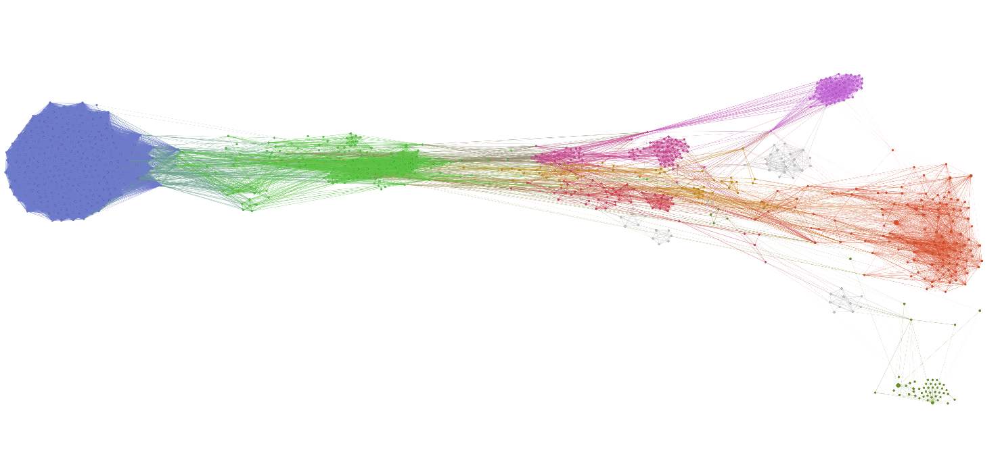

We can zoom into some of the communities of keywords identified using
the community detection method above

**Celestial bodies**

|pic1|  |pic2|

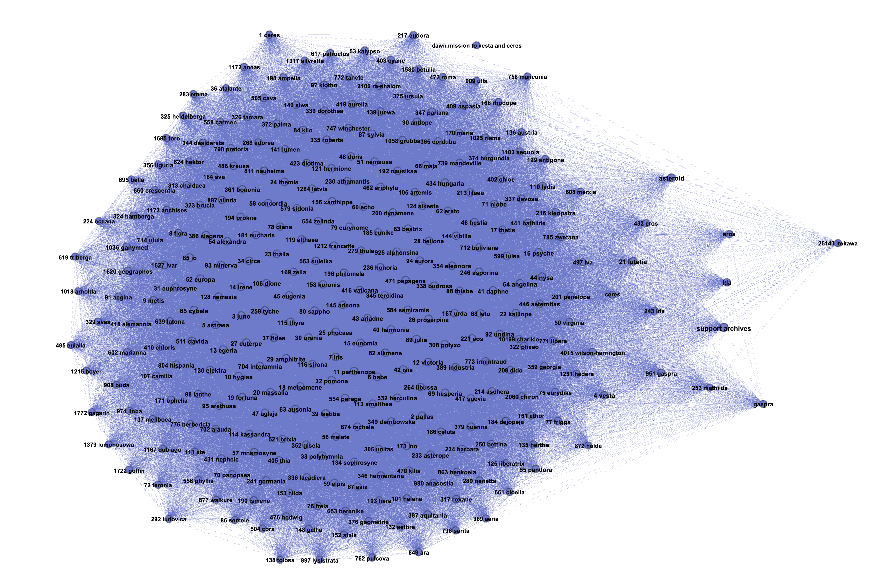

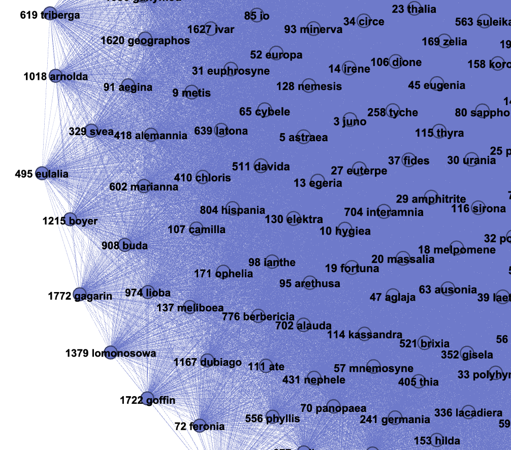

**Earth science**

|pic3|  |pic4|

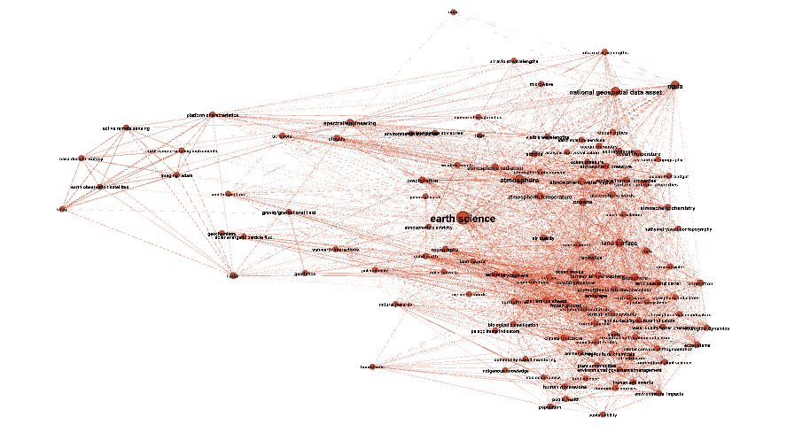

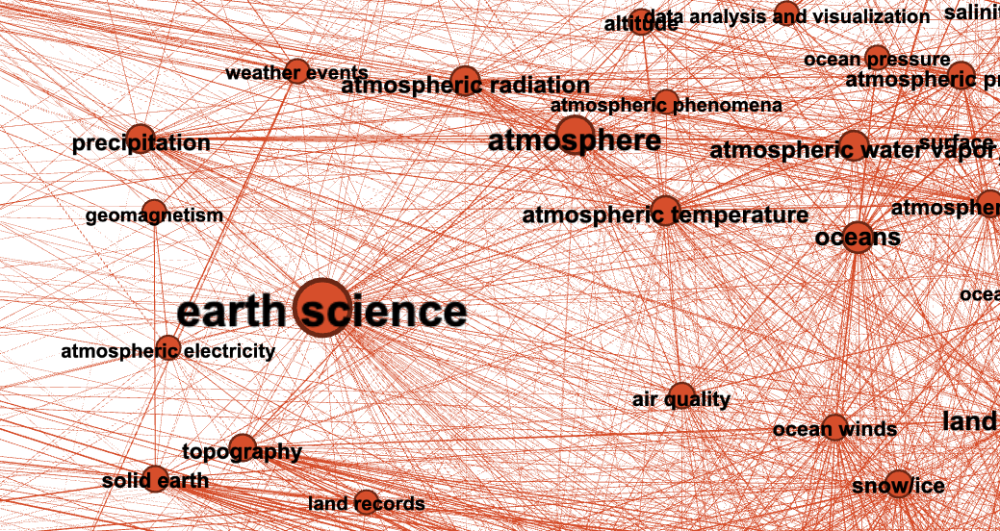

**Space programs and missions**

|pic5|  |pic6|

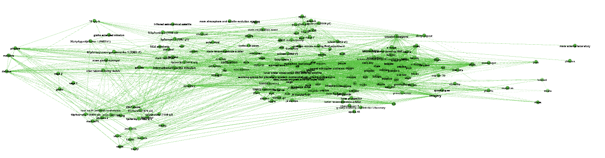

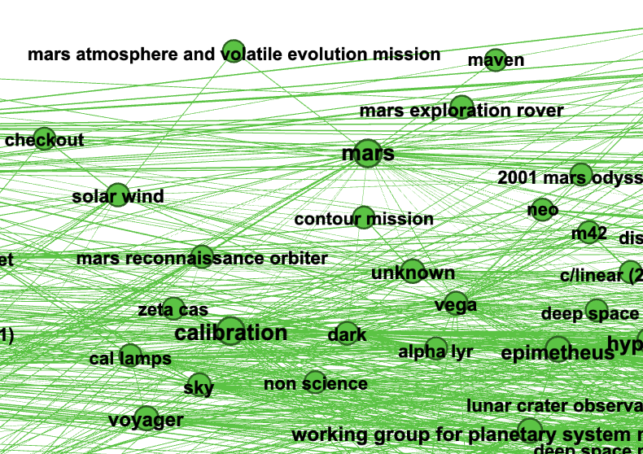

Minimum spanning tree
---------------------------

A *minimum spanning tree* of a network is given by a subset of edges
that make the network connected (:math:`n - 1` edges connecting
:math:`n` nodes). Its weighted version minimizes not only the number of
edges included in the tree, but the total edge weight.

In the following example we compute a minimum spanning tree minimizing
the NPMI-based distance weight of the network edges. We use the
Neo4j-based implementation of the ``PathFinder`` interface.

.. code:: ipython3

    path_finder.minimum_spanning_tree(distance="distance_npmi", write=True, write_edge_label="MSTEdge")

.. code:: ipython3

    nx_path_finder = NXPathFinder(new_graph, directed=False)
    tree = nx_path_finder.minimum_spanning_tree(distance="distance_npmi")

.. code:: ipython3

    tree_pgframe = networkx_to_pgframe(
        tree,
        node_prop_types=new_graph._node_prop_types,
        edge_prop_types=new_graph._edge_prop_types)

.. code:: ipython3

    tree_pgframe.export_to_gephi(
        "../data/gephi_nasa_spanning_tree", 
        node_attr_mapping = {
            "degree": "Degree",
            "pagerank": "PageRank",
            "betweenness": "Betweenness",
            "louvain_community": "Community"
        },
        edge_attr_mapping={
            "npmi": "Weight"
        })

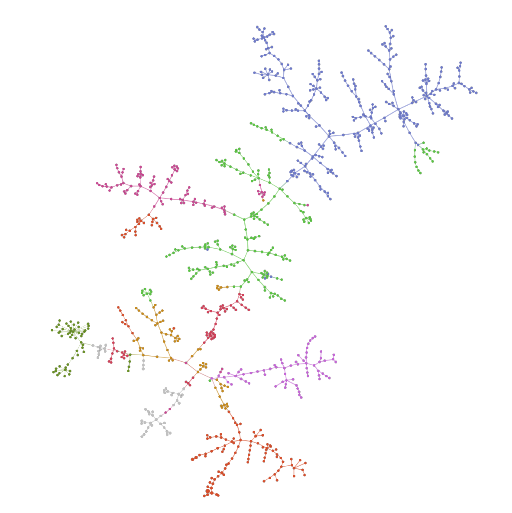

**Zoom Earth Science**

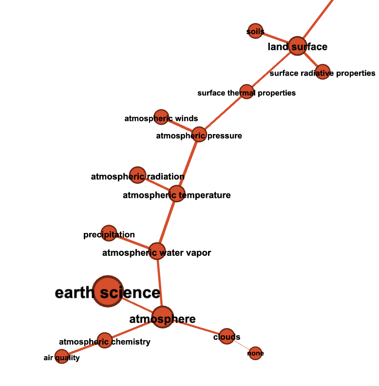

**Zoom Asteroids**

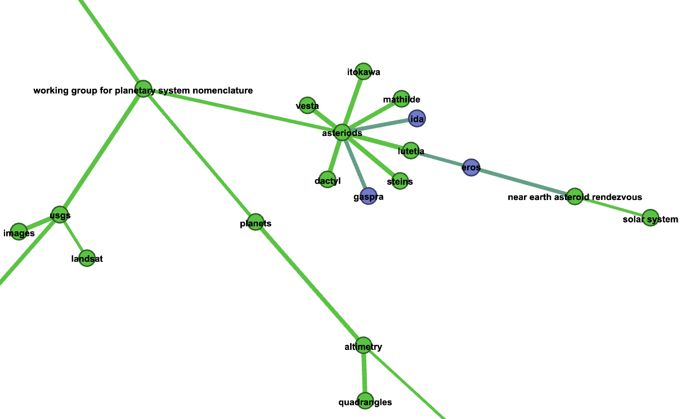

Shortest path search
--------------------

The *shortest path search problem* consisits in finding a sequence of
edges from the source node to the target node that minimizes the
cumulative weight (or distance) associated to the edges.

.. code:: ipython3

    path = path_finder.shortest_path("ecosystems", "oceans")
    pretty_print_paths([path])

.. parsed-literal::

    ecosystems <->               <-> oceans
                   earth science

The cell above illustrates that the single shortest path form
‘ecosystems’ and ‘oceans’ consists of the direct edge between them.

Now to explore related keywords we would like to find a *set* of
:math:`n` shortest paths between them. Moreover, we would like these
paths to be *indirect* (not to include the direct edge from the source
to the target). In the following examples we use
mutual-information-based edge weights to perform our literature
exploration.

In the following examples we use Yen’s algorithm for finding :math:`n`
loopless shortest paths from the source to the target
(https://en.wikipedia.org/wiki/Yen%27s_algorithm).

.. code:: ipython3

    paths = path_finder.n_shortest_paths(
        "ecosystems", "oceans", n=10,
        distance="distance_npmi",
        strategy="yen")

.. code:: ipython3

    pretty_print_paths(paths)

.. parsed-literal::

    ecosystems <->                                              <-> oceans
                   biosphere <-> coastal processes
                   biosphere <-> ocean waves
                   biosphere <-> terrestrial ecosystems
                   biosphere <-> erosion/sedimentation
                   geomorphic landforms/processes
                   biosphere <-> geomorphic landforms/processes
                   land use/land cover <-> coastal processes
                   biosphere <-> forest science
                   earth science
                   land use/land cover <-> ocean waves

.. code:: ipython3

    paths = path_finder.n_shortest_paths(
        "mission", "mars", n=10,
        distance="distance_npmi",
        strategy="yen")

.. code:: ipython3

    pretty_print_paths(paths)

.. parsed-literal::

    mission <->                                                         <-> mars
                delta <-> mars reconnaissance orbiter
                earth's bridge to space <-> mars reconnaissance orbiter
                vehicle <-> mars reconnaissance orbiter
                mars reconnaissance orbiter
                history <-> mars reconnaissance orbiter
                support <-> mars reconnaissance orbiter
                landing <-> mars reconnaissance orbiter
                delta <-> phoenix
                earth's bridge to space <-> phoenix
                vehicle <-> phoenix

Nested path search
------------------

To explore the space of co-occurring terms in depth, we can run the path
search procedure presented above in a *nested fashion*. For each edge
:math:`e_1, e_2, ..., e_n` encountered on a path from the source to the
target from, we can further expand it into :math:`n` shortest paths
between each pair of successive entities (i.e. paths between :math:`e_1`
and :math:`e_2`, :math:`e_2` and :math:`e_3`, etc.).

.. code:: ipython3

    paths1 = path_finder.n_nested_shortest_paths(
        "ecosystems", "oceans",
        top_level_n=10, nested_n=3, depth=2, distance="distance_npmi",
        strategy="yen")

.. code:: ipython3

    paths2 = path_finder.n_nested_shortest_paths(
        "mission", "mars",
        top_level_n=10, nested_n=3, depth=2, distance="distance_npmi",
        strategy="yen")

We can now build and visualize the subnetwork constructed using the
nodes and the edges discovered during our nested path search.

.. code:: ipython3

    summary_graph_oceans = networkx_to_pgframe(nx_path_finder.get_subgraph_from_paths(paths1))
    summary_graph_mars = networkx_to_pgframe(nx_path_finder.get_subgraph_from_paths(paths2))

.. code:: ipython3

    # Save the graph for Gephi import.
    summary_graph_oceans.export_to_gephi(
        "../data/gephi_nasa_path_graph_oceans", 
        node_attr_mapping = {
            "degree": "Degree",
            "pagerank": "PageRank",
            "betweenness": "Betweenness",
            "louvain_community": "Community"
        },
        edge_attr_mapping={
            "npmi": "Weight"
        })
    # Save the graph for Gephi import.
    summary_graph_mars.export_to_gephi(
        "../data/gephi_nasa_path_graph_mars", 
        node_attr_mapping = {
            "degree": "Degree",
            "pagerank": "PageRank",
            "betweenness": "Betweenness",
            "louvain_community": "Community"
        },
        edge_attr_mapping={
            "npmi": "Weight"
        })

The resulting graphs visualized with Gephi

**Ecosystems <-> Oceans**

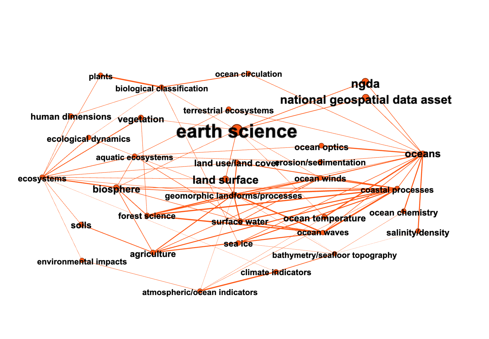

**Mission <-> Mars**

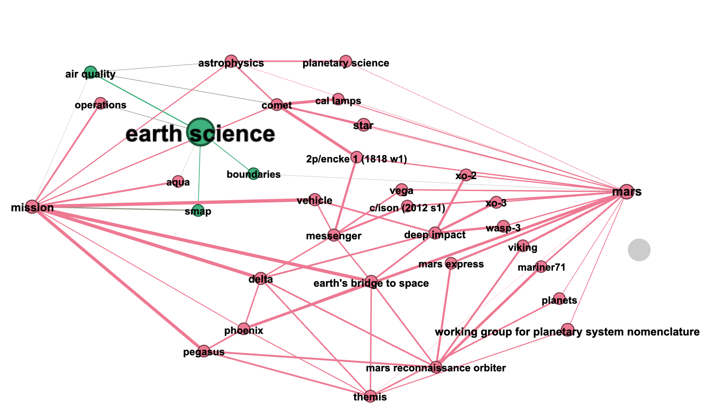
