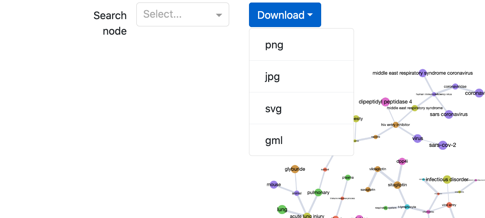

.. _visualization_guide:

Guide to the visualization app interface
=========================================

The interactive graph visualization app included as a part of the `cord19kg` package (:code:`cord19kg.apps.visualizaton_app`) contains three panels highlighted below:

The graph displayed by the app corresponds to the mutual-information-based minimum spanning tree computed on the selected set of nodes.

1. Search panel
---------------

The element on the figure below allows us to search for nodes (note that, at the moment, the result of the search is simply highlighted in the graph and not zoomed in).

.. image:: ../../assets/1_search.png
  :width: 600
  :alt: Search panel

The graph displayed in the app at any time can be downloaded using different formats (including the graph format `gml`).

2.  View control panel
----------------------

This panel expands when the `Controls` button is clicked. It contains three tabs allowing to control different aspects of the graph view.

The first tab allows the user to switch between different loaded graphs, filter nodes/edges by different criteria (frequencies, weights, nodes types, communities)

The second tab allows to change the layout of the graph and highlighting color scheme

.. image:: ../../assets/2_layouts.png
  :width: 400
  :alt: Layout panel

The third tab allows to search for different paths in the graph (the paths are found by minimizing the distance score based on the mutual information)

3. Details panel
----------------

This panel allow the user to view and interact with different graph elements. It consists of 4 tabs.

The legend tab provides the interpretation of the node colors

The details tab allows to access the knowledge associated to nodes and edges of the selected graph elements. For graph nodes, for example, we can see the definition of the associated ontology concept, all the papers where the concept is mentioned, all the raw entities associated to the concept.

The edit tab allows to edit different graph elements (remove nodes and edges, rename nodes and merge multiple nodes). Editing is available in two modes: the editing mode actually modifies the uderlying graph object, while the masking mode simply acts on the current graph view (when the view is refreshed the edits are reset).

Finally, the neighbors tab allows the user to access to the top N closest neighbors of the selected node by the largest mutual information score (normalized pointwise mutual information).

